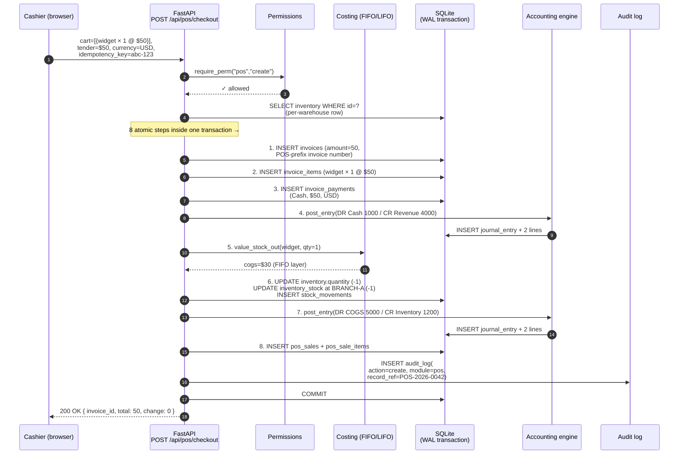
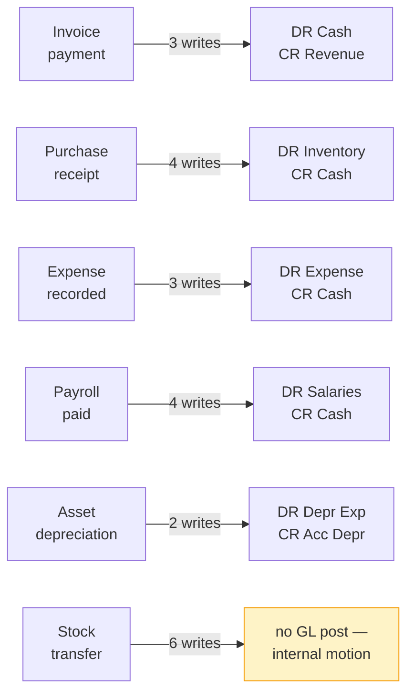
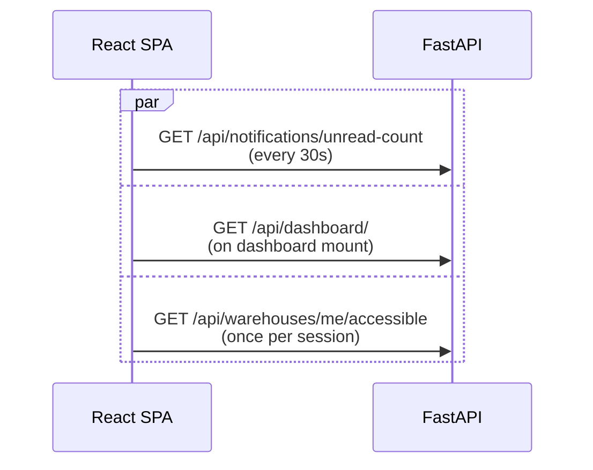

# Data flow

This page traces a **single business event** end-to-end through the system, so
you can see what writes happen where. We'll follow a POS cash sale, because
it's the busiest write path — it touches more modules at once than any
other single operation.

## The event we're tracing

> A cashier sells **1 widget for $50** for cash at POS terminal #3. The
> widget came from BRANCH-A's stock at FIFO cost of $30/unit.

## The full pipeline

Every step happens inside **one SQLite transaction**. Either all eight writes
land or none of them do — the cashier can never end up with stock deducted
but no invoice (or vice versa).

## What got written, in plain language

| Table | Row added | Why |
|---|---|---|
| `invoices` | One row, `amount=50` | The sale is a real invoice — feeds aging, VAT, search. |
| `invoice_items` | One row, widget × 1 @ $50 | Detail for the receipt. |
| `invoice_payments` | One row, `Cash`, `$50`, `USD` | The tender. Used by Finance dashboard for cash receipts. |
| `journal_entries` × 2 | Sale + COGS | Double-entry: DR Cash CR Revenue, then DR COGS CR Inventory. |
| `journal_entry_lines` × 4 | Two per journal entry | Always balanced (by construction). |
| `inventory_stock` (BRANCH-A row) | qty decremented | Per-warehouse balance is the source of truth. |
| `inventory.quantity` | Company total decremented | Denormalised total maintained for legacy queries. |
| `stock_movements` | One row, `type=sale`, `warehouse_id=BRANCH-A` | The forever-audit trail of inventory motion. |
| `inventory_cost_layers` (FIFO) | Layer drawn down | Costing follows the configured method. |
| `pos_sales`, `pos_sale_items` | One sale + line items | POS-only fields (cashier, tender, change). |
| `audit_log` | One row, `action=create`, `record_ref=POS-…` | What the auditor reads. |

## The three writes that an auditor actually verifies

Two of those tables are the audit trail proper:

| Source of truth | What it proves |
|---|---|
| `journal_entry_lines` | The books reconcile. Every transaction is balanced. |
| `audit_log` | A specific user did a specific thing at a specific time. |
| `stock_movements` | Inventory motion is traceable to the source event. |

Each can be filtered by date, module, user, or record reference from the UI.
See [Audit trail](../foundation/audit-trail.md) for the queries auditors use.

## Other event types follow the same pattern

The eight-step pattern for a POS sale is representative. Other write paths
produce a similar but shorter sequence:

The **only** write path that **doesn't** touch the GL is an internal stock
transfer between warehouses — by deliberate accounting design (one company,
one Inventory account, no internal value movement).

## What the SPA does in parallel

While the cashier is mid-checkout, the SPA is **also** doing several reads:

These are all GET requests, served from the same FastAPI process. They share
the same JWT cookie and the same row-level access checks. There's no caching
in the middle — the SPA just polls.

## Why this design

| Property | What we get |
|---|---|
| Single transaction per business event | Either the sale + GL + stock all post, or nothing posts. No partial state ever visible. |
| Audit log is a separate table | It's queryable independent of the source records; never deleted on archive. |
| GL posting is idempotent on `(source_type, source_id)` | Re-running a payroll mark-paid posts once. Re-receiving a purchase doesn't double-book. |
| Inventory balance maintained at two grains | Company total (`inventory.quantity`) + per-warehouse (`inventory_stock.quantity`) stay in lock-step. |
| No background queue | Everything happens during the HTTP request. If it succeeds the user knows it succeeded. |
