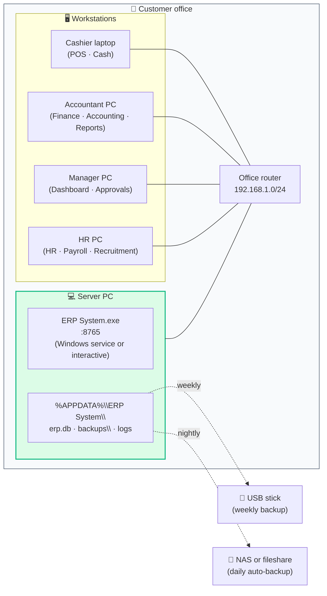
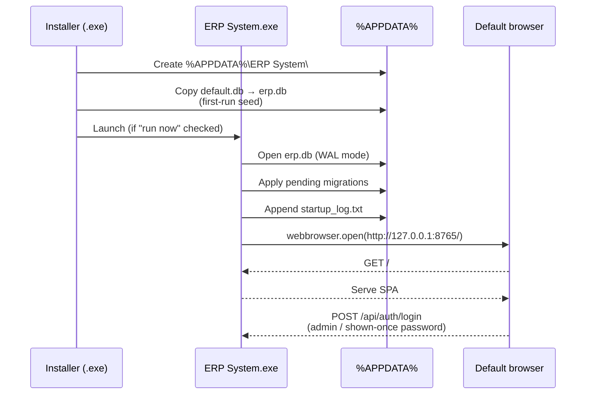
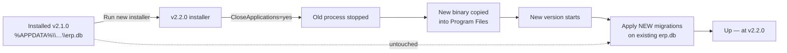

# Deployment topology

Where the system actually runs at a customer site, and what each piece
needs.

## A typical small-office install

## Roles of each box

| Box | What runs there | Notes |
|---|---|---|
| **Server PC** | The ERP install + `erp.db` | The single source of truth. Should be the most reliable PC in the office (UPS recommended). |
| **Workstation** | Just a browser | Any modern Chrome/Edge/Firefox. No client install. Reaches the server at `http://<server-name>:8765`. |
| **Router** | Standard office gateway | The ERP doesn't care — as long as workstations and server are on the same LAN. |
| **NAS / fileshare** | Nightly backup target | The auto-backup writes here on a schedule (configured in Settings → Backups). |
| **USB stick** | Manual / weekly backup target | The "give it to the accountant to take home" copy. |

## Network requirements

| Direction | Port | Reason |
|---|---|---|
| Workstations → Server | TCP 8765 | The SPA + API. The installer auto-adds the Windows Firewall rule on `domain` and `private` profiles. |
| Server → outbound | None required for core operations | The system runs fully offline. |
| Server → outbound (optional) | HTTPS 443 | Only for exchange-rate lookup if the customer enables that. |

!!! info "About `0.0.0.0` binding"
    Uvicorn binds `0.0.0.0:8765` so the LAN can reach it. The startup
    process probes that exact interface — if port 8765 is taken, it
    transparently bumps to 8766 and so on (up to 8784).

## Server-side hardware sizing

The bottleneck is almost always **disk write throughput** for the SQLite WAL
file, not CPU.

| Volume | Minimum | Recommended |
|---|---|---|
| 1–10 users, < 1 GB of data | Any modern PC, 4 GB RAM, SSD | Same |
| 10–25 users, 1–5 GB | 8 GB RAM, SSD | NVMe SSD, UPS |
| 25–50 users, 5–20 GB | 16 GB RAM, NVMe SSD, UPS | Same + nightly off-box backup |
| > 50 concurrent users | Conversation with the vendor | We size to the workload. |

Disk: budget **~4×** the live `erp.db` size to leave room for backups, WAL,
and a year of audit log growth.

## Service lifecycle

The application runs as a **regular Windows process**, not a service. This is
intentional:

| Aspect | Why a process, not a service |
|---|---|
| **Restart visibility** | A console window shows the LAN URL and any fatal error. Saves a support call. |
| **Update simplicity** | Re-run the installer; it stops the old process via `CloseApplications=yes`. |
| **Logs in plain view** | `%APPDATA%\…\startup_log.txt` is appended on every start; first stop in troubleshooting. |

A determined administrator can wrap the EXE in NSSM or schedule a Task Scheduler
auto-start; both work. The application also exposes `--no-browser` so it can
be started headlessly.

## First-run sequence

The "shown once" admin password is **printed on the console and written to
`startup_log.txt`** during the first boot. The customer is expected to log
in, force-change it, and create their real users.

## Upgrade flow

Critically, **`%APPDATA%\ERP System\erp.db` is never touched by the
installer** — only the application binaries are replaced. The new code
applies its own pending migrations on first start.

!!! danger "Before any upgrade"
    Take a manual backup (Settings → Backups → Backup now). Migrations are
    idempotent and well-tested, but rolling back to the pre-upgrade snapshot
    is the safe fallback if something on the customer's specific data
    surfaces a regression.
