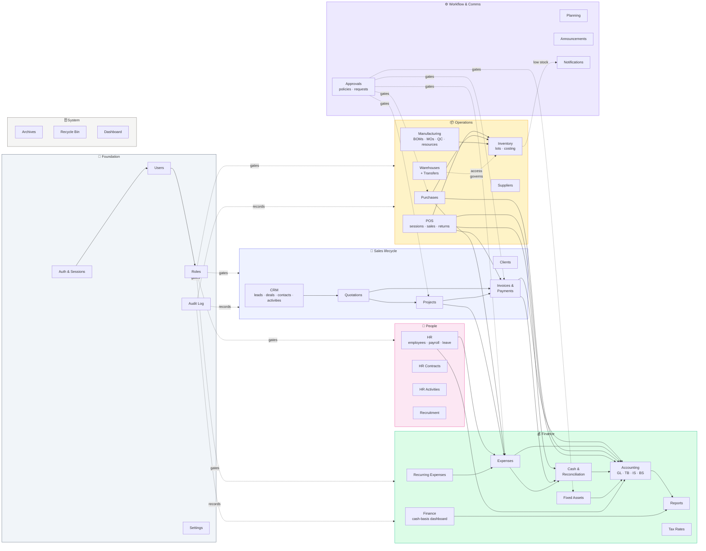

# Module map

The ERP ships with **28 modules** organized into seven functional groups. This
page shows what each one is, how they connect, and which audience cares about
which.

## The full map

Dotted edges are **cross-cutting** (RBAC gates, audit records, approval
policies). Solid edges are **data flow** — a POS sale really does create an
invoice, which really does feed cash and the GL.

## The full module index

Each module has its own page in the manual. Click through to the deep dive.

### 🔐 Foundation

| Module | Purpose | Manual page |
|---|---|---|
| Authentication | Login, sessions, password rules | [Authentication](../foundation/authentication.md) |
| Users | User accounts, status, role assignment | (Phase 6) |
| Roles | RBAC role definitions + permissions matrix | [RBAC](../foundation/rbac.md) |
| Audit Log | Immutable record of every write | [Audit trail](../foundation/audit-trail.md) |
| Settings | Company info, defaults, tax engine, exchange rate | (Phase 6) |

### 🤝 Sales lifecycle

| Module | Purpose | Phase |
|---|---|---|
| CRM | Leads → deals pipeline, contacts, activities | 2 |
| Clients | Customer master + 360° detail | 2 |
| Quotations | Proposals → conversion to invoices/projects | 2 |
| Projects | Long-form work with budget, milestones, materials | 2 |
| Invoices | Sales billing, payments (USD + LBP), aging | 2 |

### 📦 Operations

| Module | Purpose | Phase |
|---|---|---|
| Warehouses | Multi-location stock + transfers + per-warehouse RBAC | 3 |
| Inventory | Items, stock movements, lots, FIFO/LIFO/avg costing | 3 |
| Suppliers | Vendor master + 360° detail | 3 |
| Purchases | PO lifecycle (Ordered → Received → Paid) | 3 |
| Manufacturing | BOMs, production orders, QC, resources, costing | 3 |
| POS | Register sessions, sales, returns, cash drawer | 3 |

### 💰 Finance

| Module | Purpose | Phase |
|---|---|---|
| Finance | Cash-basis dashboard, P&L view, period locks | 4 |
| Expenses | Recurring + one-off, project allocation | 4 |
| Recurring Expenses | Rent, subscriptions, utilities templates | 4 |
| Cash & Reconciliation | Per-drawer daily count, USD + LBP variance | 4 |
| Fixed Assets | Capital register, depreciation auto-posting | 4 |
| Accounting | Double-entry GL: COA, JEs, TB, IS, BS, fiscal years | 4 |
| Reports | Financial, projects, clients, aging, expenses, VAT, inventory-by-warehouse | 4 |
| Tax Rates | Per-rate VAT engine, applied per line | 4 |

### 👥 People

| Module | Purpose | Phase |
|---|---|---|
| HR | Employees, departments, payroll runs, leave | 5 |
| HR Contracts | Formal contract documents | 5 |
| HR Activities | Personal calendar/log per employee | 5 |
| Recruitment | Open positions, applicants, interviews, offers | 5 |

### ⚙️ Workflow & communications

| Module | Purpose | Phase |
|---|---|---|
| Approvals | Rule-based multi-step approval chains | 5 |
| Planning | Project planning board, Gantt, milestones | 5 |
| Announcements | Internal top-down communications | 5 |
| Notifications | Per-user inbox of system events | 5 |

### 🗄️ System

| Module | Purpose | Phase |
|---|---|---|
| Dashboard | Personalized landing with KPIs across all modules | 6 |
| Archives | Soft-archived records across modules | 6 |
| Recycle Bin | Soft-deleted records (admin restore) | 6 |

## Cross-module workflows

The map above is just the static picture. The **real value** is in the
end-to-end workflows that span modules. Each subsequent phase opens with a
workflow diagram for its group:

| Workflow | Spans | Phase |
|---|---|---|
| Quote-to-cash | CRM → Quote → Project → Invoice → Payment → Cash → GL | 2 |
| Stock procurement | Low-stock alert → PO → Receipt → Inventory → Cash → GL | 3 |
| Production | BOM → MO → Materials consumed → Output produced → QC → Sale | 3 |
| Period close | Lock period → Trial balance → IS → BS → Fiscal close | 4 |
| Payroll | Open run → Calculate per-employee → Approve → Pay → Expense + GL | 5 |
| Capex approval | Asset proposal → Policy match → Approver chain → Asset created → Depreciation runs | 5 |

These are the diagrams an auditor cares about most — they cross-cut several
modules and show where the controls actually sit.
