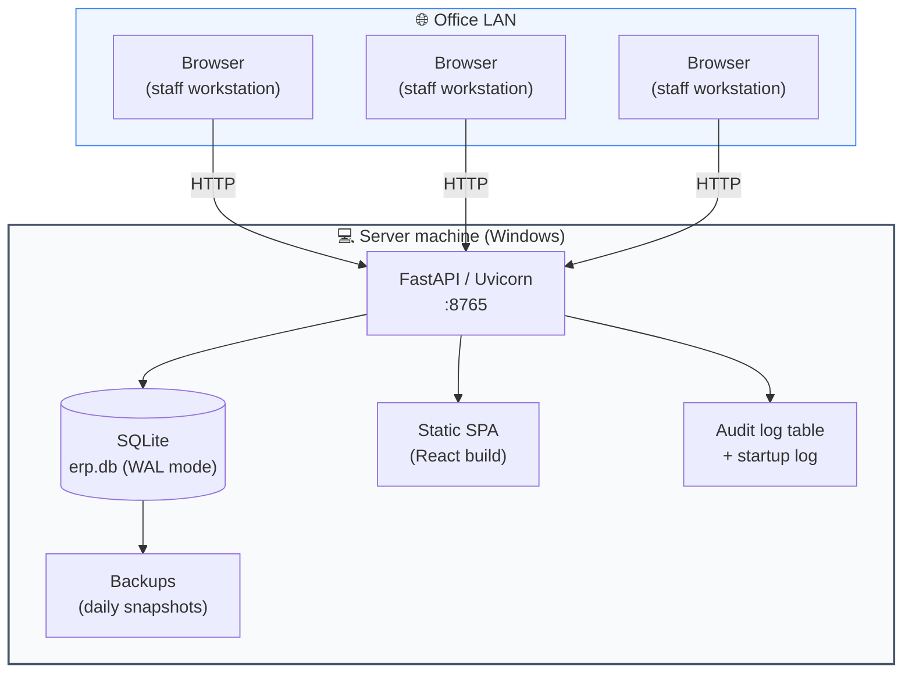
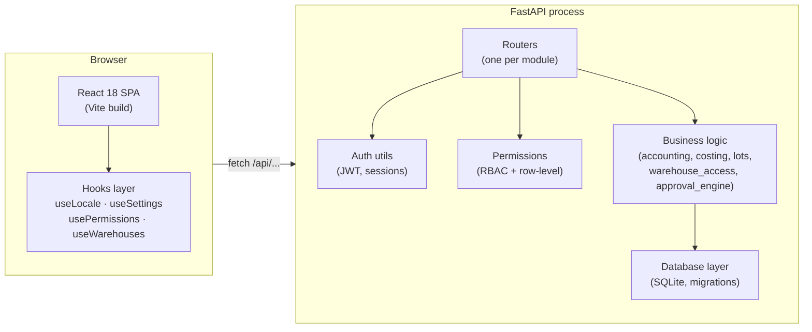
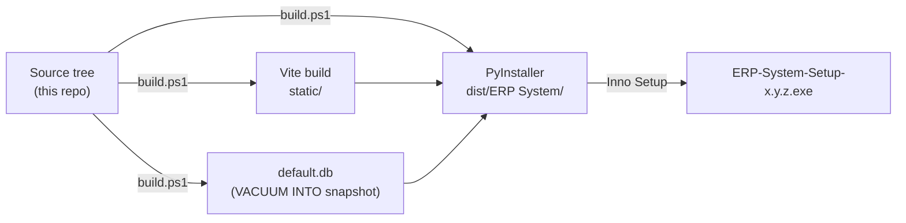

# System overview

The ERP is a **monolithic, single-tenant** application designed to be installed
once per customer. Every piece runs on a single Windows machine; the office
network reaches it over the LAN.

## Big-picture diagram

The shaded **Server machine** box is everything that ships in the installer.
There's no separate database server, no message broker, no microservices —
all the moving parts run inside one process and write to one SQLite file.

## Why this shape

| Decision | Why it suits the target user (SME, often single-site) |
|---|---|
| **Monolith** | Easier to install, back up, restore, and reason about. One log, one process, one DB file. |
| **SQLite, WAL-mode** | Zero-configuration. Survives crashes. Performs well for SME read/write volumes (10s of concurrent users). |
| **Single-tenant** | One install per customer, vendor-configurable module set. No data co-mingling. |
| **No external services** | Runs on a laptop. No internet required for core operations (LBP-rate sync is the only optional outbound). |
| **HTTP over LAN** | Office workstations reach it at `http://<server>:8765`. Bound to `0.0.0.0`, firewall rule auto-installed. |
| **Static SPA** | The React bundle is served by the same FastAPI process. No separate web server to configure. |

## Component layers

The five layers map exactly to folders in the source tree:

| Layer | Folder | Examples |
|---|---|---|
| SPA | `frontend_src/src/pages/` | `Dashboard.jsx`, `Warehouses.jsx`, `POS.jsx` |
| Hooks | `frontend_src/src/hooks/` | `useLocale`, `usePermissions`, `useWarehouses` |
| Routers | `backend/routers/` | 35 router files, one per endpoint group |
| Business logic | `backend/` | `accounting.py`, `costing.py`, `lots.py`, `warehouse_access.py`, `approval_engine.py` |
| Database | `backend/database.py` | 120+ idempotent migrations, schema + seed |

## What ships in the installer

The pipeline produces a single Windows installer (~22 MB) that drops:

- The PyInstaller-frozen backend (Python + dependencies bundled)
- The Vite-built static SPA
- A seeded `default.db` template (copied to `%APPDATA%` on first run)

After installation, the app is reachable at `http://<server>:8765/` from any
browser on the same LAN.

## Where data lives at runtime

| Path | Contents | Lifecycle |
|---|---|---|
| `%APPDATA%\ERP System\erp.db` | Live database (WAL mode) | Persists across upgrades |
| `%APPDATA%\ERP System\erp.db-wal`, `-shm` | SQLite write-ahead log + shared memory | Managed by SQLite |
| `%APPDATA%\ERP System\backups\` | Daily auto-backup snapshots + manual backups | Rotated; pinned manual backups kept |
| `%APPDATA%\ERP System\startup_log.txt` | Server startup + fatal-error trace | Append-only |
| `C:\Program Files\ERP System\` | The application binary itself | Replaced on upgrade |

!!! danger "Critical control"
    The `%APPDATA%\ERP System\` folder is **never touched by the installer**
    — uninstall and re-install does not delete business data. To wipe a
    customer install completely, delete that folder by hand after
    uninstall.

## What's NOT in the system (by design)

So you don't go looking for these:

- ❌ Multi-tenancy (one install = one company)
- ❌ Microservices / service bus
- ❌ Background worker queue (everything happens synchronously inside the request)
- ❌ Per-warehouse general ledger accounts (one `1200 Inventory` account, by design)
- ❌ Per-warehouse costing (deferred until a clear business need emerges)
- ❌ External integrations (no Stripe, no QuickBooks, no SAP — by design)

If a customer needs any of those, that's a vendor conversation, not a feature
toggle.
