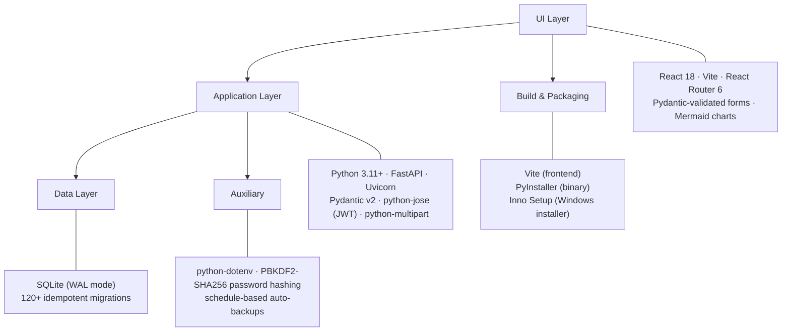

# Technology stack

The system's choices are deliberately boring — every piece is mature,
well-documented, and runs without internet. Boring software is what makes a
five-year-old install still upgrade cleanly.

## Layer by layer

## Why each piece

=== "Frontend (React 18 + Vite)"

    | Concern | Choice | Reasoning |
    |---|---|---|
    | UI framework | **React 18** | Mature, large hiring pool, hooks API is a clean separation of concerns. |
    | Build | **Vite** | Instant dev reload; the production build is a small ESM bundle (~280 KB gzipped). |
    | Routing | **React Router 6** | Standard. Lazy-loaded pages for code-splitting. |
    | State | **Hooks + Context** | No Redux. A `useSettings`/`usePermissions`/`useLocale`/`useWarehouses` per cross-cutting concern. |
    | i18n | Single dictionary | One object per locale (`en`, `ar`); a tiny `t()` function. No i18next; perfectly mirrored EN/AR. |
    | Charts | **Custom inline SVG** + Mermaid | No chart library. Dashboard sparklines are 30 lines of SVG. Mermaid only in this manual. |
    | RTL | CSS logical properties | Direction flips at the `<html dir="rtl">` level; no per-component RTL forks. |

=== "Backend (Python 3.11 + FastAPI)"

    | Concern | Choice | Reasoning |
    |---|---|---|
    | Web framework | **FastAPI** | Type-safe request bodies (Pydantic v2), automatic OpenAPI docs at `/docs`, fast enough for SME loads. |
    | ASGI server | **Uvicorn** | Single-process; uvloop on Linux, asyncio loop on Windows. |
    | Async model | **Sync handlers** | SQLite isn't async; every endpoint is `def` (not `async def`). This is a deliberate trade-off — simpler reasoning, no event-loop deadlocks. |
    | Validation | **Pydantic v2** | Request bodies validate at the boundary. Helpful 422 errors back to the SPA. |
    | Auth | **JWT (HS256)** in **HttpOnly** cookies | No bearer token in `localStorage` (XSS-safe). `SECRET_KEY` rotates via env. |
    | Password hashing | **PBKDF2-SHA256** (stdlib) | No third-party crypto. 200,000 iterations. |
    | Migrations | **Hand-rolled in `database.py`** | Idempotent `need(name) → run → done(name)` pattern. Records in `schema_migrations`. |
    | Logging | **stdlib + a single startup log** | No logger framework. Every audit-worthy event becomes an `audit_log` row, not a log line. |

=== "Database (SQLite WAL)"

    | Concern | Choice | Reasoning |
    |---|---|---|
    | Engine | **SQLite 3** | Single file. Battle-tested. Survives crashes. Zero administration. |
    | Journal mode | **WAL** | Concurrent readers + a single writer. Perfect for our R/W ratio. |
    | Foreign keys | **ON** | Enforced at the engine level. Cascade rules carry weight. |
    | Sync | **NORMAL** | Slightly faster than `FULL`, still crash-safe in WAL mode. |
    | Backups | **VACUUM INTO** | Atomic snapshot, no read-lock interruption. |
    | Schema source of truth | `backend/database.py` | One file, ~3,000 lines, all idempotent. Re-running on an installed DB is a no-op. |

=== "Packaging (Windows installer)"

    | Concern | Choice | Reasoning |
    |---|---|---|
    | Binary | **PyInstaller** | Bundles the Python interpreter + every dependency into one folder. No "install Python first" step for the customer. |
    | Installer | **Inno Setup 6** | Industry-standard Windows installer; produces a single signed `.exe`. |
    | Frontend bundling | Built once, copied as static files | The same FastAPI process serves the SPA — no separate web server. |
    | DB template | Snapshot at build time → copied on first run | A vendor can pre-seed sample data, chart of accounts, etc. The pristine `default.db` ships inside the installer. |
    | Version label | Single source: `installer/ERP-System.iss` `#define MyAppVersion` | Bumps cleanly per release. |

=== "Auxiliary services"

    | Concern | Choice | Reasoning |
    |---|---|---|
    | Auto-backup | Background thread, daily cadence | Snapshots written to `%APPDATA%\…\backups\`. |
    | Manual backup | One-click via Settings → Backups | Writes to a user-chosen folder (USB stick, network share, …). |
    | Notifications | Polled via `/api/notifications/unread-count` from the SPA | No WebSockets. No push. Polling every 30 seconds is enough for our use cases. |
    | LAN access | `BIND_HOST=0.0.0.0`, Windows Firewall rule auto-added by installer | Office laptops reach the server by its hostname or IP. |

## Version pins

Major versions only — minor/patch upgrades are automatic via `pip install`
during build:

| Component | Pinned version |
|---|---|
| Python | 3.11 or 3.12 |
| FastAPI | 0.111+ |
| Pydantic | 2.x |
| SQLite | bundled with Python (3.40+) |
| React | 18.x |
| Vite | 5.x |
| MkDocs Material (manual only) | 9.x |

## What's NOT in the stack (and why)

| Not used | Why we don't need it |
|---|---|
| PostgreSQL / MySQL | SQLite covers our concurrency. One file is easier to back up. |
| Redis / Memcached | No cache. Queries are fast on the SME data volume. |
| Celery / RQ | No background queue. Everything happens during the HTTP request. |
| nginx / Apache | FastAPI serves the SPA directly. No reverse proxy needed. |
| Docker | The customer runs Windows. PyInstaller + Inno is friendlier. |
| Kubernetes | One install per company. K8s would be three orders of magnitude over-built. |
| WebSockets | Polling at 30-second cadence is enough. WebSockets add deploy complexity (proxy, sticky sessions). |
| OAuth / SSO | The customer base is too small to justify per-IdP integration work. PBKDF2 + RBAC + audit trail covers the controls. |

!!! info "When this might change"
    The stack is sized for SMEs with 5–50 users. If a customer ever needs
    multi-site replication, true concurrent writers, or a federated SSO,
    those would be architectural deltas, not feature toggles. The vendor
    is involved either way.
