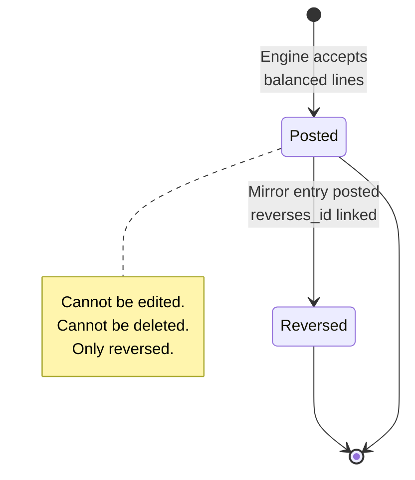
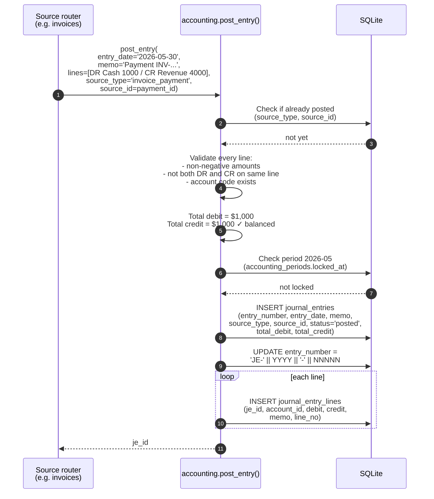
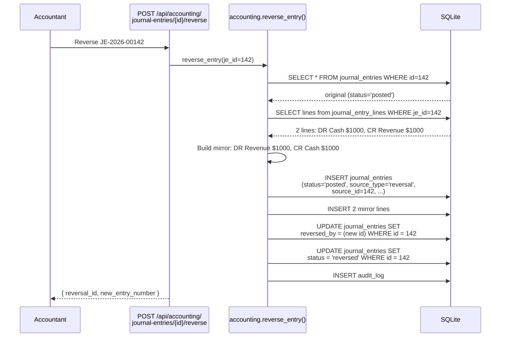
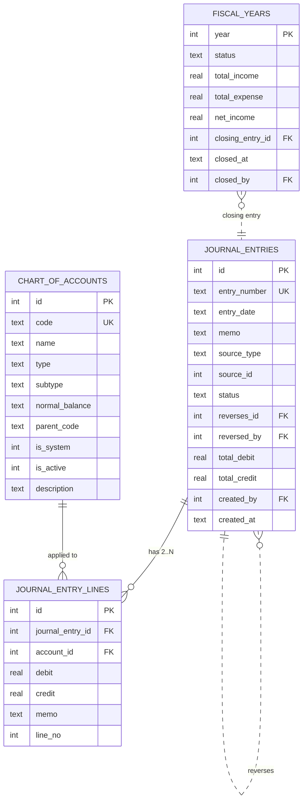

# Accounting — General Ledger

The accrual books. Chart of Accounts, balanced journal entries, Trial
Balance, Income Statement, Balance Sheet, fiscal-year closing. The single
source of truth for "what's the company worth and what did it earn?"

## Purpose

The accounting module is **the books of record**. Every business event that
moves money produces one or more `journal_entries` — each balanced by
construction, each carrying a `source_type` + `source_id` linking back to
the originating business event.

Five views:

| View | Read | Answers |
|---|---|---|
| **Chart of Accounts** | `chart_of_accounts` | What accounts exist, what type, what side |
| **Journal Entries** | `journal_entries` + `journal_entry_lines` | Every posted JE, filterable |
| **Trial Balance** | derived | Per-account balance "as of" a date — must tie |
| **Income Statement** | derived | Revenue − Expense over a period |
| **Balance Sheet** | derived | Assets, Liabilities, Equity "as of" a date — must balance |

## Personas

| Persona | What they do here |
|---|---|
| **Accountant** | Posts manual JEs (opening balances, accruals, adjustments), reads TB/IS/BS |
| **Finance Manager** | Reviews JEs, runs reports, closes fiscal years |
| **External Auditor** | Reads TB / IS / BS, samples JEs, verifies reconciliations |
| **CEO** | Reads IS and BS for board reporting |

## Quick reference

- **30 seeded accounts** in the chart, code 1000-6920
- **Five account types**: `Asset`, `Liability`, `Equity`, `Income`, `Expense`
- **Two normal balance sides**: `debit`, `credit`
- **Auto-posted from**: invoice payments, POS sales, purchases (receipt),
  expenses, payroll, depreciation, cash variances, FX revaluation, fiscal
  year close
- **Manual entries**: opening balances, accruals, ad-hoc adjustments
- **Idempotent posting** keyed on `(source_type, source_id)`
- **Corrections via reversal** — never by edit or delete
- **Period locks honoured** at posting time

---

=== "Operator's view"

    ### Reading the Trial Balance

    Accounting → **Trial Balance** → set "As of" to any date.

    | Column | What it shows |
    |---|---|
    | Code | Account number |
    | Name | Account name |
    | Type | Asset / Liability / Equity / Income / Expense |
    | Debit | Balance on the debit side |
    | Credit | Balance on the credit side |
    | (footer) | Total debits, total credits, ✓ Balanced |

    The footer **must** show ✓ Balanced (green). If it shows ⚠ Not balanced
    (red), the system is in a bad state — stop and call the vendor.

    ### Reading the Income Statement

    Accounting → **Income Statement** → pick start + end date.

    Sections:
    - **Income** — all `Income` type accounts (4000 series), positive
    - **Cost of Goods Sold** — account 5000
    - **Operating Expenses** — accounts 6000-6900
    - **Other Income** — account 4900 (FX gains, asset disposals)
    - **Other Expense** — 6920 (FX losses)
    - **Net Income** — Income − Expense

    The cash-basis Finance dashboard and the GL Income Statement will
    legitimately differ — see [Finance dashboard](finance.md).

    ### Reading the Balance Sheet

    Accounting → **Balance Sheet** → as of any date.

    Sections:
    - **Assets** (1000-series + 1500): Cash, A/R, Inventory, Fixed Assets,
      − Accumulated Depreciation
    - **Liabilities** (2000-series): A/P, VAT Payable, Payroll Liabilities
    - **Equity** (3000-series): Owner's Equity, Retained Earnings
    - **+ Net Income** for the YTD if not yet closed

    Must satisfy `Assets = Liabilities + Equity + Net Income`. Footer
    shows ✓ Balanced or ⚠ Not balanced.

    ### Posting a manual JE

    Accounting → **Journal Entries** → **+ New entry**:

    | Field | Notes |
    |---|---|
    | Entry date | When the entry posts to |
    | Memo | Description (auditor will read this) |
    | Lines | Add at least 2 lines, each with account + debit or credit |

    Save. The engine checks:
    - At least 2 lines
    - At least one debit + one credit total
    - `total_debit ≈ total_credit` (within $0.005)
    - Entry date not in a locked period

    The system **refuses** to save an unbalanced entry. There is no path
    to "save anyway".

    ### Reversing a JE

    Open the JE → **Reverse**. Posts a new JE with `debit ↔ credit` swapped,
    `entry_date = today`, `reverses_id = original`. The original gets
    `reversed_by = new`.

    Both entries remain visible — that's the audit trail. There is no
    delete.

=== "Administrator's view"

    ### Permissions

    | Role | view | create | edit | delete | approve |
    |---|---|---|---|---|---|
    | Accountant | ✅ | ✅ | ✗ | ✗ | ✗ |
    | Finance Manager | ✅ | ✅ | ✗ | ✗ | ✅ |
    | Auditor | ✅ | ✗ | ✗ | ✗ | ✗ |
    | Owner | ✅ | ✗ | ✗ | ✗ | ✗ |

    Notice: **no role has `edit` or `delete`**. Manual JEs can't be edited
    or deleted by anyone — corrections are via reversal only.

    ### The 30 seeded accounts

    | Code | Name | Type | Normal | Used by |
    |---|---|---|---|---|
    | 1000 | Cash & Bank | Asset | DR | USD cash + bank balances |
    | 1010 | Cash — LBP | Asset | DR | LBP cash (F-4 fix) |
    | 1100 | Accounts Receivable | Asset | DR | (informational only; system is cash-basis) |
    | 1200 | Inventory | Asset | DR | Perpetual inventory (F-2(b) fix) |
    | 1500 | Fixed Assets | Asset | DR | Capital register |
    | 1510 | Accumulated Depreciation | Asset (contra) | CR | Auto-posted monthly |
    | 2000 | Accounts Payable | Liability | CR | (informational) |
    | 2100 | VAT Payable | Liability | CR | Tax engine outputs |
    | 2200 | Payroll Liabilities | Liability | CR | NSSF/PAYE accruals |
    | 3000 | Owner's Equity | Equity | CR | Capital contributions |
    | 3900 | Retained Earnings | Equity | CR | Year-end closing target |
    | 4000 | Sales Revenue | Income | CR | All sales — POS, invoices |
    | 4900 | Other Income | Income | CR | Asset disposal gains |
    | 4910 | Foreign Exchange Gain | Income | CR | FX revaluation gains (F-4 fix) |
    | 5000 | Cost of Goods Sold | Expense | DR | COGS on every sale |
    | 6000 | Salaries & Wages | Expense | DR | Payroll net total |
    | 6100 | Rent | Expense | DR | Expense category 'Rent' |
    | 6200 | Utilities | Expense | DR | Expense category 'Utilities' |
    | 6300 | Depreciation Expense | Expense | DR | Per-asset monthly |
    | 6400 | Materials | Expense | DR | Project material consumption |
    | 6500 | Labour | Expense | DR | |
    | 6600 | Equipment | Expense | DR | |
    | 6700 | Transport | Expense | DR | |
    | 6800 | Subcontractor | Expense | DR | |
    | 6850 | Insurance | Expense | DR | |
    | 6860 | Subscriptions | Expense | DR | |
    | 6870 | Permits & Fees | Expense | DR | |
    | 6900 | General & Other Expense | Expense | DR | Default for uncategorised |
    | 6910 | Cash Short & Over | Expense | DR | F-3 variance posting |
    | 6920 | Foreign Exchange Loss | Expense | DR | F-4 fix |

    ### Adding custom accounts

    Accounting → Chart of Accounts → **+ Add account**:

    - Pick a code that doesn't collide with system accounts
    - Type + normal_balance must be consistent (DR-normal for Asset/Expense,
      CR-normal for Liability/Equity/Income)
    - `is_system=0` for custom accounts

    Custom accounts can be edited (name, description) but never deleted
    once they've received a JE.

    ### Fiscal year close

    At end of fiscal year:

    `POST /api/accounting/fiscal-years/{year}/close`

    The system:

    1. Verifies all 12 months are locked
    2. Computes annual income, expense, net income
    3. Posts the **closing entry**: zeros out every Income and Expense
       account, with the net hitting `3900 Retained Earnings`
    4. Sets `fiscal_years.status = 'closed'`, `closed_at`, `closed_by`

    The closing entry is `source_type='closing', source_id=year`.

    ### Reopening a closed year

    `POST /api/accounting/fiscal-years/{year}/reopen`

    Reverses the closing entry (it stays in the history, marked
    `reversed_by`), flips fiscal_year status back to `open`. Costly
    operation — used to fix a discovered error in a prior year.

=== "Auditor's view"

    ### The four invariants

    | Invariant | SQL check |
    |---|---|
    | Every JE is balanced | `SELECT je.id FROM journal_entries je WHERE ABS(je.total_debit - je.total_credit) > 0.01;` should return zero rows |
    | Trial Balance ties | Sum of all debits = sum of all credits over time |
    | Balance Sheet balances | Assets = Liabilities + Equity + YTD Net Income |
    | No JE in locked period | Every JE's `entry_date` falls outside locked months unless the period was unlocked |

    ### Trial Balance computation

    The system computes it like this — auditor can verify independently:

    ```sql
    SELECT a.code, a.name, a.type, a.normal_balance,
           SUM(jel.debit)  AS total_debits,
           SUM(jel.credit) AS total_credits,
           CASE WHEN a.normal_balance='debit'
                THEN SUM(jel.debit) - SUM(jel.credit)
                ELSE SUM(jel.credit) - SUM(jel.debit)
           END AS balance_on_normal_side
    FROM chart_of_accounts a
    JOIN journal_entry_lines jel ON jel.account_id = a.id
    JOIN journal_entries je ON je.id = jel.journal_entry_id
    WHERE je.status = 'posted'
      AND je.entry_date <= '2026-05-31'
    GROUP BY a.id
    HAVING total_debits > 0 OR total_credits > 0
    ORDER BY a.code;
    ```

    Sum the debit and credit totals across the result — they should be
    equal.

    ### Reconciliations between modules and the GL

    Reference the relevant module's Auditor view for the full check:

    | Module | Reconciles to | Where to find it |
    |---|---|---|
    | Inventory | 1200 Inventory | [Inventory page](../operations/inventory.md) |
    | Fixed Assets | 1500 + 1510 | [Fixed Assets](assets.md) |
    | POS sales | 4000 + 5000 | [POS](../operations/pos.md) |
    | Invoice payments | 1000 + 1010 | [Invoices](../sales/invoices.md) |
    | Cash drawer | 1000 + 1010 + 6910 | [Cash](cash.md) |

    ### Source-event tracing

    Every JE references the originating business event. Trace a JE back
    to its source:

    ```sql
    SELECT je.entry_number, je.entry_date, je.memo,
           je.source_type, je.source_id,
           je.created_by, je.created_at
    FROM journal_entries je
    WHERE je.entry_number = 'JE-2026-00142';
    ```

    Then look up `source_id` in the appropriate table based on `source_type`:

    | source_type | Table to look up source_id in |
    |---|---|
    | `invoice_payment` | invoice_payments |
    | `purchase` | purchases |
    | `expense` | expenses |
    | `payroll` | hr_payroll_runs |
    | `depreciation` | fixed_assets |
    | `pos_cogs` | invoices (POS-prefixed) |
    | `cash_variance_usd` / `cash_variance_lbp` | cash_reconciliations |
    | `fx_revaluation` | (none — manually triggered) |
    | `closing` | fiscal_years |
    | `manual` | (none — manual entry) |
    | `reversal` | journal_entries (the reversed one) |

---

## Journal entry lifecycle



## Workflow — auto-posting from a business event



## Workflow — reversing a JE



## Data model



## API surface

| Endpoint | Purpose |
|---|---|
| `GET /api/accounting/accounts` | List Chart of Accounts |
| `POST /api/accounting/accounts` | Create custom account |
| `PUT /api/accounting/accounts/{id}` | Edit (system accounts can't be edited beyond description) |
| `GET /api/accounting/journal-entries` | List JEs (filter source_type, date) |
| `POST /api/accounting/journal-entries` | Post a manual JE |
| `GET /api/accounting/journal-entries/{id}` | JE + lines |
| `POST /api/accounting/journal-entries/{id}/reverse` | Post reversal |
| `GET /api/accounting/general-ledger` | Per-account drill-down |
| `GET /api/accounting/trial-balance` | TB "as of" |
| `GET /api/accounting/balance-sheet` | BS "as of" |
| `GET /api/accounting/income-statement` | IS for range |
| `GET /api/accounting/summary` | KPIs |
| `GET /api/accounting/fiscal-years` | All fiscal years with status |
| `POST /api/accounting/fiscal-years/{year}/close` | Year-end close |
| `POST /api/accounting/fiscal-years/{year}/reopen` | Reverse the close |
| `POST /api/accounting/fx-revaluation` | F-8 LBP cash mark-to-market |

## What's NOT supported

- Accounts hierarchical roll-up beyond the seeded `parent_code` field.
  Reports group by `subtype`; full COA trees would extend the schema.
- Multi-book / multi-entity. One company, one set of books.
- Budgeting / forecasting. Use Reports + Excel.
- Direct edit of posted JEs. Only reversal. By design.
- Soft-delete of JEs. They live forever for audit.
