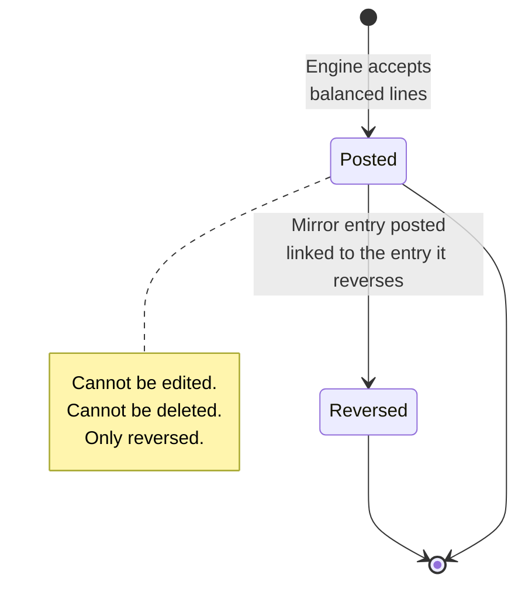

# Accounting — General Ledger

The accrual books. Chart of Accounts, balanced journal entries, Trial
Balance, Income Statement, Balance Sheet, fiscal-year closing. The single
source of truth for "what's the company worth and what did it earn?"

## Purpose

The accounting module is **the books of record**. Every business event that
moves money produces one or more journal entries — each balanced by
construction, each carrying a source + source record linking back to
the originating business event.

Five views.

| View | Read | Answers |
|---|---|---|
| **Chart of Accounts** | the chart of accounts | What accounts exist, what type, what side |
| **Journal Entries** | journal entries + journal entry lines | Every posted entry, filterable |
| **Trial Balance** | derived | Per-account balance "as of" a date — must tie |
| **Income Statement** | derived | Revenue − Expense over a period |
| **Balance Sheet** | derived | Assets, Liabilities, Equity "as of" a date — must balance |

## Personas

| Persona | What they do here |
|---|---|
| **Accountant** | Posts manual JEs (opening balances, accruals, adjustments), reads TB/IS/BS |
| **Finance Manager** | Reviews JEs, runs reports, closes fiscal years |
| **External Auditor** | Reads TB / IS / BS, samples JEs, verifies reconciliations |
| **CEO** | Reads IS and BS for board reporting |

## Quick reference

- **32 seeded accounts** in the chart, code 1000-6920
- **Five account types**: `Asset`, `Liability`, `Equity`, `Income`, `Expense`
- **Two normal balance sides**: `debit`, `credit`
- **Auto-posted from**: invoice payments, POS sales, purchases (receipt),
  expenses, payroll, depreciation, cash variances, FX revaluation, fiscal
  year close
- **Manual entries**: opening balances, accruals, ad-hoc adjustments
- **No double-posting** — the same source document posts once, however
  many times it is re-saved
- **Corrections via reversal** — never by edit or delete
- **Period locks honoured** at posting time

---

=== "Operator's view"

    ### Reading the Trial Balance

    Accounting → **Trial Balance** → set "As of" to any date.

    | Column | What it shows |
    |---|---|
    | Code | Account number |
    | Name | Account name |
    | Type | Asset / Liability / Equity / Income / Expense |
    | Debit | Balance on the debit side |
    | Credit | Balance on the credit side |
    | (footer) | Total debits, total credits, ✓ Balanced |

    The footer **must** show ✓ Balanced (green). If it shows ⚠ Not balanced
    (red), the system is in a bad state — stop and call the vendor.

    ### Reading the Income Statement

    Accounting → **Income Statement** → pick start + end date.

    Sections:
    - **Income** — all `Income` type accounts (4000 series), positive
    - **Cost of Goods Sold** — account 5000
    - **Operating Expenses** — accounts 6000-6900
    - **Other Income** — account 4900 (FX gains, asset disposals)
    - **Other Expense** — 6920 (FX losses)
    - **Net Income** — Income − Expense

    The cash-basis Finance dashboard and the GL Income Statement will
    legitimately differ — see [Finance dashboard](finance.md).

    ### Reading the Balance Sheet

    Accounting → **Balance Sheet** → as of any date.

    Sections:
    - **Assets** (1000-series + 1500): Cash, A/R, Inventory, Fixed Assets,
      − Accumulated Depreciation
    - **Liabilities** (2000-series): A/P, VAT Payable, Payroll Liabilities
    - **Equity** (3000-series): Owner's Equity, Retained Earnings
    - **+ Net Income** for the YTD if not yet closed

    Must satisfy `Assets = Liabilities + Equity + Net Income`. Footer
    shows ✓ Balanced or ⚠ Not balanced.

    ### Changing the chart of accounts

    **Accounting → Accounts** says which chart your books are on. A business
    that has never posted switches in one click. One that has traded is asked
    to type a confirmation, because its balances are about to sit across two
    charts until they are carried over.

    ### Carrying the balances across

    **Accounting → Carry Balances Across.** Switching charts leaves every
    historical entry pointing at the account it was posted to — which is right,
    and is why nothing is ever deleted — but it leaves the balances there too.
    Until they move, the trial balance shows two charts at once and no
    statement reads correctly.

    The screen lists every retired account still holding something, and where
    it would go:

    | Badge | Means |
    |---|---|
    | **Same part** | Derived, not guessed. Receivables to receivables, cash to cash — the account that plays that role on the new chart. |
    | **Best guess — check it** | Nobody's role covers it, so it picked the closest account of the same type. This one is your judgement, not the system's. |

    Change any destination you disagree with. Only accounts of the **same
    type** are offered: moving a balance from an asset to an income account
    restates the books rather than relocating them, and would change the year's
    profit without anybody intending it.

    Posting writes **one journal entry**. It takes each old account to zero and
    puts the same amount on its replacement — no figure changes, they only
    move. The totals, the profit for the period and every historical entry are
    exactly as they were.

    If the mapping turns out wrong, reverse the entry like any other and run it
    again.

    ### Removing the old chart

    Switching **retires** the previous chart rather than deleting it, because
    an account is what historical entries point at. That is right while those
    entries exist. It is only clutter when they do not — a business that
    switched before it ever posted is left with forty rows of a chart nobody
    uses sitting in the account list, and they cannot be deleted one by one
    because every seeded account is a system account.

    **Accounting → Remove the old chart.** It shows exactly what would go:

    - An account with **no posted entries** is deleted. Nothing points at it,
      so nothing is lost.
    - An account **with** entries stays, retired, and is named individually
      with its line count. Deleting it would leave entries referencing an
      account that no longer exists, and the trial balance would stop being
      able to explain itself. Carry the balances across first if you want
      those gone too.

    A business still on the default chart is refused: there, "the accounts not
    on the current chart" are the ones it is using.

    !!! note "They no longer come back"
        Every migration that adds an account inserts it active, so a tenant
        already on the statutory chart used to collect default-chart codes one
        deploy at a time — euro cash, then the asset-disposal pair. Anything
        not on the chart in use is now retired automatically at the end of
        every upgrade.

    What it refuses, and why:

    - **An account with nowhere to go** stops the whole thing. A half-finished
      move leaves the books across two charts while looking finished.
    - **Running it twice** — the second would move every balance again, off the
      new accounts and back onto themselves.
    - **A date in the future** — the entry would exist and no statement would
      show it until that date arrived, so the books would look untouched.

    ### Finding an entry

    Accounting → **Journal Entries**. Beside the date range, source and status
    filters:

    | Control | What it searches |
    |---|---|
    | Search box | Entry number, memo, source type, **the accounts on the lines**, and the line memos |
    | Account | Everything that touched one account, without leaving the journal |
    | Min / Max | Entry totals within a range — for finding "that posting for about 4,000" |

    Searching an account name finds every entry that touched it, which is
    usually what you meant rather than an entry number you do not know.
    **Clear** resets all of them at once.

    The global search (top of any screen) reaches journal entries and accounts
    too, and opens what you picked: an entry opens its detail, an account opens
    its ledger.

    ### Posting an entry by hand

    Accounting → **Journal Entries** → **+ New entry**.

    | Field | Notes |
    |---|---|
    | Entry date | When the entry posts to |
    | Memo | Description (auditor will read this) |
    | Lines | Add at least 2 lines, each with account + debit or credit |

    Save. The engine checks:
    - At least 2 lines
    - At least one debit + one credit total
    - debits and credits agree (within half a cent)
    - Entry date not in a locked period

    The system **refuses** to save an unbalanced entry. There is no path
    to "save anyway".

    ### Reversing an entry

    Open the entry → **Reverse**. Posts a new entry with `debit ↔ credit` swapped,
    dated today, and marked as reversing the original. The original gets
    a note of the entry that reversed it.

    Both entries remain visible — that's the audit trail. There is no
    delete.

=== "Administrator's view"

    ### Permissions

    | Role | view | create | edit | delete | approve |
    |---|---|---|---|---|---|
    | Accountant | ✅ | ✅ | ✗ | ✗ | ✗ |
    | Finance Manager | ✅ | ✅ | ✗ | ✗ | ✅ |
    | Auditor | ✅ | ✗ | ✗ | ✗ | ✗ |
    | Owner | ✅ | ✗ | ✗ | ✗ | ✗ |

    Notice: **no role has `edit` or `delete`**. Manual JEs can't be edited
    or deleted by anyone — corrections are via reversal only.

    ### The 32 seeded accounts

    | Code | Name | Type | Normal | Used by |
    |---|---|---|---|---|
    | 1000 | Cash & Bank | Asset | DR | USD cash + bank balances |
    | 1010 | Cash — LBP | Asset | DR | LBP cash |
    | 1100 | Accounts Receivable | Asset | DR | Debited when an invoice is raised; relieved as payments arrive |
    | 1200 | Inventory | Asset | DR | Perpetual inventory |
    | 1300 | Prepaid Expenses | Asset | DR | Multi-month recurring costs, released monthly |
    | 1500 | Fixed Assets | Asset | DR | Capital register |
    | 1510 | Accumulated Depreciation | Asset (contra) | CR | Auto-posted monthly |
    | 2000 | Accounts Payable | Liability | CR | (informational) |
    | 2100 | VAT Payable | Liability | CR | Tax engine outputs |
    | 2200 | Payroll Liabilities | Liability | CR | NSSF/PAYE accruals |
    | 2400 | Deferred Revenue | Liability | CR | Invoiced but not yet collected |
    | 3000 | Owner's Equity | Equity | CR | Capital contributions |
    | 3900 | Retained Earnings | Equity | CR | Year-end closing target |
    | 4000 | Sales Revenue | Income | CR | All sales — POS, invoices |
    | 4900 | Other Income | Income | CR | Asset disposal gains |
    | 4910 | Foreign Exchange Gain | Income | CR | FX revaluation gains |
    | 5000 | Cost of Goods Sold | Expense | DR | COGS on every sale |
    | 6000 | Salaries & Wages | Expense | DR | Payroll net total |
    | 6100 | Rent | Expense | DR | Expense category 'Rent' |
    | 6200 | Utilities | Expense | DR | Expense category 'Utilities' |
    | 6300 | Depreciation Expense | Expense | DR | Per-asset monthly |
    | 6400 | Materials | Expense | DR | Project material consumption |
    | 6500 | Labour | Expense | DR | |
    | 6600 | Equipment | Expense | DR | |
    | 6700 | Transport | Expense | DR | |
    | 6800 | Subcontractor | Expense | DR | |
    | 6850 | Insurance | Expense | DR | |
    | 6860 | Subscriptions | Expense | DR | |
    | 6870 | Permits & Fees | Expense | DR | |
    | 6900 | General & Other Expense | Expense | DR | Default for uncategorised |
    | 6910 | Cash Short & Over | Expense | DR | Till variances |
    | 6920 | Foreign Exchange Loss | Expense | DR | FX revaluation losses |

    ### Adding custom accounts

    Accounting → Chart of Accounts → **+ Add account**.

    - Pick a code that doesn't collide with system accounts
    - The type and its normal side must agree (DR-normal for Asset/Expense,
      CR-normal for Liability/Equity/Income)
    - custom accounts are yours to edit

    Custom accounts can be edited (name, description) but never deleted
    once anything has been posted to them.

    ### Fiscal year close

    At end of fiscal year.

    **Accounting → Closing → Close year.**

    The system.

    1. Verifies all 12 months are locked
    2. Computes annual income, expense, net income
    3. Posts the **closing entry**: zeros out every Income and Expense
       account, with the net hitting `3900 Retained Earnings`
    4. Sets the year to closed, with who closed it and when

    The closing entry is marked as the year's closing entry.

    ### Reopening a closed year

    **Accounting → Closing → Reopen year.**

    Reverses the closing entry (it stays in the history, marked
    reversed by), puts the year back to open. Costly
    operation — used to fix a discovered error in a prior year.

=== "Auditor's view"

    ### The four invariants

    | Invariant | What it means |
    |---|---|
    | Every entry is balanced | Debits equal credits on every single journal entry |
    | Trial Balance ties | Sum of all debits = sum of all credits over time |
    | Balance Sheet balances | Assets = Liabilities + Equity + YTD Net Income |
    | Nothing posted into a locked month | Every entry's date falls outside locked months unless the period was unlocked |

    ### Trial Balance computation

    The system computes it like this — auditor can verify independently.

    Sum the debit and credit totals across the result — they should be
    equal.

    ### Reconciliations between modules and the GL

    Reference the relevant module's Auditor view for the full check.

    | Module | Reconciles to | Where to find it |
    |---|---|---|
    | Inventory | 1200 Inventory | [Inventory page](../operations/inventory.md) |
    | Fixed Assets | 1500 + 1510 | [Fixed Assets](assets.md) |
    | POS sales | 4000 + 5000 | [POS](../operations/pos.md) |
    | Invoice payments | 1000 + 1010 | [Invoices](../sales/invoices.md) |
    | Cash drawer | 1000 + 1010 + 6910 | [Cash](cash.md) |

    ### Source-event tracing

    Every entry points back to what caused it, and you can follow it in
    either direction without leaving the screen you are on.

    **From a posting to the document.** Open any entry in the Journal. Under
    the memo it names the document it came from — the invoice number, the PO
    number — as a link. Click it and you land on that document. Entries with
    no document behind them (manual entries, the year-end close, an FX
    revaluation) say so instead of offering a link that goes nowhere, as does
    an entry whose document has since been removed.

    **From a document to its postings.** Invoices, expenses and purchase
    orders each carry a **View accounting** panel. Open it and you get every
    entry that document produced, with its lines — an invoice usually has
    more than one: the revenue posting, the cost of goods when it came from
    the till, and one more for each payment against it. Reversed entries are
    shown and marked rather than hidden. The panel only appears for people
    with permission to read the ledger.

    The table below is the underlying mapping, for reference.

    | Source | What kind of document it came from |
    |---|---|
    | invoice payment | invoice payments |
    | `purchase` | purchases |
    | `expense` | expenses |
    | `payroll` | payroll runs |
    | `depreciation` | fixed assets |
    | pos cogs | invoices (POS-prefixed) |
    | cash variance usd / cash variance lbp | cash reconciliations |
    | fx revaluation | (none — manually triggered) |
    | `closing` | the fiscal year |
    | `manual` | (none — manual entry) |
    | `reversal` | the journal entry it reversed |

---

## Journal entry lifecycle

## What's NOT supported

- Multi-level account trees. Reports group by account type, not by an
  arbitrary hierarchy you define.
- Multi-book / multi-entity. One company, one set of books.
- Budgeting / forecasting. Use Reports + Excel.
- Direct edit of posted JEs. Only reversal. By design.
- Soft-delete of JEs. They live forever for audit.
