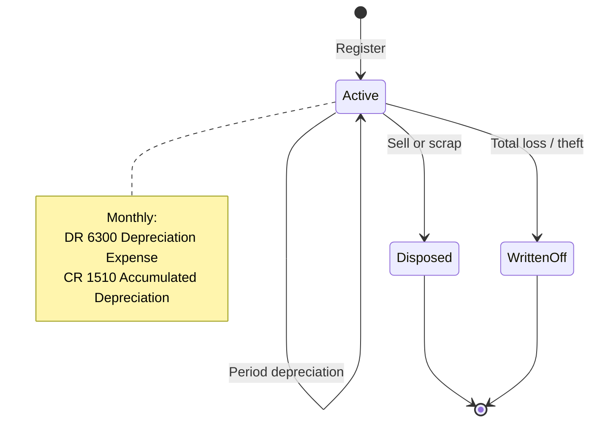
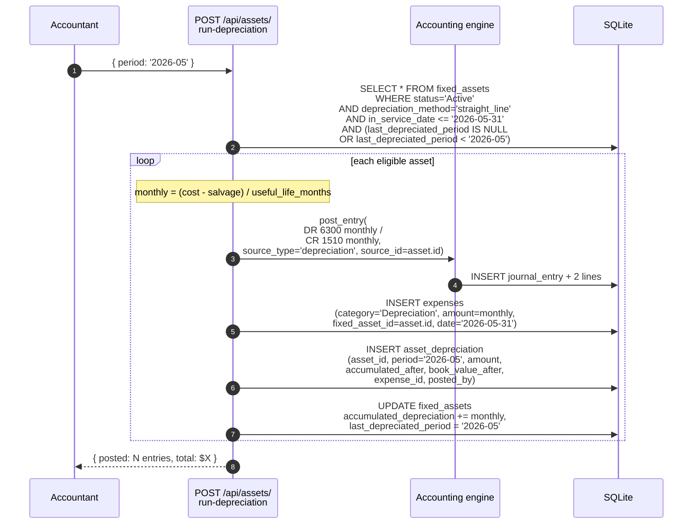
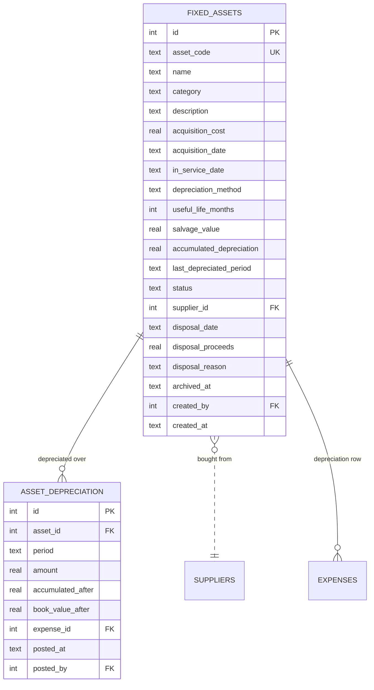

# Fixed Assets

The capital register. Trucks, computers, machinery — anything depreciable.
Straight-line depreciation runs per period and auto-posts to the GL.

## Purpose

Fixed assets differ from inventory and expenses in two ways:

1. They live on the **Balance Sheet** at acquisition cost minus accumulated
   depreciation, rather than hitting the Income Statement at purchase
2. The cost flows to the Income Statement **over time** via depreciation —
   one period at a time, auto-posted

The system models this with **two tables**: `fixed_assets` (the register)
and `asset_depreciation` (the per-period postings).

## Personas

| Persona | What they do here |
|---|---|
| **Accountant** | Adds new assets, runs depreciation for the period, posts disposals |
| **Finance Manager** | Reviews book value, approves disposals, audits depreciation schedule |
| **Operations Manager** | Identifies assets ready for disposal or write-down |
| **Auditor** | Verifies depreciation arithmetic, reconciles register to GL `1500 Fixed Assets` and `1510 Accumulated Depreciation` |

## Quick reference

- **Asset codes**: vendor-configurable; default `FA-NNNN`
- **Depreciation methods**: `straight_line` or `none`
- **Useful life**: in months
- **Salvage value**: residual amount at end of life (default 0)
- **Status**: `Active` (default), `Disposed`, `Written Off`
- **Auto-posting**: each period's depreciation creates a JE + an `expenses` row

---

=== "Operator's view"

    ### Registering a new asset

    Fixed Assets → **+ Add asset**:

    | Field | Notes |
    |---|---|
    | Asset code | E.g. `FA-2026-0001`; can be auto-generated |
    | Name | "Delivery van #3" |
    | Category | Free text |
    | Acquisition cost | Total cost in USD |
    | Acquisition date | When purchased |
    | In-service date | When it started being used (depreciation begins here) |
    | Depreciation method | `straight_line` or `none` |
    | Useful life (months) | E.g. 60 for a 5-year asset |
    | Salvage value | Optional; default 0 |
    | Supplier | Optional FK to suppliers |

    Save. The asset lands in **Active** status with `accumulated_depreciation=0`.

    ### Running depreciation for a period

    Once per month: Fixed Assets → **Run depreciation for period**. The
    system:

    1. Picks every Active asset with `in_service_date ≤ period end`
    2. Computes `monthly_depreciation = (acquisition_cost − salvage_value) ÷ useful_life_months`
    3. Skips assets where `last_depreciated_period ≥ this period` (idempotent)
    4. For each: posts one JE + one expense row

    | JE line | Account | Amount |
    |---|---|---|
    | Debit | `6300 Depreciation Expense` | monthly_depreciation |
    | Credit | `1510 Accumulated Depreciation` | monthly_depreciation |

    Plus a row in `asset_depreciation`:

    | Field | Value |
    |---|---|
    | asset_id | FK |
    | period | `YYYY-MM` |
    | amount | monthly_depreciation |
    | accumulated_after | running total |
    | book_value_after | acquisition_cost − accumulated_after |
    | expense_id | FK to the `expenses` row |

    The `expenses` row keeps the cash-basis Finance dashboard's monthly
    expenses in sync.

    ### Disposing an asset

    Asset detail → **Dispose**:

    | Field | Notes |
    |---|---|
    | Disposal date | When |
    | Disposal proceeds | What you got (sold) or 0 (scrapped) |
    | Disposal reason | Free text |

    The system computes **gain/loss** = `proceeds − book_value` and posts:

    - **Gain** (proceeds > book value): `DR Cash CR 4900 Other Income`
    - **Loss** (proceeds < book value): `DR 6900 General & Other Expense CR Cash` (loss portion)

    Plus accumulates depreciation cleared and asset status → `Disposed`.

    ### Capex approval (optional)

    If the customer's policy says "any asset > $10,000 needs Finance
    Manager approval before posting", set up an approval policy. The
    asset stays in **Pending Approval** until the policy clears.

=== "Administrator's view"

    ### Permissions

    | Role | view | create | edit | delete | approve |
    |---|---|---|---|---|---|
    | Accountant | ✅ | ✅ | ✅ | ✗ | ✗ |
    | Finance Manager | ✅ | ✅ | ✅ | ✗ | ✅ |
    | Operations Manager | ✅ | ✗ | ✗ | ✗ | ✗ |
    | Auditor | ✅ | ✗ | ✗ | ✗ | ✗ |

    ### Asset code scheme

    Vendor-configurable. Default `FA-YYYY-NNNN` with the sequence per
    year. Codes are unique across all status (active + disposed + archived).

    ### Depreciation idempotency

    The system uses `last_depreciated_period` to prevent double-posting.
    Running the period-end job twice the same month creates **zero**
    additional entries on the second run.

    To regenerate a specific period (after a correction), reverse the
    period's JE manually, then back-date `last_depreciated_period` and
    re-run.

    ### Depreciation timing

    Run depreciation **as part of the period-close playbook** (step 3, see
    [Period close](period-close.md)). The amount hits the Income
    Statement for the period being closed.

=== "Auditor's view"

    ### Asset register ties to GL

    The headline reconciliation:

    ```sql
    -- Asset register sum
    SELECT SUM(acquisition_cost) AS register_cost,
           SUM(accumulated_depreciation) AS register_acc_dep,
           SUM(acquisition_cost - accumulated_depreciation) AS register_book_value
    FROM fixed_assets
    WHERE archived_at IS NULL AND status = 'Active';

    -- GL balances
    SELECT
      (SELECT SUM(jel.debit) - SUM(jel.credit)
       FROM journal_entry_lines jel
       JOIN journal_entries je ON je.id = jel.journal_entry_id
       JOIN chart_of_accounts a ON a.id = jel.account_id
       WHERE a.code = '1500' AND je.status = 'posted') AS gl_fixed_assets,
      (SELECT SUM(jel.credit) - SUM(jel.debit)
       FROM journal_entry_lines jel
       JOIN journal_entries je ON je.id = jel.journal_entry_id
       JOIN chart_of_accounts a ON a.id = jel.account_id
       WHERE a.code = '1510' AND je.status = 'posted') AS gl_acc_depr;
    ```

    Numbers should match exactly. Drift = a register entry without GL
    backing, or a GL JE for an asset outside the register.

    ### Depreciation arithmetic

    Verify the monthly amount per asset:

    ```sql
    SELECT id, name, acquisition_cost, salvage_value, useful_life_months,
           ROUND((acquisition_cost - salvage_value) / useful_life_months, 2)
             AS expected_monthly_depreciation,
           accumulated_depreciation,
           last_depreciated_period
    FROM fixed_assets
    WHERE depreciation_method = 'straight_line'
      AND status = 'Active';
    ```

    Each `asset_depreciation` row's `amount` should equal
    `expected_monthly_depreciation` (within rounding).

    ### Depreciation completeness

    Every active depreciable asset should have an entry for the current
    period:

    ```sql
    SELECT fa.id, fa.name, fa.last_depreciated_period
    FROM fixed_assets fa
    WHERE fa.status = 'Active'
      AND fa.depreciation_method = 'straight_line'
      AND fa.in_service_date <= '2026-05-31'
      AND (fa.last_depreciated_period IS NULL
        OR fa.last_depreciated_period < '2026-05');
    -- Expected: zero rows after the period close playbook is complete
    ```

    ### Disposal trail

    ```sql
    SELECT fa.asset_code, fa.name,
           fa.acquisition_cost, fa.accumulated_depreciation,
           fa.disposal_date, fa.disposal_proceeds,
           fa.disposal_proceeds
             - (fa.acquisition_cost - fa.accumulated_depreciation) AS gain_loss
    FROM fixed_assets fa
    WHERE fa.status = 'Disposed'
    ORDER BY fa.disposal_date DESC;
    ```

    Each row's gain/loss should match a `4900 Other Income` (gain) or
    `6900` (loss) JE on `disposal_date`.

---

## Asset lifecycle



## Workflow — period depreciation auto-post



## Data model



## API surface

| Endpoint | Purpose |
|---|---|
| `GET /api/assets/` | List assets |
| `POST /api/assets/` | Register asset |
| `GET /api/assets/{id}` | Detail with depreciation history |
| `PUT /api/assets/{id}` | Update |
| `POST /api/assets/{id}/dispose` | Dispose with proceeds + reason |
| `POST /api/assets/run-depreciation` | Period depreciation for all eligible |
| `GET /api/assets/summary` | KPIs (active count, total book value) |

## What's NOT supported

- Declining-balance / sum-of-years' digits / units-of-production
  depreciation. Straight-line only; the schema would extend but the
  business logic doesn't ship.
- Asset componentisation (separately depreciating a forklift's engine vs.
  body). One asset = one depreciation stream.
- Impairment write-downs as a separate workflow. Use `Written Off` status
  + a manual JE.
- Mid-month proration. Depreciation runs per **full month** — a mid-month
  in-service date depreciates the full month it's placed in service.
