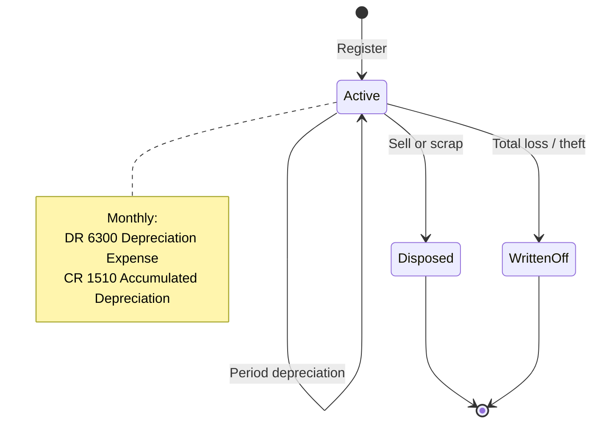

# Fixed Assets

Things the business owns and uses for years — vehicles, computers,
machinery. Not stock you sell, and not an everyday cost.

## Purpose

Buying a van is not the same as buying fuel.

Fuel is a cost this month. A van is worth something for years, so its cost
is spread across those years instead of landing in one month. That spreading
is called **depreciation**, and the system does it for you, a little each
month, and records it in the accounts automatically.

So a fixed asset shows two numbers: what you paid for it, and what it is
worth now after depreciation.

## Personas

| Persona | What they do here |
|---|---|
| **Accountant** | Adds new assets, runs depreciation for the period, posts disposals |
| **Finance Manager** | Reviews book value, approves disposals, audits depreciation schedule |
| **Operations Manager** | Identifies assets ready for disposal or write-down |
| **Auditor** | Verifies depreciation arithmetic, reconciles register to GL `1500 Fixed Assets` and `1510 Accumulated Depreciation` |

## Quick reference

- **Asset codes**: vendor-configurable; default `FA-NNNN`
- **Depreciation methods**: straight line or `none`
- **Useful life**: in months
- **Salvage value**: residual amount at end of life (default 0)
- **Status**: `Active` (default), `Disposed`, `Written Off`
- **Auto-posting**: each period's depreciation creates a journal entry and an expense

---

=== "Operator's view"

    ### Registering a new asset

    Fixed Assets → **+ Add asset**.

    | Field | Notes |
    |---|---|
    | Asset code | E.g. `FA-2026-0001`; can be auto-generated |
    | Name | "Delivery van #3" |
    | Category | Free text |
    | Acquisition cost | Total cost in USD |
    | Acquisition date | When purchased |
    | In-service date | When it started being used (depreciation begins here) |
    | Depreciation method | straight line or `none` |
    | Useful life (months) | E.g. 60 for a 5-year asset |
    | Salvage value | Optional; default 0 |
    | Supplier | Optional — who you bought it from |

    Save. The asset lands in **Active** status with no depreciation yet.

    ### Running depreciation for a period

    Once per month: Fixed Assets → **Run depreciation for period**. The
    system.

    1. Picks every Active asset already in service by the end of the month
    2. Computes the monthly amount: (cost − salvage value) ÷ life in months
    3. Skips anything already depreciated for that month, so running it
       twice changes nothing
    4. For each: posts one journal entry and one expense

    | Entry line | Account | Amount |
    |---|---|---|
    | Debit | `6300 Depreciation Expense` | the monthly amount |
    | Credit | `1510 Accumulated Depreciation` | the monthly amount |

    Plus a depreciation record against the asset.

    | Field | Value |
    |---|---|
    | Asset | which asset it belongs to |
    | period | `YYYY-MM` |
    | amount | the monthly amount |
    | Depreciation so far | running total |
    | Book value after | cost minus depreciation so far |
    | Expense | the expense it created |

    The expense keeps the cash-basis Finance dashboard's monthly
    expenses in sync.

    ### Disposing an asset

    Asset detail → **Dispose**.

    | Field | Notes |
    |---|---|
    | Disposal date | When |
    | Disposal proceeds | What you got (sold) or 0 (scrapped) |
    | Disposal reason | Free text |

    The system computes **gain/loss** = sale proceeds minus book value and posts.

    - **Gain** (proceeds > book value): `DR Cash CR 4900 Other Income`
    - **Loss** (proceeds < book value): `DR 6900 General & Other Expense CR Cash` (loss portion)

    Plus accumulates depreciation cleared and asset status → `Disposed`.

    ### Capex approval (optional)

    If the customer's policy says "any asset > $10,000 needs Finance
    Manager approval before posting", set up an approval policy. The
    asset stays in **Pending Approval** until the policy clears.

=== "Administrator's view"

    ### Permissions

    | Role | view | create | edit | delete | approve |
    |---|---|---|---|---|---|
    | Accountant | ✅ | ✅ | ✅ | ✗ | ✗ |
    | Finance Manager | ✅ | ✅ | ✅ | ✗ | ✅ |
    | Operations Manager | ✅ | ✗ | ✗ | ✗ | ✗ |
    | Auditor | ✅ | ✗ | ✗ | ✗ | ✗ |

    ### Asset code scheme

    Vendor-configurable. Default `FA-YYYY-NNNN` with the sequence per
    year. Codes are unique across all status (active + disposed + archived).

    ### Depreciation idempotency

    The system uses last depreciated period to prevent double-posting.
    Running the period-end job twice the same month creates **zero**
    additional entries on the second run.

    To regenerate a specific period (after a correction), reverse the
    period's entry by hand, then back-date the last depreciated period and
    re-run.

    ### Depreciation timing

    Run depreciation **as part of the period-close playbook** (step 3, see
    [Period close](period-close.md)). The amount hits the Income
    Statement for the period being closed.

=== "Auditor's view"

    ### Asset register ties to GL

    The headline reconciliation.

    Numbers should match exactly. Drift = a register entry without GL
    backing, or an entry for an asset that is not in the register.

    ### Depreciation arithmetic

    Verify the monthly amount per asset.

    Each depreciation record's amount should equal
    expected monthly depreciation (within rounding).

    ### Depreciation completeness

    Every active depreciable asset should have an entry for the current
    period.

    ### Disposal trail

    Each disposal's gain or loss should match a `4900 Other Income` (gain) or
    `6900` (loss) entry on the disposal date.

---

## Asset lifecycle

## What's NOT supported

- Declining-balance / sum-of-years' digits / units-of-production
  depreciation. Straight-line only.
- Asset componentisation (separately depreciating a forklift's engine vs.
  body). One asset = one depreciation stream.
- Impairment write-downs as a separate workflow. Use `Written Off` status
  plus an entry posted by hand.
- Mid-month proration. Depreciation runs per **full month** — a mid-month
  in-service date depreciates the full month it's placed in service.
