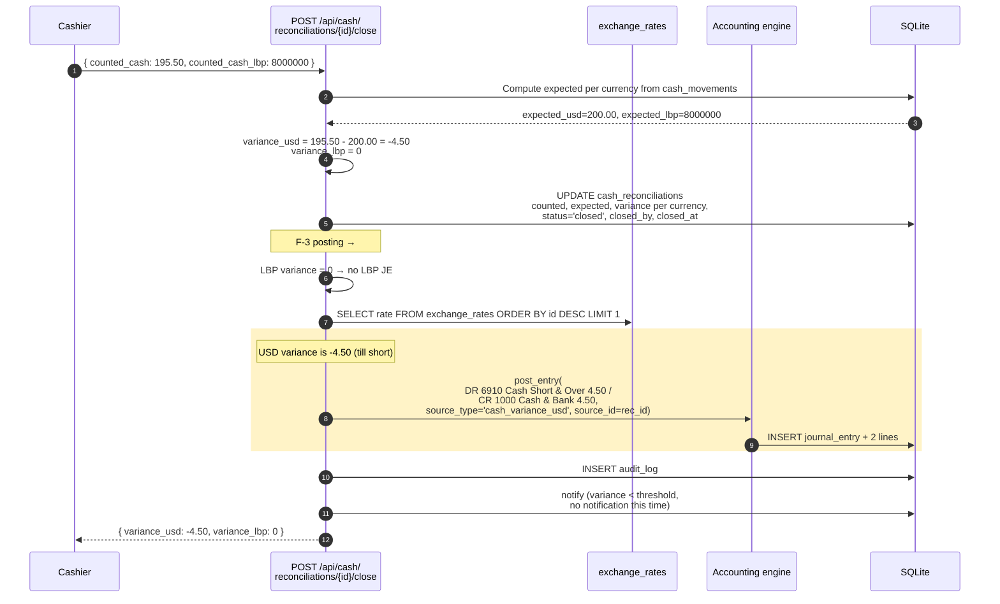
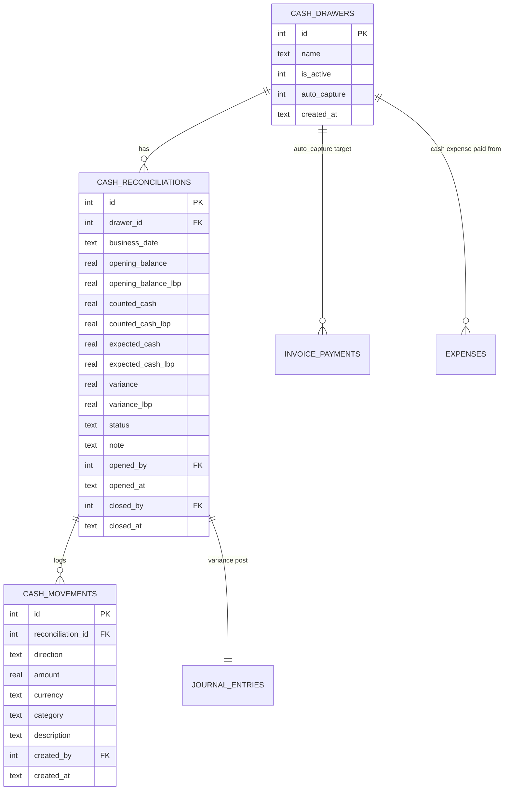

# Cash & Reconciliation

Per-drawer daily reconciliation, separately for USD and LBP. Verifies that
physical cash matches what the system says should be there — and posts any
variance to the GL (F-3 audit fix).

## Purpose

A **cash drawer** is a physical cash point (Main Till, Petty Cash, Workshop
Petty Cash, …). A **reconciliation** is one drawer-day: opening balance,
expected cash, counted cash, variance.

The system computes "expected" from real activity (cash payments + cash
expenses dated that day). The cashier counts the physical cash. Variance =
counted − expected. The F-3 audit fix posts that variance to the GL.

## Personas

| Persona | What they do here |
|---|---|
| **Cashier** | Counts the till at end of shift; closes the reconciliation |
| **Cash Manager** | Reviews variances, creates new drawers, sets auto-capture |
| **Operations Manager** | Approves recurrent variance investigations |
| **Auditor** | Reconciles physical cash trail to GL Cash account, verifies variance postings |

## Quick reference

- **One drawer is `auto_capture`** — receives all cash transactions that don't specify a drawer
- **Per-currency reconciliation** — USD and LBP counted separately (Phase 4 of multi-currency)
- **Variance posting** — F-3 audit fix: closes → GL post to 6910 Cash Short & Over
- **Thresholds** for variance alerts: ≥ $5 USD or ≥ 100,000 LBP triggers notification
- **Status**: only `open` (active reconciliation) or `closed` (finalized)

---

=== "Operator's view"

    ### Opening a reconciliation

    Cash → pick a drawer → **+ New reconciliation** for today's business
    date. Enter:

    - Opening balance USD (defaults to the prior close)
    - Opening balance LBP (same)

    Save. Reconciliation is now **open**.

    ### What "expected cash" means

    While the reconciliation is open, the system tracks:

    | Cash in | Cash out |
    |---|---|
    | Cash invoice payments dated today | Cash expenses dated today |
    | POS cash sales dated today | POS refunds (returns) |
    | Manual cash-in movements | Manual cash-out movements |

    Per currency. The dashboard shows:

    | | USD | LBP |
    |---|---|---|
    | Opening | (entered) | (entered) |
    | + Cash in | sum of today's cash payments + sales | (LBP equivalent) |
    | − Cash out | sum of today's cash expenses + refunds | (LBP equivalent) |
    | = Expected | computed | computed |
    | Counted (you fill in) | — | — |
    | Variance | counted − expected | counted − expected |

    ### Closing — the count

    End of shift:
    1. Count physical USD bills and coins → enter **Counted USD**
    2. Count physical LBP bills → enter **Counted LBP**
    3. Click **Close**

    The system posts the variance to the GL automatically (F-3 fix):

    | Variance | GL post |
    |---|---|
    | USD < 0 (till short) | `DR 6910 Cash Short & Over / CR 1000 Cash & Bank` |
    | USD > 0 (till over) | `DR 1000 Cash & Bank / CR 6910 Cash Short & Over` |
    | LBP < 0 (till short) | `DR 6910 Cash Short & Over / CR 1010 Cash — LBP` |
    | LBP > 0 (till over) | `DR 1010 Cash — LBP / CR 6910 Cash Short & Over` |

    LBP variance is translated to USD at the latest spot rate for the
    journal post.

    ### Reopening (admin only)

    If you closed by mistake (typo in the count, for example), an
    administrator can **Reopen** the reconciliation. The variance JE is
    reversed; you can re-count and re-close.

    ### Manual cash movements

    Inside an open reconciliation: **+ Add movement** records an
    out-of-band cash event (cash withdrawal, owner draw, ad-hoc
    safe-load):

    - Direction: `in` or `out`
    - Amount, currency
    - Category (free text)
    - Description

    Manual movements affect the **expected cash** computation but **do
    NOT auto-post to the GL** — that's the operator's separate journal
    entry decision.

=== "Administrator's view"

    ### Permissions

    | Role | view | create | edit | delete | approve |
    |---|---|---|---|---|---|
    | Cashier | ✅ (their drawer) | ✅ | ✅ | ✗ | ✗ |
    | Cash Manager | ✅ | ✅ | ✅ | ✅ | ✅ |
    | Finance Manager | ✅ | ✅ | ✅ | ✗ | ✅ |
    | Operations Manager | ✅ | ✅ | ✅ | ✗ | ✗ |
    | Auditor | ✅ | ✗ | ✗ | ✗ | ✗ |

    `approve` is what lets a user **reopen** a closed reconciliation —
    a high-trust action.

    ### Creating drawers

    Cash → **Drawers** tab → **+ Add drawer**:

    | Field | Notes |
    |---|---|
    | Name | "Main Till", "Workshop Petty Cash", … |
    | Active | Inactive drawers don't appear in selectors |
    | **Auto capture** | Exactly one drawer carries `auto_capture=1` |

    The auto-capture drawer is where unattributed cash transactions land
    — POS sales without a drawer, expenses without a drawer.

    Promoting a new drawer to auto-capture flips the old one off
    automatically (enforced by a uniqueness constraint).

    ### Variance thresholds

    Hard-coded in `cash.py`:

    - `_USD_THRESHOLD = 5.0` — variance ≥ $5 USD fires a notification
    - `_LBP_THRESHOLD = 100_000.0` — variance ≥ LBP 100,000 fires a notification

    At today's rate that's about $1.12 — a sensible noise floor.

    ### LBP variance translation

    The variance posting translates LBP variance to USD using the **latest
    stored exchange rate**. If no rate is configured, the LBP variance is
    **not posted** (the till-side variance is still recorded on the
    reconciliation row + surfaced in the notification).

=== "Auditor's view"

    ### Cash trail — physical → ledger

    The headline control: physical cash deposited equals GL Cash balance.

    ```sql
    -- Last close per drawer (the "trust this number" point)
    SELECT cr.id, d.name, cr.business_date,
           cr.counted_cash AS usd_counted,
           cr.counted_cash_lbp AS lbp_counted,
           cr.variance, cr.variance_lbp
    FROM cash_reconciliations cr
    JOIN cash_drawers d ON d.id = cr.drawer_id
    WHERE cr.status = 'closed'
      AND cr.closed_at = (
        SELECT MAX(closed_at) FROM cash_reconciliations
        WHERE drawer_id = cr.drawer_id AND status = 'closed'
      );
    ```

    Sum these `counted_cash` values across drawers — should equal the
    `1000 Cash & Bank` GL balance at the same point in time.

    ### Variance posting check (F-3 verification)

    Every closed reconciliation with a non-trivial variance should have a
    matching JE:

    ```sql
    SELECT cr.id, cr.business_date, d.name,
           cr.variance AS usd_variance,
           cr.variance_lbp AS lbp_variance,
           je_usd.entry_number AS usd_je,
           je_lbp.entry_number AS lbp_je
    FROM cash_reconciliations cr
    JOIN cash_drawers d ON d.id = cr.drawer_id
    LEFT JOIN journal_entries je_usd
      ON je_usd.source_type = 'cash_variance_usd' AND je_usd.source_id = cr.id
    LEFT JOIN journal_entries je_lbp
      ON je_lbp.source_type = 'cash_variance_lbp' AND je_lbp.source_id = cr.id
    WHERE cr.status = 'closed'
      AND (ABS(COALESCE(cr.variance, 0)) > 0.01
        OR ABS(COALESCE(cr.variance_lbp, 0)) > 1)
    ORDER BY cr.closed_at DESC LIMIT 20;
    ```

    NULL in the JE column with a non-zero variance = a pre-F-3 leak (or
    an LBP variance with no exchange rate, which is the documented
    no-post case).

    ### Recurring shortfalls per cashier

    Cashiers with persistent shortages need investigation:

    ```sql
    SELECT cr.closed_by_name AS cashier,
           COUNT(*) AS closes,
           SUM(CASE WHEN cr.variance < 0 THEN 1 ELSE 0 END) AS shortages,
           SUM(CASE WHEN cr.variance < 0 THEN cr.variance ELSE 0 END) AS total_short
    FROM cash_reconciliations cr
    WHERE cr.status = 'closed'
      AND cr.closed_at >= date('now', '-90 days')
    GROUP BY cr.closed_by
    HAVING shortages > 3
    ORDER BY total_short;
    ```

---

## Lifecycle


## Workflow — closing reconciliation with variance



## Data model



## API surface

| Endpoint | Purpose |
|---|---|
| `GET /api/cash/drawers` | List drawers |
| `POST /api/cash/drawers` | Create drawer |
| `PUT /api/cash/drawers/{id}` | Update (incl. set auto_capture) |
| `GET /api/cash/reconciliations` | List reconciliations (filter by drawer, date) |
| `POST /api/cash/reconciliations` | Open new |
| `POST /api/cash/reconciliations/{id}/close` | Close + variance posting |
| `POST /api/cash/reconciliations/{id}/reopen` | Reverse close (admin) |
| `POST /api/cash/reconciliations/{id}/movements` | Manual cash-in/out |
| `GET /api/cash/summary` | Per-drawer KPIs |

## What's NOT supported

- Multi-cashier per drawer per day. One reconciliation per drawer per day —
  if two cashiers share a till, the second's count happens at handover via
  a manual movement.
- Cash deposit / withdrawal to/from a bank account. Manual journal entry
  in the GL.
- Reconciliation across multiple drawers in one click. Each drawer
  reconciles independently.
