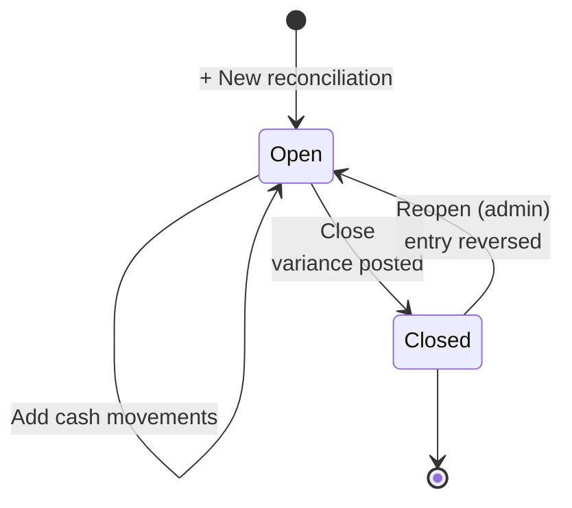

# Cash & Reconciliation

Per-drawer daily reconciliation, separately for USD and LBP. Verifies that
physical cash matches what the system says should be there — and posts any
variance to the ledger.

## Purpose

A **cash drawer** is a physical cash point (Main Till, Petty Cash, Workshop
Petty Cash, …). A **reconciliation** is one drawer-day: opening balance,
expected cash, counted cash, variance.

The system computes "expected" from real activity (cash payments + cash
expenses dated that day). The cashier counts the physical cash. Variance =
counted − expected. The system posts that variance to the ledger.

## Personas

| Persona | What they do here |
|---|---|
| **Cashier** | Counts the till at end of shift; closes the reconciliation |
| **Cash Manager** | Reviews variances, creates new drawers, sets auto-capture |
| **Operations Manager** | Approves recurrent variance investigations |
| **Auditor** | Reconciles physical cash trail to GL Cash account, verifies variance postings |

## Quick reference

- **One drawer is auto capture** — receives all cash transactions that don't specify a drawer
- **Per-currency reconciliation** — USD and LBP are counted separately
- **Variance posting** — closing a drawer posts any difference to 6910 Cash Short & Over
- **Thresholds** for variance alerts: ≥ $5 USD or ≥ 100,000 LBP triggers notification
- **Status**: only `open` (active reconciliation) or `closed` (finalized)

---

=== "Operator's view"

    ### Bank accounts

    A drawer holds notes. A **bank account** is where everything else ends up
    — transfers, cheques, card settlements — and each one you set up gets its
    own code in the chart, which is what makes its balance something you can
    hold against the statement the bank sends.

    Settings → **Bank accounts** → *Add a bank account*. Name it what the
    staff call it ("Byblos current"), and give it an opening balance if the
    account existed before the ERP did, so the figure here can be compared
    with a statement from day one.

    ### Choosing the account on a payment

    Anywhere a payment method is chosen, picking **Bank Transfer**, **Cheque**
    or **Card** reveals a *Bank account* box:

    | Where | What it covers |
    |---|---|
    | Invoices → Record payment | A customer settling one invoice |
    | Clients → Record payment | A customer settling their account |
    | POS → Checkout | A card or transfer at the counter |
    | Expenses | A bill paid out of an account |
    | Purchases → Mark paid | Settling a supplier |
    | HR → Payroll → Mark paid | Salaries leaving the business |

    The last two open a small dialog rather than a straight click, because
    marking either one paid is the moment the money actually leaves. Both
    answers are optional — press through and it behaves as it did before.

    Cash never shows the box — notes belong to a drawer, and a bank balance
    that has to reconcile must not contain them.

    Leaving it blank is allowed: the money still lands in the bank, just the
    general account rather than a named one. It is a refinement, never
    something that blocks taking a payment.

    ### Where the money goes

    Each account posts to its own ledger code, so its balance stands alone and
    two accounts never merge into one line. Cash keeps going to the till
    account for its currency.

    !!! warning "This changed"
        Every path except the customer's account payment used to post bank
        transfers to **cash**. On the default chart, cash and bank share one
        combined account and the error was invisible; on the Lebanese plan,
        where 5312 is the till and 512 is the bank, the till was overstated by
        every transfer it never received. New payments post correctly.
        Entries already made stay where they were posted — they are history —
        so a till balance that looks too high for an earlier period is that,
        and a reclassifying journal entry is the way to move it.

    ### Opening a reconciliation

    Cash → pick a drawer → **+ New reconciliation** for today's business
    date. Enter.

    - Opening balance USD (defaults to the prior close)
    - Opening balance LBP (same)

    Save. Reconciliation is now **open**.

    ### What "expected cash" means

    While the reconciliation is open, the system tracks.

    | Cash in | Cash out |
    |---|---|
    | Cash invoice payments dated today | Cash expenses dated today |
    | POS cash sales dated today | POS refunds (returns) |
    | Manual cash-in movements | Manual cash-out movements |

    Per currency. The dashboard shows.

    | | USD | LBP |
    |---|---|---|
    | Opening | (entered) | (entered) |
    | + Cash in | sum of today's cash payments + sales | (LBP equivalent) |
    | − Cash out | sum of today's cash expenses + refunds | (LBP equivalent) |
    | = Expected | computed | computed |
    | Counted (you fill in) | — | — |
    | Variance | counted − expected | counted − expected |

    ### Closing — the count

    End of shift:
    1. Count physical USD bills and coins → enter **Counted USD**
    2. Count physical LBP bills → enter **Counted LBP**
    3. Click **Close**

    The system posts the variance to the ledger automatically.

    | Variance | GL post |
    |---|---|
    | USD < 0 (till short) | `DR 6910 Cash Short & Over / CR 1000 Cash & Bank` |
    | USD > 0 (till over) | `DR 1000 Cash & Bank / CR 6910 Cash Short & Over` |
    | LBP < 0 (till short) | `DR 6910 Cash Short & Over / CR 1010 Cash — LBP` |
    | LBP > 0 (till over) | `DR 1010 Cash — LBP / CR 6910 Cash Short & Over` |

    LBP variance is translated to USD at the latest spot rate for the
    journal post.

    ### Reopening (admin only)

    If you closed by mistake (typo in the count, for example), an
    administrator can **Reopen** the reconciliation. The variance entry is
    reversed; you can re-count and re-close.

    ### Manual cash movements

    Inside an open reconciliation: **+ Add movement** records an
    out-of-band cash event (cash withdrawal, owner draw, ad-hoc
    safe-load).

    - Direction: `in` or `out`
    - Amount, currency
    - Category (free text)
    - Description

    Manual movements affect the **expected cash** computation but **do
    NOT auto-post to the GL** — that's the operator's separate journal
    entry decision.

=== "Administrator's view"

    ### Permissions

    | Role | view | create | edit | delete | approve |
    |---|---|---|---|---|---|
    | Cashier | ✅ (their drawer) | ✅ | ✅ | ✗ | ✗ |
    | Cash Manager | ✅ | ✅ | ✅ | ✅ | ✅ |
    | Finance Manager | ✅ | ✅ | ✅ | ✗ | ✅ |
    | Operations Manager | ✅ | ✅ | ✅ | ✗ | ✗ |
    | Auditor | ✅ | ✗ | ✗ | ✗ | ✗ |

    `approve` is what lets a user **reopen** a closed reconciliation —
    a high-trust action.

    ### Creating drawers

    Cash → **Drawers** tab → **+ Add drawer**.

    | Field | Notes |
    |---|---|
    | Name | "Main Till", "Workshop Petty Cash", … |
    | Active | Inactive drawers don't appear in selectors |
    | **Auto capture** | Exactly one drawer carries auto-capture switched on |

    The auto-capture drawer is where unattributed cash transactions land
    — POS sales without a drawer, expenses without a drawer.

    Promoting a new drawer to auto-capture flips the old one off
    automatically (enforced by a uniqueness constraint).

    ### Variance thresholds

    Hard-coded in `cash.py`.

    - `_USD_THRESHOLD = 5.0` — variance ≥ $5 USD fires a notification
    - `_LBP_THRESHOLD = 100_000.0` — variance ≥ LBP 100,000 fires a notification

    At today's rate that's about $1.12 — a sensible noise floor.

    ### LBP variance translation

    The variance posting translates LBP variance to USD using the **latest
    stored exchange rate**. If no rate is configured, the LBP variance is
    **not posted** (the till-side variance is still recorded on the
    reconciliation, and surfaced in the notification).

=== "Auditor's view"

    ### Cash trail — physical → ledger

    The headline control: physical cash deposited equals GL Cash balance.

    Sum these counted cash values across drawers — should equal the
    `1000 Cash & Bank` GL balance at the same point in time.

    ### Checking variances were posted

    Every closed reconciliation with a non-trivial variance should have a
    matching entry.

    An empty entry column with a non-zero variance means nothing was posted (or
    an LBP variance with no exchange rate, which is the documented
    no-post case).

    ### Recurring shortfalls per cashier

    Cashiers with persistent shortages need investigation.

---

## Lifecycle

## What's NOT supported

- Multi-cashier per drawer per day. One reconciliation per drawer per day —
  if two cashiers share a till, the second's count happens at handover via
  a manual movement.
- Cash deposit / withdrawal to/from a bank account. Manual journal entry
  in the GL.
- Reconciliation across multiple drawers in one click. Each drawer
  reconciles independently.
