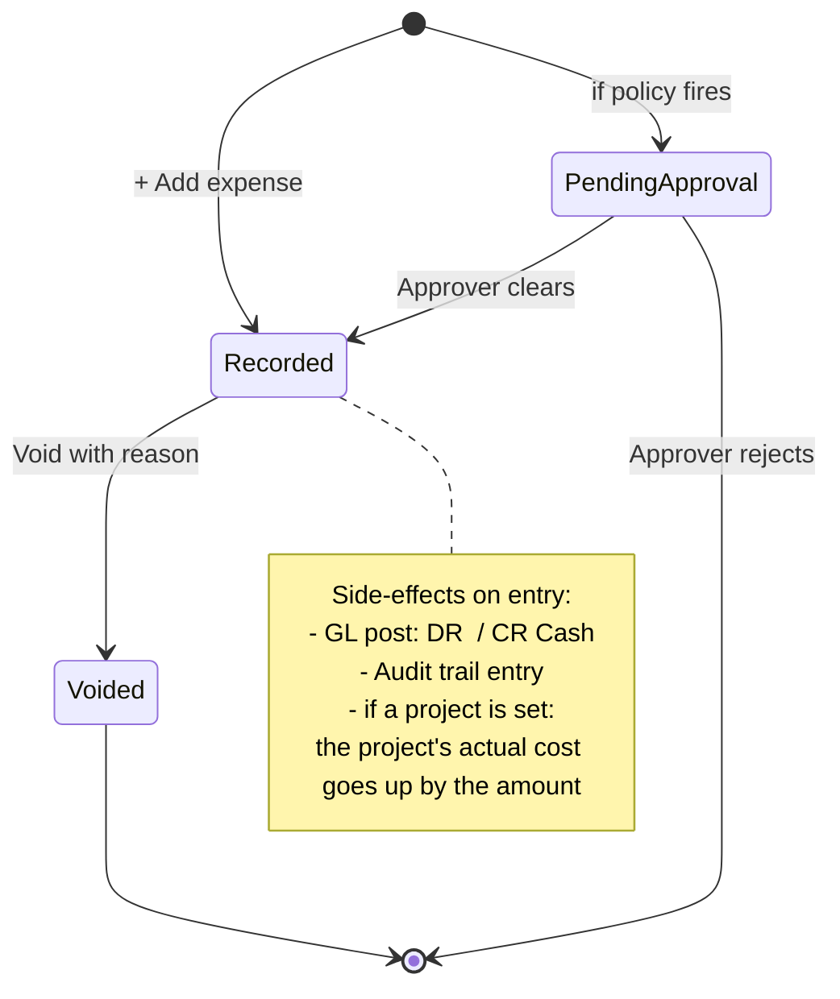

# Expenses & Recurring Expenses

Money going out — rent, fuel, salaries paid outside payroll, anything that
is not stock you bought or an asset you own.

## Purpose

An expense records one payment out of the business: what it was for, how
much, when, and optionally which project it belongs to. It is posted to the
accounts for you.

**Recurring expenses** are for costs that repeat — rent every month, a
subscription every year. You set the template once and the system creates
the expense each time it falls due, so nobody has to remember.

## Personas

| Persona | What they do here |
|---|---|
| **Accountant** | Records expenses, voids mistakes, runs reports |
| **Project Manager** | Reads project expenses for budget vs. actual |
| **Finance Manager** | Approves above-threshold expenses, manages recurring templates |
| **Operations Manager** | Records purchases / subcontracts |
| **Auditor** | Checks expenses against the ledger, samples high-value expenses for documentation |

## Quick reference

- **14 categories**: Rent, Utilities, Materials, Equipment, Transport,
  Subcontractor, Salary, Payroll, Permits, Subscription, Insurance,
  Depreciation, Purchase, Other
- **Per-category GL routing**: each maps to a specific 6xxx account
- **Status**: `Recorded` (default) or `Pending Approval` (if a policy kicks in)
- **Soft delete + void**: void preserves the record with void reason
- **Multi-currency**: the payment method records how it was paid, but the amount is USD
- **Recurring frequencies**: `monthly`, `quarterly`, `annual`

---

=== "Operator's view"

    ### Recording a one-off expense

    Expenses → **+ Add expense**.

    | Field | Notes |
    |---|---|
    | Category | Pick from the 14 standard categories |
    | Description | Free text — what was bought / for whom |
    | Amount | In USD |
    | Date | When it was incurred |
    | Project | Optional — allocates the cost to a project's actual cost |
    | Tax rate | Optional |
    | Payment method | `Cash`, `Bank Transfer`, `Card`, … |
    | Cash drawer | Required if the payment method is Cash |

    Save. The expense is **Recorded** immediately (or **Pending Approval**
    if a policy applies — see Administrator's view).

    ### Voiding an expense

    Open the expense → **Void** with a required reason. It stays in
    the database with void date + void reason, but is excluded from
    Finance totals + reports + the cash dashboard.

    Cannot edit a Recorded expense — for a correction, void and re-record.

    ### Recurring expense templates

    Use these for rent, subscriptions, utilities — anything that happens
    on a schedule.

    Recurring Expenses → **+ Add template**.

    | Field | Notes |
    |---|---|
    | Name | E.g. "Office rent" |
    | Category | Maps to a GL account |
    | Amount | The recurring amount in USD |
    | Frequency | `monthly`, `quarterly`, `annual` |
    | Start date | First occurrence |
    | End date | Optional — leave blank for indefinite |
    | Project, payment method, tax | Optional defaults |

    Save. The system computes next run date from the frequency.

    ### How recurring becomes actual

    On a scheduled tick (or manual **Run due**), the system.

    1. Finds templates with a next run date of today or earlier, still switched on
    2. For each: creates a real expense with the template's
       values + recurring expense id linking back
    3. Updates the template's last generated date and bumps
       next run date by the frequency

    You can pause a template by switching it off without deleting it.

=== "Administrator's view"

    ### Permissions

    | Role | view | create | edit | delete | approve |
    |---|---|---|---|---|---|
    | Accountant | ✅ | ✅ | ✅ | ✗ | ✗ |
    | Finance Manager | ✅ | ✅ | ✅ | ✗ | ✅ |
    | Project Manager | ✅ (their projects) | ✅ | ✗ | ✗ | ✗ |
    | Procurement Officer | ✅ | ✅ | ✗ | ✗ | ✗ |
    | Auditor | ✅ | ✗ | ✗ | ✗ | ✗ |

    ### Category → GL account mapping

    Hard-coded in `accounting.CATEGORY_ACCOUNTS`.

    | Category | GL account |
    |---|---|
    | Rent | 6100 Rent |
    | Utilities | 6200 Utilities |
    | Materials | 6400 Materials |
    | Labour | 6500 Labour |
    | Equipment | 6600 Equipment |
    | Transport | 6700 Transport |
    | Subcontractor | 6800 Subcontractor |
    | Insurance | 6850 Insurance |
    | Subscription | 6860 Subscriptions |
    | Permits | 6870 Permits & Fees |
    | Salary / Payroll | 6000 Salaries & Wages |
    | Depreciation | 6300 Depreciation Expense |
    | Purchase | 5000 Cost of Goods Sold |
    | Other | 6900 General & Other Expense |

    ### Approval policies

    Common policies on expenses:
    - "Expenses > $5,000 need Finance Manager approval"
    - "Expenses tagged with category=Subcontractor need Operations Manager approval"

    When a policy fires, the expense status moves to `Pending Approval` and
    the GL post is **deferred** until the approval clears. See [Approvals](../people/index.md).

    ### Recurring expense scheduler

    A background thread checks for due templates every hour. Manual
    trigger.

    **Expenses → Recurring → Run due now.**

    Running it twice the same day is safe — you will not get duplicate
    expenses. Each expense moves on to its next due date as it is created.

=== "Auditor's view"

    ### Expense → GL reconciliation

    Every recorded expense should have a matching journal entry.

    An expense with no journal entry behind it is a gap worth asking
    about. When tax was charged, the tax is posted separately to
    *2100 VAT Payable* rather than lumped into the expense.

    ### Voided expenses

    Each void should have an audit-trail entry and a Finance Manager (or higher)
    approval if the policy requires it.

    ### Recurring template completeness

    No active template should be "stale" (its next run date long past).

    ### Project allocation totals

    Compare to the project's running actual cost — the two
    should equal within rounding.

---

## Expense lifecycle

## What's NOT supported

- Several lines on one expense. Each expense is one amount in one category;
  for mixed categories, enter them separately.
- Multi-currency expense amounts. Always USD. Payment method captures the
  tender but the amount is the USD-equivalent.
- Expense claim workflow (employee submits → manager approves → finance pays).
  The approval engine handles the approve step; the rest is operational.
