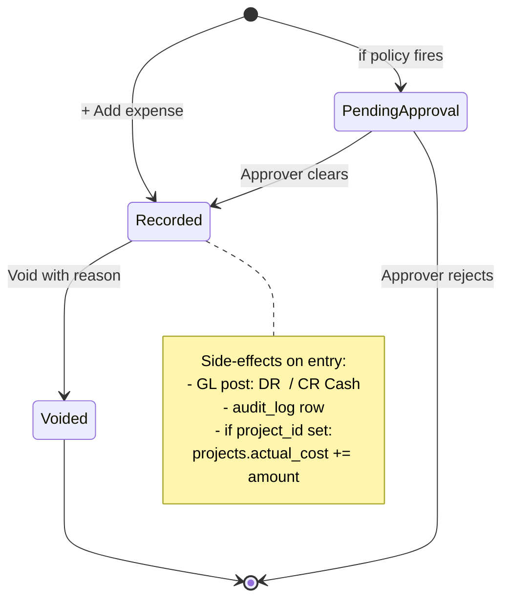
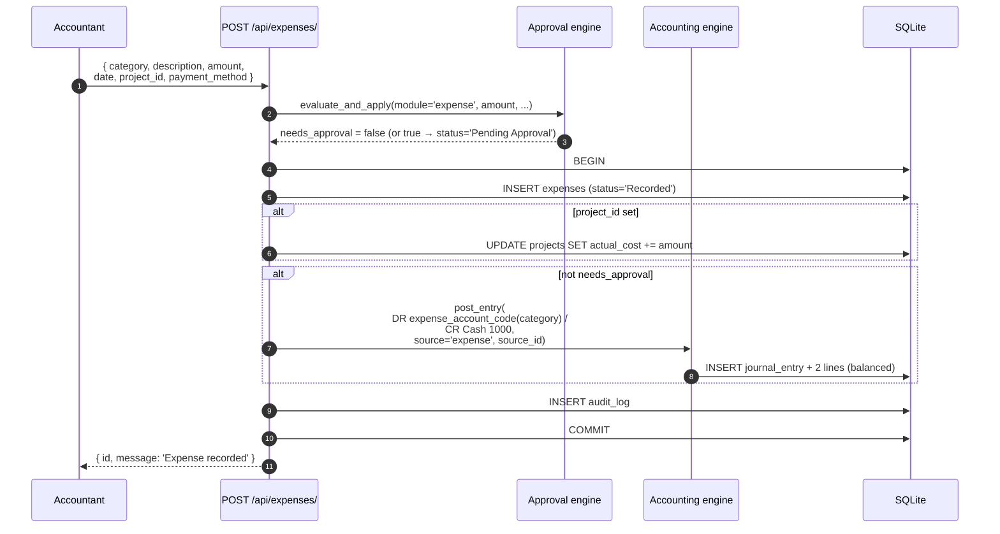
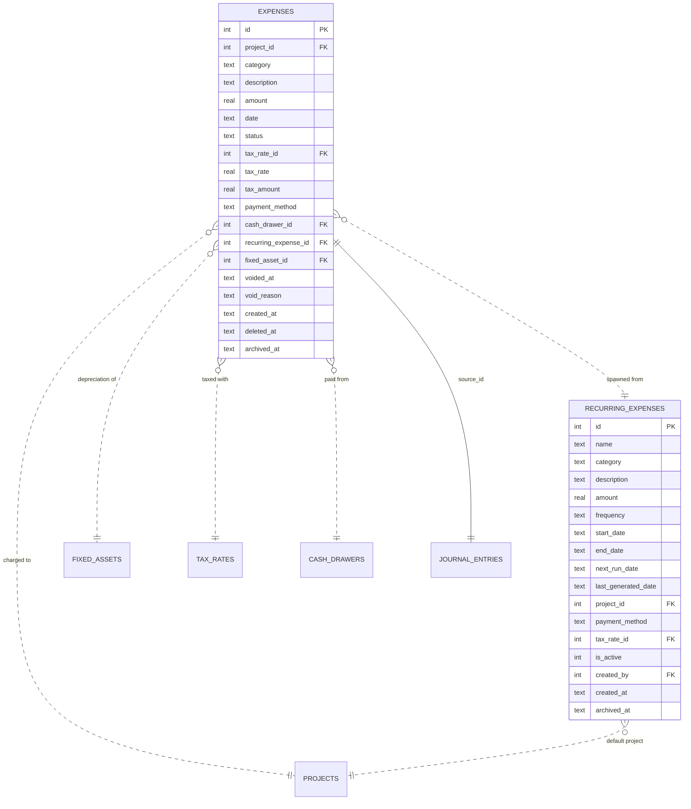

# Expenses & Recurring Expenses

The cost record. Every dollar that leaves the company (except inventory
purchases at receipt and payroll) flows through here.

## Purpose

An expense is a **single cost event** — money out the door. The system models
both **one-off** expenses (`expenses` table) and **recurring templates**
(`recurring_expenses` table) that spawn one-off expenses on a schedule.

Every expense:

- Records the **what** (`category`, `description`)
- Records the **how much** (`amount`, plus optional `tax_amount`)
- Records the **when** (`date`)
- Optionally allocates to a **project** (`project_id`)
- May reference a **cash drawer** (for cash payments)
- Auto-posts to the GL

## Personas

| Persona | What they do here |
|---|---|
| **Accountant** | Records expenses, voids mistakes, runs reports |
| **Project Manager** | Reads project expenses for budget vs. actual |
| **Finance Manager** | Approves above-threshold expenses, manages recurring templates |
| **Operations Manager** | Records purchases / subcontracts |
| **Auditor** | Reconciles expense rows to GL, samples high-value expenses for documentation |

## Quick reference

- **14 categories**: Rent, Utilities, Materials, Equipment, Transport,
  Subcontractor, Salary, Payroll, Permits, Subscription, Insurance,
  Depreciation, Purchase, Other
- **Per-category GL routing**: each maps to a specific 6xxx account
- **Status**: `Recorded` (default) or `Pending Approval` (if a policy kicks in)
- **Soft delete + void**: void preserves the record with `void_reason`
- **Multi-currency**: payment_method captures the tender but amount is USD
- **Recurring frequencies**: `monthly`, `quarterly`, `annual`

---

=== "Operator's view"

    ### Recording a one-off expense

    Expenses → **+ Add expense**:

    | Field | Notes |
    |---|---|
    | Category | Pick from the 14 standard categories |
    | Description | Free text — what was bought / for whom |
    | Amount | In USD |
    | Date | When it was incurred |
    | Project | Optional — allocates the cost to a project's `actual_cost` |
    | Tax rate | Optional |
    | Payment method | `Cash`, `Bank Transfer`, `Card`, … |
    | Cash drawer | Required if payment_method is Cash |

    Save. The expense is **Recorded** immediately (or **Pending Approval**
    if a policy applies — see Administrator's view).

    ### Voiding an expense

    Open the expense → **Void** with a required reason. The row stays in
    the database with `voided_at` + `void_reason`, but is excluded from
    Finance totals + reports + the cash dashboard.

    Cannot edit a Recorded expense — for a correction, void and re-record.

    ### Recurring expense templates

    Use these for rent, subscriptions, utilities — anything that happens
    on a schedule.

    Recurring Expenses → **+ Add template**:

    | Field | Notes |
    |---|---|
    | Name | E.g. "Office rent" |
    | Category | Maps to a GL account |
    | Amount | The recurring amount in USD |
    | Frequency | `monthly`, `quarterly`, `annual` |
    | Start date | First occurrence |
    | End date | Optional — leave blank for indefinite |
    | Project, payment method, tax | Optional defaults |

    Save. The system computes `next_run_date` from the frequency.

    ### How recurring becomes actual

    On a scheduled tick (or manual **Run due**), the system:

    1. Finds templates with `next_run_date ≤ today` and `is_active = 1`
    2. For each: spawns an actual `expenses` row with the template's
       values + `recurring_expense_id` linking back
    3. Updates the template's `last_generated_date` and bumps
       `next_run_date` by the frequency

    You can pause a template via `is_active=0` without deleting it.

=== "Administrator's view"

    ### Permissions

    | Role | view | create | edit | delete | approve |
    |---|---|---|---|---|---|
    | Accountant | ✅ | ✅ | ✅ | ✗ | ✗ |
    | Finance Manager | ✅ | ✅ | ✅ | ✗ | ✅ |
    | Project Manager | ✅ (their projects) | ✅ | ✗ | ✗ | ✗ |
    | Procurement Officer | ✅ | ✅ | ✗ | ✗ | ✗ |
    | Auditor | ✅ | ✗ | ✗ | ✗ | ✗ |

    ### Category → GL account mapping

    Hard-coded in `accounting.CATEGORY_ACCOUNTS`:

    | Category | GL account |
    |---|---|
    | Rent | 6100 Rent |
    | Utilities | 6200 Utilities |
    | Materials | 6400 Materials |
    | Labour | 6500 Labour |
    | Equipment | 6600 Equipment |
    | Transport | 6700 Transport |
    | Subcontractor | 6800 Subcontractor |
    | Insurance | 6850 Insurance |
    | Subscription | 6860 Subscriptions |
    | Permits | 6870 Permits & Fees |
    | Salary / Payroll | 6000 Salaries & Wages |
    | Depreciation | 6300 Depreciation Expense |
    | Purchase | 5000 Cost of Goods Sold |
    | Other | 6900 General & Other Expense |

    ### Approval policies

    Common policies on expenses:
    - "Expenses > $5,000 need Finance Manager approval"
    - "Expenses tagged with category=Subcontractor need Operations Manager approval"

    When a policy fires, the expense status moves to `Pending Approval` and
    the GL post is **deferred** until the approval clears. See [Approvals](../people/index.md) (Phase 5).

    ### Recurring expense scheduler

    A background thread checks for due templates every hour. Manual
    trigger:

    `POST /api/recurring-expenses/run-due`

    The handler is **idempotent** — running it twice the same day doesn't
    create duplicate expense rows (the `next_run_date` advances on each
    spawn).

=== "Auditor's view"

    ### Expense → GL reconciliation

    Every recorded expense should have a matching journal entry:

    ```sql
    SELECT e.id, e.category, e.amount, e.date,
           je.entry_number, jel.debit AS posted_debit, a.code
    FROM expenses e
    LEFT JOIN journal_entries je
      ON je.source_type = 'expense' AND je.source_id = e.id
    LEFT JOIN journal_entry_lines jel
      ON jel.journal_entry_id = je.id AND jel.debit > 0
    LEFT JOIN chart_of_accounts a ON a.id = jel.account_id
    WHERE e.deleted_at IS NULL AND e.voided_at IS NULL
      AND e.status = 'Recorded'
      AND DATE(e.created_at) >= '2026-05-01'
    ORDER BY e.date DESC LIMIT 20;
    ```

    Every row should show a non-null `entry_number`. NULLs = expense
    recorded without GL post (control gap).

    Posted debit should equal `amount + tax_amount` (when tax > 0, the tax
    splits to 2100 VAT Payable).

    ### Voided expenses

    ```sql
    SELECT e.id, e.amount, e.voided_at, e.void_reason,
           u.username AS voided_by
    FROM expenses e
    LEFT JOIN audit_log a
      ON a.module='expenses' AND a.action='void' AND a.record_id=e.id
    LEFT JOIN users u ON u.id = a.user_id
    WHERE e.voided_at IS NOT NULL
    ORDER BY e.voided_at DESC;
    ```

    Each void should have an audit row + a Finance Manager (or higher)
    approval if the policy requires it.

    ### Recurring template completeness

    No active template should be "stale" (next_run far in the past):

    ```sql
    SELECT id, name, frequency, next_run_date, last_generated_date
    FROM recurring_expenses
    WHERE is_active = 1
      AND date(next_run_date) < date('now', '-7 days');
    -- Expected: zero rows (the scheduler should keep next_run_date current)
    ```

    ### Project allocation totals

    ```sql
    SELECT p.id, p.name, p.estimated_cost,
           COALESCE(SUM(e.amount), 0) AS total_expense
    FROM projects p
    LEFT JOIN expenses e ON e.project_id = p.id
                          AND e.deleted_at IS NULL
                          AND e.voided_at IS NULL
                          AND e.status = 'Recorded'
    WHERE p.deleted_at IS NULL
    GROUP BY p.id
    ORDER BY total_expense DESC;
    ```

    Compare to `projects.actual_cost` (maintained denormally) — the two
    should equal within rounding.

---

## Expense lifecycle



## Workflow — recording an expense atomically



## Data model



## API surface

| Endpoint | Purpose |
|---|---|
| `GET /api/finance/expenses` | List expenses (filter by category, project, date) |
| `POST /api/finance/expenses` | Create expense |
| `PATCH /api/finance/expenses/{id}/void` | Void with reason |
| `GET /api/recurring-expenses/` | List templates |
| `POST /api/recurring-expenses/` | Create template |
| `PUT /api/recurring-expenses/{id}` | Update |
| `POST /api/recurring-expenses/{id}/toggle` | Pause/resume (is_active flip) |
| `POST /api/recurring-expenses/run-due` | Manual scheduler trigger |

## What's NOT supported

- Per-line expense detail (multiple lines on one expense row). Each expense
  is one row, one category. For mixed categories, split into multiple expenses.
- Multi-currency expense amounts. Always USD. Payment method captures the
  tender but the amount is the USD-equivalent.
- Expense claim workflow (employee submits → manager approves → finance pays).
  The approval engine handles the approve step; the rest is operational.
