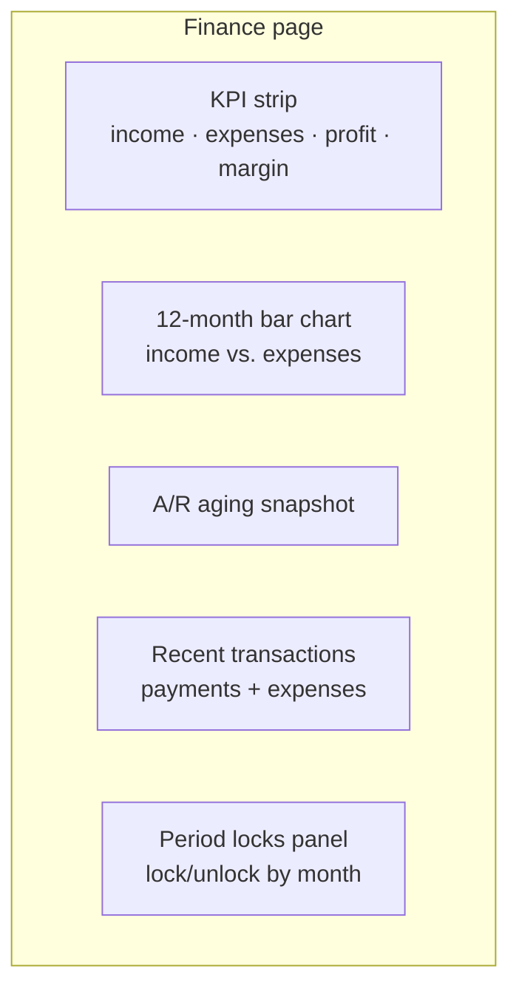

# Finance dashboard

The cash-basis P&L view. Real-time, simple, and the daily-driver for owners
and finance managers.

## Purpose

Finance dashboard is **NOT** the accounting GL. It's a cash-basis derivative
view that answers "did we make money this month?" without requiring you to
read journal entries.

Two simple definitions.

| Field | Computed from |
|---|---|
| **Monthly income** | the total of payments received where payment date is this month |
| **Monthly expenses** | Every expense dated this month, added up |

Profit = income − expenses. Margin = profit ÷ income.

## Personas

| Persona | What they read here |
|---|---|
| **Owner / CEO** | Glance at monthly profit, margin, A/R |
| **Finance Manager** | Period locks, recurring expense oversight |
| **Accountant** | Cross-reference to journal-entry truth |
| **Auditor** | Reconcile cash-basis view to accrual GL |

## What's on the screen

---

=== "Operator's view"

    ### What the numbers mean

    | KPI | Definition | Notes |
    |---|---|---|
    | Monthly revenue | Sum of payments received this month | Cash basis — only paid invoices count |
    | Monthly expenses | Every expense dated this month, added up | Includes purchases-paid + payroll-paid |
    | Net profit | Revenue − Expenses | The cash-basis number |
    | Margin | Profit ÷ Revenue × 100 | Negative = operating loss |

    ### Smart Insights

    The panel under the KPI strip is a scan of the whole business, not a
    summary of the numbers above it. Every time the reporting window changes
    the server reads the modules you have permission to see and reports what
    is worth acting on — with the count of records it read in the header, so
    you can tell how much it actually looked at.

    | Area | What it looks for |
    |---|---|
    | Trend and margin | Profit and revenue against the previous period, margin health, break-even proximity, revenue volatility |
    | Receivables | Invoices past due, the open book against billing, and how many days customers take to pay |
    | Inventory | Stock with no sale in 90 days, items below their reorder point, sellers that are out of stock, anything priced under cost |
    | Sales | A customer who has become most of the revenue, discount given away as a share of billing, the line that drives the most |
    | Quotations | Acceptance rate, and quotes sent and never answered |
    | Purchasing | Orders never marked received, and a supplier who has become most of the spend |
    | Service | Completed jobs nobody invoiced, and visits past their scheduled date |
    | Projects | Jobs over budget while still running, and finished ones never billed |
    | Pipeline | Deals nobody has touched, and a pipeline too thin for the revenue it has to replace |
    | People | Payroll as a share of revenue |
    | Production | Orders stalled mid-build, and stock reserved rather than sellable |
    | Controls | Finished months left unlocked, an unclosed prior year, till closes that did not balance, a stale exchange rate |

    Two rules govern what you see. **At most two observations from any one
    area**, so a warehouse having a bad week cannot push an unbilled repair
    off the bottom of the panel. And **nothing is shown for a module you
    cannot see** — not a zero, which would be a claim about the business, but
    nothing at all.

    Every observation names a real figure from your own data and, where there
    is something to do about it, says what. Nothing here is a forecast: it is
    what the records already say, read across modules that otherwise only ever
    get looked at one at a time.

    ### Drilling into a number

    - Click "Monthly revenue" → opens payments filtered to this month
    - Click "Monthly expenses" → opens expenses filtered to this month
    - Click "A/R" → opens Invoice Aging report

    ### Period locks

    Bottom of the page: **Period locks** lists every month with a lock
    state. Click a month → **Lock** or **Unlock**.

    Locked months reject:
    - New expense recorded with `date` in the month
    - New invoice payment with payment date in the month
    - New manual journal entry with entry date in the month
    - Any edit to something already in the month

    Locking is the bright line between "this month is open for adjustments"
    and "the books are final".

=== "Administrator's view"

    ### Permissions

    | Role | view | create | edit | delete | approve |
    |---|---|---|---|---|---|
    | Finance Manager | ✅ | ✅ | ✅ | ✗ | ✅ |
    | Accountant | ✅ | ✅ | ✅ | ✗ | ✗ |
    | Owner | ✅ | ✗ | ✗ | ✗ | ✗ |
    | Auditor | ✅ | ✗ | ✗ | ✗ | ✗ |

    `approve` is what allows locking/unlocking periods. Typically only the
    Finance Manager.

    ### How the dashboard interacts with accounting

    The Finance dashboard reads from **two source tables**:
    - payments (income)
    - expenses (cost)

    It does **NOT** read from journal entries. That's deliberate — it's
    the cash-flow view, not the accrual GL view. To get the accrual
    picture, use Accounting → Income Statement.

    ### The dual writes — invariant

    Every time the dashboard's numbers move, the GL also moves.

    | Cash dashboard write | Matching GL post |
    |---|---|
    | A payment is recorded | Journal entry: DR Cash CR Revenue |
    | An expense is recorded | Journal entry: DR Expense CR Cash |

    The pair is atomic — either both happen or neither.
    audit fixes closed the gap.

=== "Auditor's view"

    ### Cash-basis vs. accrual

    Finance dashboard (cash basis).

    Accounting GL (accrual).

    They legitimately differ when:
    - **Inventory was purchased** — cash dashboard sees the expense (paid
      a purchase order creates an expense), the ledger does not (DR Inventory)
    - **Inventory was sold** — GL sees COGS, cash dashboard doesn't (no
      expense for stock leaving)
    - **Depreciation was posted** — GL sees expense, cash dashboard
      doesn't
    - **FX gain/loss** — same: GL only

    For an unsold inventory build-up, the **cash dashboard understates
    profit**; for a sold-from-stock period, it **overstates**. The GL is
    always the accrual truth.

    ### Period lock audit

    Every lock + unlock action is in the audit trail with `module='finance'`
    and the lock and unlock actions.

---

## What's NOT supported

- Custom KPIs / dashboards. The Finance dashboard is fixed; for custom
  analytics use Reports + Excel export.
- Per-project P&L on the dashboard. Drill into Projects for that.
- Cash-flow statement. The dashboard answers "income − expenses" — for a
  proper cash-flow statement (operating / investing / financing) use
  Accounting → Income Statement + Balance Sheet diff.
