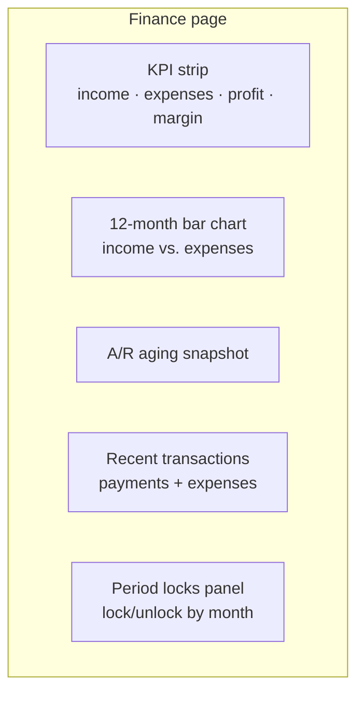
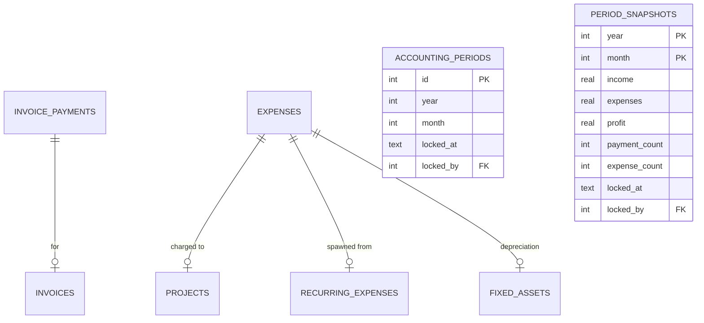

# Finance dashboard

The cash-basis P&L view. Real-time, simple, and the daily-driver for owners
and finance managers.

## Purpose

Finance dashboard is **NOT** the accounting GL. It's a cash-basis derivative
view that answers "did we make money this month?" without requiring you to
read journal entries.

Two simple definitions:

| Field | Computed from |
|---|---|
| **Monthly income** | `SUM(invoice_payments.amount)` where `paid_at` is this month |
| **Monthly expenses** | `SUM(expenses.amount)` where `date` is this month |

Profit = income − expenses. Margin = profit ÷ income.

## Personas

| Persona | What they read here |
|---|---|
| **Owner / CEO** | Glance at monthly profit, margin, A/R |
| **Finance Manager** | Period locks, recurring expense oversight |
| **Accountant** | Cross-reference to journal-entry truth |
| **Auditor** | Reconcile cash-basis view to accrual GL |

## What's on the screen



---

=== "Operator's view"

    ### What the numbers mean

    | KPI | Definition | Notes |
    |---|---|---|
    | Monthly revenue | Sum of payments received this month | Cash basis — only paid invoices count |
    | Monthly expenses | Sum of expense rows dated this month | Includes purchases-paid + payroll-paid |
    | Net profit | Revenue − Expenses | The cash-basis number |
    | Margin | Profit ÷ Revenue × 100 | Negative = operating loss |

    ### Drilling into a number

    - Click "Monthly revenue" → opens payments filtered to this month
    - Click "Monthly expenses" → opens expenses filtered to this month
    - Click "A/R" → opens Invoice Aging report

    ### Period locks

    Bottom of the page: **Period locks** lists every month with a lock
    state. Click a month → **Lock** or **Unlock**.

    Locked months reject:
    - New expense recorded with `date` in the month
    - New invoice payment with `paid_at` in the month
    - New manual journal entry with `entry_date` in the month
    - Any edit to existing rows in the month

    Locking is the bright line between "this month is open for adjustments"
    and "the books are final".

=== "Administrator's view"

    ### Permissions

    | Role | view | create | edit | delete | approve |
    |---|---|---|---|---|---|
    | Finance Manager | ✅ | ✅ | ✅ | ✗ | ✅ |
    | Accountant | ✅ | ✅ | ✅ | ✗ | ✗ |
    | Owner | ✅ | ✗ | ✗ | ✗ | ✗ |
    | Auditor | ✅ | ✗ | ✗ | ✗ | ✗ |

    `approve` is what allows locking/unlocking periods. Typically only the
    Finance Manager.

    ### How the dashboard interacts with accounting

    The Finance dashboard reads from **two source tables**:
    - `invoice_payments` (income)
    - `expenses` (cost)

    It does **NOT** read from `journal_entries`. That's deliberate — it's
    the cash-flow view, not the accrual GL view. To get the accrual
    picture, use Accounting → Income Statement.

    ### The dual writes — invariant

    Every time the dashboard's numbers move, the GL also moves:

    | Cash dashboard write | Matching GL post |
    |---|---|
    | `invoice_payments` row added | `journal_entries` row: DR Cash CR Revenue |
    | `expenses` row added | `journal_entries` row: DR Expense CR Cash |

    The pair is atomic — either both writes happen or neither. F-1 and F-2
    audit fixes closed the gap.

=== "Auditor's view"

    ### Cash-basis vs. accrual

    Finance dashboard (cash basis):
    ```sql
    SELECT
      (SELECT SUM(amount) FROM invoice_payments
       WHERE strftime('%Y-%m', paid_at) = '2026-05') AS revenue,
      (SELECT SUM(amount) FROM expenses
       WHERE strftime('%Y-%m', date) = '2026-05'
         AND deleted_at IS NULL AND voided_at IS NULL) AS expenses;
    ```

    Accounting GL (accrual):
    ```sql
    SELECT
      SUM(CASE WHEN a.type = 'Income'  THEN jel.credit - jel.debit ELSE 0 END) AS revenue,
      SUM(CASE WHEN a.type = 'Expense' THEN jel.debit - jel.credit ELSE 0 END) AS expenses
    FROM journal_entry_lines jel
    JOIN journal_entries je ON je.id = jel.journal_entry_id
    JOIN chart_of_accounts a ON a.id = jel.account_id
    WHERE strftime('%Y-%m', je.entry_date) = '2026-05'
      AND je.status = 'posted';
    ```

    They legitimately differ when:
    - **Inventory was purchased** — cash dashboard sees the expense (paid
      PO creates `expenses` row), GL doesn't (DR Inventory)
    - **Inventory was sold** — GL sees COGS, cash dashboard doesn't (no
      `expenses` row for stock leaving)
    - **Depreciation was posted** — GL sees expense, cash dashboard
      doesn't
    - **FX gain/loss** — same: GL only

    For an unsold inventory build-up, the **cash dashboard understates
    profit**; for a sold-from-stock period, it **overstates**. The GL is
    always the accrual truth.

    ### Period lock audit

    ```sql
    SELECT ap.year, ap.month, ap.locked_at,
           u.username AS locked_by
    FROM accounting_periods ap
    LEFT JOIN users u ON u.id = ap.locked_by
    ORDER BY ap.year DESC, ap.month DESC;
    ```

    Every lock + unlock action is in `audit_log` with `module='finance'`
    and `action IN ('lock_period','unlock_period')`.

---

## Data model

The Finance dashboard has **no tables of its own**. It reads from:



`period_snapshots` is the **archival** record. Once a period is locked,
its frozen totals live here independent of any later adjustments.

## API surface

| Endpoint | Purpose |
|---|---|
| `GET /api/finance/summary` | Headline KPIs for current month |
| `GET /api/finance/monthly` | 12-month trend (income + expenses + profit) |
| `GET /api/finance/recent` | Recent payments + expenses |
| `GET /api/finance/periods` | All periods with their lock state |
| `POST /api/finance/periods/{year}/{month}/lock` | Lock |
| `POST /api/finance/periods/{year}/{month}/unlock` | Unlock |
| `POST /api/finance/periods/{year}/{month}/snapshot` | Persist totals |

## What's NOT supported

- Custom KPIs / dashboards. The Finance dashboard is fixed; for custom
  analytics use Reports + Excel export.
- Per-project P&L on the dashboard. Drill into Projects for that.
- Cash-flow statement. The dashboard answers "income − expenses" — for a
  proper cash-flow statement (operating / investing / financing) use
  Accounting → Income Statement + Balance Sheet diff.
