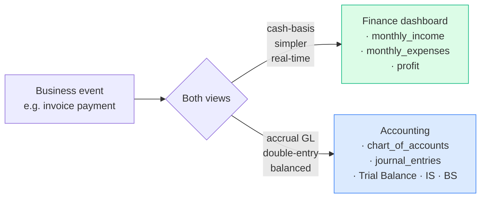

# Finance & Accounting

The books-of-record chapter. Eight modules that turn business events into
financial statements.

| Page | What it covers |
|---|---|
| [Period close workflow](period-close.md) | End-to-end month/year close. Read first. |
| [Finance dashboard](finance.md) | Cash-basis P&L view, period locks |
| [Expenses & Recurring](expenses.md) | One-off + recurring expenses, project allocation, approval gates |
| [Cash & Reconciliation](cash.md) | Per-drawer daily count, USD + LBP variance, GL posting (F-3) |
| [Fixed Assets](assets.md) | Capital register, straight-line depreciation auto-posting |
| [Accounting (GL)](accounting.md) | Chart of Accounts, journal entries, Trial Balance, IS, BS, fiscal years |
| [Reports](reports.md) | Financial, Aging, Expenses, VAT, Inventory by Warehouse |
| [Tax Rates](tax.md) | Per-rate VAT engine, applied per line |
| [Multi-currency (USD/LBP)](multi-currency.md) | F-4/F-5/F-8/F-9 audit remediation, FX gain/loss |

## Two parallel books — by design

The system maintains **two views** of the company's finances:

| Layer | Source of truth | What it answers |
|---|---|---|
| **Cash-basis Finance** | payments, expenses rows | "What's in the bank?" "What did we spend this month?" |
| **Double-entry GL** | journal entries + journal entry lines | "Show me the Trial Balance." "Are we profitable accrual-basis?" |

The two reconcile at the **payment level**: every payment row triggers a GL
post; every expense row triggers a GL post. The system's audit remediation
(F-1 through F-9) closed every gap between them.

## Personas

| Persona | Where they live in this chapter |
|---|---|
| **Accountant** | Expenses, Cash, Accounting → journal entries, Reports |
| **Finance Manager** | Finance dashboard, Reports, period locks, approvals |
| **Cashier** | Cash → close their drawer |
| **Owner / CEO** | Finance dashboard, Reports → Financial, Trial Balance |
| **External Auditor** | Accounting → Trial Balance / IS / BS, Reports → VAT |

## What the audit remediation gave you

The chapter assumes the F-1 through F-9 fixes are live. Quick reference:

| Finding | Fix |
|---|---|
| F-1 — POS sales bypassed GL | Every POS sale now posts DR Cash CR Revenue + DR COGS CR Inventory |
| F-2 — COGS not debited; purchases wrongly hit COGS | Perpetual inventory model: receipts DR Inventory, sales DR COGS |
| F-3 — Cash variance not posted | End-of-session variance posts to 6910 Cash Short & Over |
| F-4 — Missing accounts in COA | Added 1010 Cash—LBP, 4910 FX Gain, 6910 Cash Short & Over, 6920 FX Loss |
| F-5 — LBP cash hit USD account | Cash account selected by currency via `cash_account_for()` |
| F-6 — Payroll mis-posted LBP face value | Per-line salary currency snapshot + spot-rate conversion |
| F-8 — No FX revaluation | **Accounting → FX revaluation** marks LBP cash to market |
| F-9 — LBP payment without rate | Falls back to latest stored rate; explicit error if none |

Each page in this chapter references the relevant fixes.
