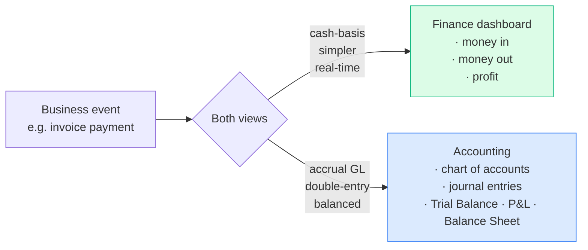

# Finance & Accounting

The books-of-record chapter. Eight modules that turn business events into
financial statements.

| Page | What it covers |
|---|---|
| [Period close workflow](period-close.md) | End-to-end month/year close. Read first. |
| [Finance dashboard](finance.md) | Cash-basis P&L view, period locks |
| [Expenses & Recurring](expenses.md) | One-off + recurring expenses, project allocation, approval gates |
| [Cash & Reconciliation](cash.md) | Per-drawer daily count, USD + LBP variance, GL posting |
| [Fixed Assets](assets.md) | Capital register, straight-line depreciation auto-posting |
| [Accounting (GL)](accounting.md) | Chart of Accounts, journal entries, Trial Balance, IS, BS, fiscal years |
| [Reports](reports.md) | Financial, Aging, Expenses, VAT, Inventory by Warehouse |
| [Tax Rates](tax.md) | Per-rate VAT engine, applied per line |
| [Multi-currency (USD/LBP)](multi-currency.md) | Working in two currencies, and FX gain and loss |

## Two parallel books — by design

The system maintains **two views** of the company's finances:

| Layer | Source of truth | What it answers |
|---|---|---|
| **Cash-basis Finance** | payments and expenses | "What's in the bank?" "What did we spend this month?" |
| **Double-entry GL** | journal entries + journal entry lines | "Show me the Trial Balance." "Are we profitable accrual-basis?" |

The two reconcile at the **payment level**: every payment posts to the
ledger, and so does every expense.

## Personas

| Persona | Where they live in this chapter |
|---|---|
| **Accountant** | Expenses, Cash, Accounting → journal entries, Reports |
| **Finance Manager** | Finance dashboard, Reports, period locks, approvals |
| **Cashier** | Cash → close their drawer |
| **Owner / CEO** | Finance dashboard, Reports → Financial, Trial Balance |
| **External Auditor** | Accounting → Trial Balance / IS / BS, Reports → VAT |

## How the two layers stay in step

Every money event writes to both layers at once, so they cannot drift.

| When this happens | The ledger records |
|---|---|
| A sale at the till | DR Cash CR Revenue, and DR Cost of Sales CR Inventory |
| Goods received on a purchase | DR Inventory — the cost sits in stock until it sells |
| A drawer closes short or over | The difference, to 6910 Cash Short & Over |
| An LBP payment | To the LBP cash account, never the USD one |
| Payroll paid | Each line at its own currency, converted at the rate of the day |
| The LBP rate moves | **Accounting → FX revaluation** restates LBP cash, and posts the gain or loss |

If an LBP payment is taken with no exchange rate set at all, the system uses
the most recent rate it has, and refuses with a clear message if there has
never been one.

