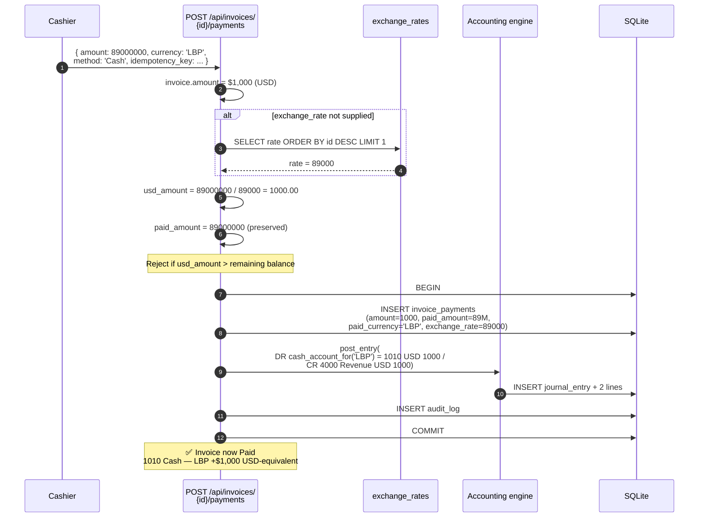
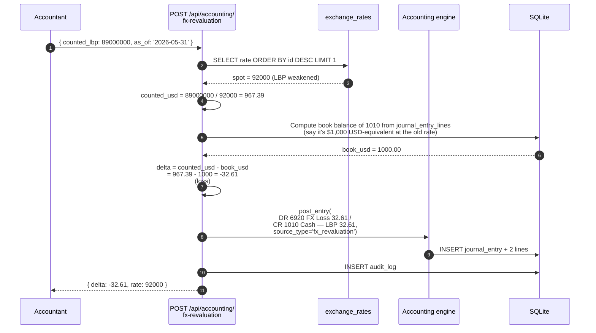
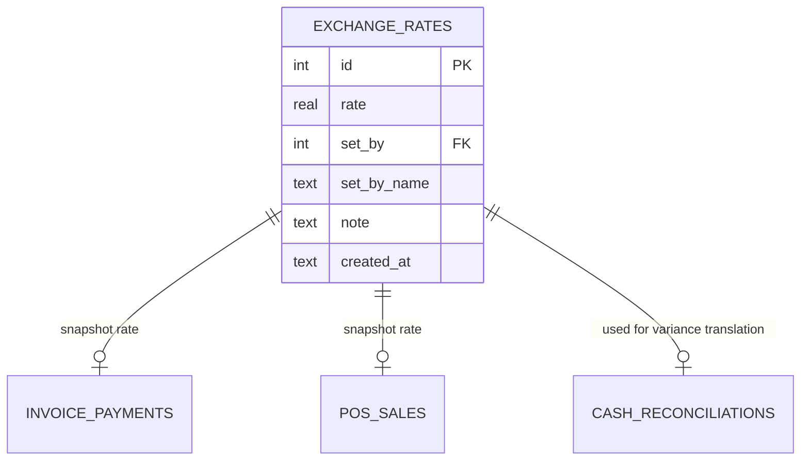

# Multi-currency (USD + LBP)

How the system represents dual-currency operations under one functional
currency (USD), with deliberate provisions for the Lebanese pound (LBP).

## Purpose

The system runs on a **single functional currency** (USD), with LBP fully
supported as a **secondary tender currency**. Every business amount stored
in the database is normalised to USD — but documents capture and preserve
the **actual tender** the operator handled.

This is the IAS 21 / SME GAAP-compatible model. The F-1 through F-9 audit
remediation closed every gap between the multi-currency UI and the
single-currency books.

## Personas

| Persona | What they care about |
|---|---|
| **Operator** | "I count what I have in pounds; the system handles the conversion." |
| **Administrator** | "Set the rate, designate accounts, run revaluation at period close." |
| **Accountant** | "Every LBP transaction routes to the right cash account; period-end FX adjustment is one click." |
| **Auditor** | "Verify no transaction silently mixed currencies; verify period-end revaluation per IAS 21." |

## Quick reference

- **Functional currency**: USD
- **Secondary currency**: LBP
- **Rate format**: `LBP per 1 USD` (e.g. 89,000)
- **Where rates are stored**: `exchange_rates` table — versioned, with `set_by` and `note`
- **Default fallback**: latest stored rate
- **Two cash accounts**: `1000 Cash & Bank` (USD) + `1010 Cash — LBP` (F-4 fix)
- **FX gain/loss accounts**: `4910 FX Gain` and `6920 FX Loss` (F-4)

---

=== "Operator's view"

    ### Receiving LBP cash from a customer

    Invoice payment screen:
    - Amount: `89000000` (what the customer hands over)
    - Currency: `LBP`
    - Exchange rate: leave blank (falls back to system rate) or override

    The system computes `usd_amount = 89,000,000 ÷ rate`. For rate 89,000
    that's exactly $1,000. The invoice settles by $1,000 USD.

    The journal post routes the cash to **1010 Cash — LBP** (not 1000).
    LBP cash stays on its own ledger line for future revaluation.

    ### POS LBP tender

    Same model. The cashier types the LBP amount; the system computes the
    USD equivalent for the sale total. The sale's GL post hits 1010.

    ### Paying an LBP-denominated payroll

    If an employee's contract is in LBP (per `hr_contracts.salary_currency`),
    payroll resolves their salary at the latest rate at mark-paid time.
    The DR Salaries posts the USD equivalent; the CR side hits 1010 Cash
    — LBP.

    F-6 fix: if no exchange rate exists and an LBP contract is in the run,
    the system **refuses to post** rather than silently treating LBP face
    value as USD.

=== "Administrator's view"

    ### Setting the rate

    Settings → **Exchange Rate** → enter the new rate + optional note →
    **Save**.

    Each save inserts a row into `exchange_rates`. The latest row by `id`
    is the active rate. History is preserved indefinitely.

    | Field | Notes |
    |---|---|
    | Rate | LBP per 1 USD (e.g. 89000) |
    | Note | "Bank rate 2026-05-15", "Customer-negotiated", … |
    | Set by | Auto-captured (`set_by` + `set_by_name`) |

    ### When to update the rate

    Practical guidance:

    - Update daily during periods of high volatility
    - Update at least once a week in stable times
    - Update specifically at month-end (before the FX revaluation step
      of [period close](period-close.md))

    ### Period-end FX revaluation

    Once a month, after locking everything else, before the period lock:

    1. Count physical LBP across all drawers
    2. Call `POST /api/accounting/fx-revaluation`:
       ```
       { "counted_lbp": 89000000, "as_of": "2026-05-31" }
       ```
    3. The system marks `1010 Cash — LBP` to the current spot rate and
       posts the delta:
       - LBP weakened → loss → DR 6920 / CR 1010
       - LBP strengthened → gain → DR 1010 / CR 4910

    F-8 audit fix.

    ### The five multi-currency accounts

    | Code | Name | Role |
    |---|---|---|
    | 1000 | Cash & Bank | USD cash + bank balances |
    | 1010 | Cash — LBP | LBP cash holdings |
    | 4910 | Foreign Exchange Gain | Realised + unrealised gains |
    | 6910 | Cash Short & Over | Till variances (F-3) |
    | 6920 | Foreign Exchange Loss | Realised + unrealised losses |

    Seeded by migration 120 (Phase 4 audit remediation).

=== "Auditor's view"

    ### LBP cash routing audit

    Every LBP payment should debit 1010, not 1000 (F-5 verification):

    ```sql
    SELECT je.entry_number, ip.paid_currency, ip.paid_amount,
           ip.exchange_rate, ip.amount AS usd,
           a.code AS posted_to
    FROM invoice_payments ip
    JOIN journal_entries je
      ON je.source_type = 'invoice_payment' AND je.source_id = ip.id
    JOIN journal_entry_lines jel ON jel.journal_entry_id = je.id
                                AND jel.debit > 0
    JOIN chart_of_accounts a ON a.id = jel.account_id
    WHERE ip.paid_currency = 'LBP'
    ORDER BY ip.paid_at DESC LIMIT 20;
    ```

    `posted_to` should consistently show `1010`. Any `1000` = pre-F-5
    transaction (or a bug).

    ### FX revaluation effect

    A revaluation entry should net to zero in the books except for the
    gain/loss recognition:

    ```sql
    SELECT je.entry_number, je.entry_date, je.memo,
           SUM(jel.debit) AS total_dr, SUM(jel.credit) AS total_cr
    FROM journal_entries je
    JOIN journal_entry_lines jel ON jel.journal_entry_id = je.id
    WHERE je.source_type = 'fx_revaluation'
    GROUP BY je.id ORDER BY je.entry_date DESC LIMIT 10;
    ```

    Every entry must balance (`total_dr = total_cr`). The size of the
    delta is the period's recognised FX gain or loss.

    ### Cash — LBP balance vs. physical reality

    At period close after revaluation, `1010 Cash — LBP` balance should
    equal `(LBP physically counted) ÷ spot_rate`:

    ```sql
    SELECT
      (SELECT SUM(jel.debit) - SUM(jel.credit)
       FROM journal_entry_lines jel
       JOIN journal_entries je ON je.id = jel.journal_entry_id
       JOIN chart_of_accounts a ON a.id = jel.account_id
       WHERE a.code = '1010' AND je.status = 'posted'
         AND je.entry_date <= '2026-05-31') AS book_usd_equivalent;
    ```

    `book_usd_equivalent × spot_rate` should equal physical LBP at month-end.

    ### Exchange rate change history

    ```sql
    SELECT id, rate, set_by_name, note, created_at
    FROM exchange_rates ORDER BY id DESC LIMIT 30;
    ```

    Inspect for unexpected spikes (potential data-entry error) or stale
    periods (rate not updated for a long time during volatility).

---

## The LBP payment journey end-to-end



## Period-end FX revaluation



## Data model



## API surface

| Endpoint | Purpose |
|---|---|
| `GET /api/settings/exchange-rate` | Latest rate + history (last 20) |
| `POST /api/settings/exchange-rate` | Record new rate |
| `POST /api/accounting/fx-revaluation` | Mark 1010 to current spot rate |

## What's NOT supported

- Currencies beyond USD + LBP. Adding EUR or GBP is a vendor-level
  extension (new cash account + adjustments to `cash_account_for`).
- Auto-pull live rates from a feed. Manual entry is the supported path —
  reflects the deliberate decision to record the rate the customer
  actually used, not whatever Reuters said.
- LBP-denominated invoices. Sales documents are always in USD; the
  multi-currency layer is at the payment level.
