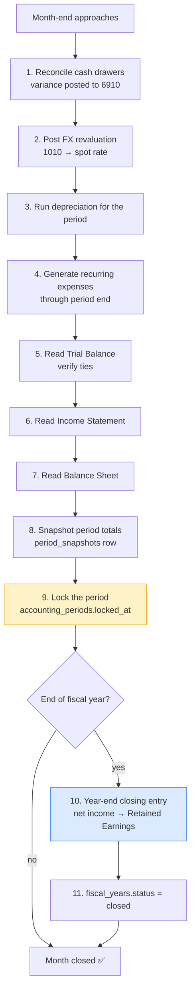
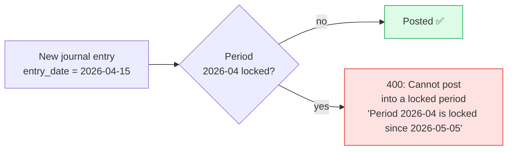

# Period close workflow

The end-of-period playbook. Run this once a month (soft close) and once a
year (hard close). The system enforces the controls; this page walks you
through them in order.

## The big picture



## Detailed steps

### 1. Reconcile cash drawers

For every drawer with activity in the period: open Cash → pick drawer →
reconcile for each business date. Close each reconciliation with the
counted USD + LBP balances. The F-3 fix posts any variance to **6910 Cash
Short & Over** automatically.

Verify there are no open reconciliations.

### 2. Post FX revaluation (if you hold LBP cash)

Count the physical LBP across all drawers, then go to
**Accounting → FX revaluation**, enter the counted amount and the date,
and save.
```

The system marks `1010 Cash — LBP` to the current spot rate and posts the
delta to `4910 FX Gain` or `6920 FX Loss`. See [Multi-currency](multi-currency.md)
for the math.

### 3. Run depreciation

Fixed Assets → **Run depreciation for period**. The system computes
straight-line depreciation for every active asset that's eligible
(in service date ≤ period end, last depreciated period < this period)
and posts.

`DR 6300 Depreciation Expense / CR 1510 Accumulated Depreciation`

One journal entry per asset, marked `source_type='depreciation'` and
`source_id=asset_id`. See [Fixed Assets](assets.md).

### 4. Generate recurring expenses

Recurring expense templates produce actual expenses rows on their
next run date. The scheduler runs automatically, but you can force it.

**Expenses → Recurring → Run due now**

After running, verify the recurring expenses for the period are all
generated.

### 5. Read the Trial Balance

Accounting → **Trial Balance** → set "As of" to the period end date. The
footer must show **✓ Balanced** (debits = credits). If it shows red, stop
— investigate before continuing.

### 6. Read the Income Statement

Accounting → **Income Statement** → set range to the period.

The headline:
- Total Income (sum of 4000-series + 4900-series accounts)
- Total Expense (sum of 5000- and 6000-series accounts)
- **Net Income = Income − Expense**

Compare against the cash-basis Finance dashboard's monthly profit. The
two will differ for the period if any of:
- Inventory was received (DR Inventory not Expense)
- Inventory was consumed (DR COGS hits IS but not the cash dashboard)
- Depreciation was posted (only in GL)

This is expected — see [Finance vs. GL](finance.md#cash-basis-vs-accrual).

### 7. Read the Balance Sheet

Accounting → **Balance Sheet** → as of period end.

Must satisfy: **Assets = Liabilities + Equity + Net Income**.

The footer shows ✓ Balanced (green) or ⚠ Not balanced (red). Never lock a
period showing red.

### 8. Snapshot period totals

Finance → **Period snapshots** → **Save snapshot for [month]**. Writes
one period snapshots row with frozen income / expenses / profit /
counts.

The snapshot is the post-lock single-source-of-truth — even after
unlocking and adjustments, the snapshot persists for trend analysis.

### 9. Lock the period

Finance → **Lock period** → confirm. Writes `accounting_periods.locked_at`
+ locked by. From this point.

- Any new journal entry with entry date in the locked period is **rejected**
- Edits to invoices/expenses/payments in the period are blocked
- The lock is reversible by an administrator

### 10–11. Year-end (only if December close)

For the December close, after step 9 also.

```
Accounting → Closing → Close year
```

The system computes Net Income for the year and posts the **closing
entry**.

`DR Income accounts (zero them out) / CR Expense accounts (zero them out) / CR Retained Earnings (3900)`

This is the only entry that touches Retained Earnings via the closing
process. The `fiscal_years.status` flips to `closed`; closing entry id
references the entry.

## What can go wrong (and how to recover)

| Symptom | Cause | Recovery |
|---|---|---|
| Trial Balance not balanced | Manual JE was unbalanced (shouldn't happen — the engine refuses) | Find the offending entry with `total_debit != total_credit`, reverse it |
| Income Statement shows zero revenue | No payments recorded in period | Verify invoices have payments. POS sales without payments = bug |
| Balance Sheet not balanced | Net income calc disagrees with retained earnings | Run income_statement(year) and balance_sheet(year) — the system computes both from the same JE data |
| Locked period blocks legitimate adjustment | Operator needs to post into a closed month | Administrator unlocks, adjustment posts, re-locks. Audit log records all three |

## The locked-period invariant



Enforced at the engine level in `accounting.post_entry()` — every router
that posts a JE inherits the check.

## Roles involved

| Step | Who does it |
|---|---|
| 1. Reconcile drawers | Cashiers (each their own); Cash Manager reviews |
| 2. FX revaluation | Finance Manager or Accountant |
| 3. Run depreciation | Accountant |
| 4. Recurring expenses | Automatic, verified by Accountant |
| 5–7. Read TB / IS / BS | Accountant + Finance Manager |
| 8. Snapshot | Accountant |
| 9. Lock | Finance Manager (admin-tier permission) |
| 10–11. Year-end | Finance Manager + the customer's external auditor sign-off |

## Auditor's checklist for a closed period

- [ ] Cash reconciliations all closed for the period
- [ ] FX revaluation posted (if LBP cash held)
- [ ] Depreciation posted for every active asset
- [ ] Recurring expenses generated to period end
- [ ] Trial Balance ties (debits = credits)
- [ ] Income Statement reconciles to GL journal lines
- [ ] Balance Sheet ties (Assets = Liabilities + Equity + Net Income)
- [ ] Period locked (`accounting_periods.locked_at` is set)
- [ ] Period snapshot persisted
- [ ] Audit log shows the lock action by an authorised user

Every item is one SQL query against the live database — the auditor
needn't take the operator's word for any of it.
