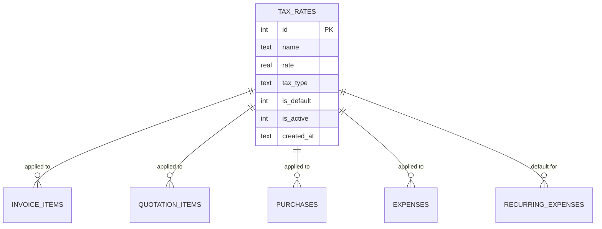

# Tax Rates

The VAT engine. Admin-defined named rates, applied per line, snapshotted on
the document at the time of write — so a tax rate change next year doesn't
retroactively alter old documents.

## Purpose

The tax engine is **rate-based** (not formula-based). Each rate has:

- A name (`"Standard 11%"`, `"Zero"`, `"Exempt"`)
- A rate value (`11`, `0`, ...)
- A type (`standard`, `zero`, `exempt`)
- An is_default flag

Documents (invoices, quotations, purchases, expenses) reference a rate by
**ID + snapshot** — `tax_rate_id`, `tax_rate` (the value at write time),
`tax_amount` (computed).

## Personas

| Persona | What they do here |
|---|---|
| **Administrator** | Defines rates, sets the default |
| **Accountant** | Picks the rate when entering a document |
| **Finance Manager** | Reviews rate usage in VAT report |
| **Auditor** | Verifies the per-line snapshot survives rate changes |

## Quick reference

- **Three types**: `standard`, `zero`, `exempt`
- **One rate has `is_default=1`** — used when no rate is specified
- **Per-line snapshot** — invoices, quotations, expenses, purchases all
  carry `tax_rate_id`, `tax_rate`, `tax_amount`
- **Output VAT** goes to `2100 VAT Payable` (credit)
- **Input VAT** also tracks against `2100 VAT Payable` (debit) for
  net-VAT computation

---

=== "Operator's view"

    ### Picking a rate on a document

    Every line item form (invoice, quote, purchase, expense) has an
    optional "Tax rate" dropdown. Options:

    - The default rate (auto-selected)
    - Other active rates
    - `(none)` — no tax

    The displayed dropdown shows `name (rate%)` — e.g. "Standard (11%)".

    When you save, the system snapshots `tax_rate_id`, `tax_rate`, and
    computes `tax_amount = quantity × unit_price × rate / 100`.

    ### Subtotal vs. amount

    Every taxed document carries:

    | Field | Computed |
    |---|---|
    | Subtotal | Sum of (qty × price) per line, BEFORE tax |
    | Tax total | Sum of `tax_amount` per line |
    | Amount | Subtotal + Tax total |

    The customer pays `Amount`; the VAT report nets out the tax portion.

=== "Administrator's view"

    ### Permissions

    Tax rates are gated by `admin_access` (Business Owner + Superadmin) —
    not via the regular RBAC `tax_rates` module key. That's because
    changing tax rates affects the books.

    ### Creating a rate

    Settings → **Tax Rates** → **+ Add rate**:

    | Field | Notes |
    |---|---|
    | Name | "Standard 11%", "Reduced 5%", "Zero", "Exempt" |
    | Rate (%) | 0-100 |
    | Type | `standard`, `zero`, `exempt` |
    | Is default | Exactly one rate is the default |
    | Is active | Inactive rates don't show in dropdowns |

    ### What "is_default" means

    The default rate is auto-selected on every new line item. To enforce
    "always uses Standard 11%", make that rate the default.

    Setting a new rate as default flips the old default's `is_default=0`
    automatically.

    ### Changing a rate's value

    Editing a rate's `rate` value does **NOT** retroactively change
    existing documents — they hold their snapshotted `tax_rate` value.
    Only documents created **after** the change use the new value.

    For a true regime change (e.g. VAT went from 10% to 11%), create a
    **new rate** (e.g. "Standard 11%"), mark it default, and **deactivate**
    the old one. Existing documents continue to show "10%" because
    that's what was true when they were posted.

    ### Tax type semantics

    | Type | What the system does |
    |---|---|
    | `standard` | Normal VAT — `tax_amount` computed and posted to `2100 VAT Payable` |
    | `zero` | Zero-rated — `tax_amount=0`, but the transaction shows in the VAT report |
    | `exempt` | Exempt — `tax_amount=0`, transaction excluded from VAT report's net base |

    Use `zero` for exports / international sales. Use `exempt` for
    domestic services that are VAT-exempt by regulation.

=== "Auditor's view"

    ### Per-line snapshot integrity

    The snapshot is what survives rate changes — verify it's intact:

    ```sql
    -- Lines whose snapshotted tax_amount doesn't match
    -- recompute from the current rate. Different = snapshot working as intended.
    SELECT ii.invoice_id, ii.id AS line_id,
           ii.quantity, ii.unit_price, ii.tax_rate AS snap_rate,
           tr.rate AS current_rate,
           ii.tax_amount AS snap_tax_amount,
           ROUND(ii.quantity * ii.unit_price * tr.rate / 100, 2) AS recomputed
    FROM invoice_items ii
    LEFT JOIN tax_rates tr ON tr.id = ii.tax_rate_id
    WHERE ii.tax_rate IS NOT NULL
      AND ABS(ii.tax_amount - ROUND(ii.quantity * ii.unit_price * tr.rate / 100, 2)) > 0.01;
    ```

    Many rows here = the rate changed at some point, and the snapshots
    preserved the original rate. If you ran this immediately after a rate
    change, every line dated before the change should show
    `snap_rate ≠ current_rate`.

    ### VAT Payable ties to per-document tax totals

    ```sql
    -- VAT Payable from GL
    SELECT SUM(jel.credit) - SUM(jel.debit) AS vat_payable
    FROM journal_entry_lines jel
    JOIN journal_entries je ON je.id = jel.journal_entry_id
    JOIN chart_of_accounts a ON a.id = jel.account_id
    WHERE a.code = '2100' AND je.status = 'posted';

    -- VAT collected on invoices minus VAT paid on purchases
    SELECT
      (SELECT SUM(tax_total) FROM invoices WHERE deleted_at IS NULL
                                              AND voided_at IS NULL) AS output_vat,
      (SELECT SUM(tax_amount) FROM purchases WHERE status IN ('Received','Paid')
                                              AND deleted_at IS NULL) AS input_vat;
    ```

    `output_vat − input_vat` should equal `vat_payable` (within rounding).

    ### Default rate audit

    Exactly one rate should be the default at any time:

    ```sql
    SELECT COUNT(*) FROM tax_rates WHERE is_default = 1 AND is_active = 1;
    -- Expected: 1
    ```

---

## Data model



## API surface

| Endpoint | Purpose |
|---|---|
| `GET /api/tax-rates/` | List rates |
| `POST /api/tax-rates/` | Create rate |
| `PUT /api/tax-rates/{id}` | Update (name, rate, type) |
| `PATCH /api/tax-rates/{id}/toggle-active` | Activate/deactivate |
| `PATCH /api/tax-rates/{id}/set-default` | Promote to default |

## What's NOT supported

- Compound taxes (VAT on top of a city tax). Single rate per line.
- Per-item default rates (item X always uses rate Y). The default is global;
  per-line override is operator's choice.
- Tax-inclusive pricing. The line's `unit_price` is always the **net** of
  VAT; the customer-visible "gross" is computed. (POS has a tax-inclusive
  option, see [POS](../operations/pos.md).)
- Per-jurisdiction tax engines. One country, one regime per install.
