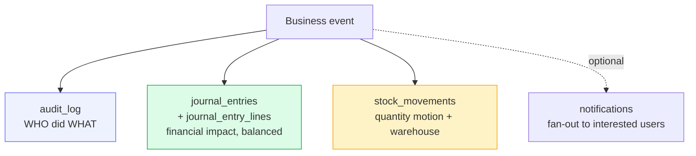

# Audit trail

What the system records about every action, where it lives, and how an auditor
verifies any historical change.

## Purpose

> **Every write that matters is recorded with who did it, when, where, and what
> changed.**

The audit trail is the single source of truth when "what happened?" comes up
— for a board review, a financial audit, a fraud investigation, or just an
operator's "I didn't change that, did I?".

## Personas

| Persona | Concern |
|---|---|
| **Operator** | "Show me what I did this week so I can write my report." |
| **Administrator** | "Who deleted that supplier yesterday?" |
| **Auditor** | "Prove this invoice was approved by an authorised person before it was paid." |

## The three audit surfaces

The system **isn't** built on one giant audit table. Different kinds of
evidence live in different places, each fit for purpose.

| Surface | Answers | Granularity |
|---|---|---|
| the audit trail | "Who pressed which button?" | Per request, per business action |
| journal entries + journal entry lines | "What's the financial impact?" | Per balanced double-entry posting |
| stock movements | "Where did the units go?" | Per quantity change, per warehouse |

A POS sale writes to
**all three**: one the audit trail row, two journal entries (sale + COGS), one
stock movements row.

---

=== "Operator's view"

    ### Your own activity

    Top right menu → **My activity** → see everything you did, paginated by
    date, with module + record reference. You can filter by module.

    ### "What does the system know about this invoice?"

    Open the invoice → **History** button (top right). You get.

    - Every status change with who and when
    - Every payment recorded
    - The auto-posted journal entry (if Accounting permission)

    Same pattern on Purchases, Expenses, Projects, Production Orders.

=== "Administrator's view"

    ### Admin Panel → Audit Log

    Free-text search + filters: User, Module, Action, Date range. Each row
    expands to show the full detail captured at the time of the action.

    ### Common queries

    **"Who deleted that supplier?"**

    1. Admin Panel → Audit Log
    2. Filter: Module=suppliers, Action=`delete`
    3. Sort by date desc
    4. The the record it refers to column shows the supplier name; the user shows
       who did it

    **"What did this user do last Tuesday?"**

    1. Filter: User=<user>, Date=specific day
    2. Group by module to see the day's pattern

    **"What changed in this period?"**

    1. Filter: Date range covering the period
    2. Export to Excel via the Export button on the audit log page

    ### Retention

    The the audit trail table is **never truncated**. Even on archive operations
    (Archives page), the underlying records soft-archive but their audit
    history persists.

=== "Auditor's view"

    ### Tables you'll spend time in

    | Table | What it proves | Indexes |
    |---|---|---|
    | the audit trail | Who did what, when | `(module, created_at)`, `(user_id, created_at)` |
    | journal entries | Financial events posted | `(entry_date)`, `(source_type, source_id)` |
    | journal entry lines | Per-account debits/credits | `(journal_entry_id)`, `(account_id)` |
    | stock movements | Inventory motion | `(inventory_id)`, `(warehouse_id, created_at)` |
    | sessions | Session-level evidence | `(jti)`, `(user_id, created_at)` |
    | approval steps | Multi-step approvals trace | `(request_id, step_number)` |

    ### Standard queries

    **Top 10 most-deleted modules:**

    **Every action by a specific user on a specific day:**

    **All journal entries from a single business event:**

    **Reconcile inventory motion to the GL:**

    ### Controls in place

    - The the audit trail table is **append-only** in practice — no UI exposes
      DELETE; no router writes UPDATE.
    - Journal entries are **never deleted, never edited**. Corrections happen
      via balanced reversals (see [Accounting](../finance/index.md), Phase 4).
    - Stock movements are **never deleted, never edited**. Corrections happen
      via offsetting movements (negative delta of the same type, or a
      transfer cancel).
    - Period locks (`accounting_periods.locked_at`) block any new journal
      entry with entry date inside a locked month/year.
    - Backups (see [Backups](backups.md)) are atomic snapshots — restore
      gets you to a clean past state.

---

## Things the audit trail does NOT record

By design.

- ❌ Read operations (GETs). Capturing every page view would 100× the log
  without giving an auditor more leverage than session timestamps already do.
- ❌ Login failures of unknown usernames. (Recorded only as
  login attempts for rate-limiting, no audit log row, to avoid disclosing
  whether a username exists.)
- ❌ Cosmetic UI changes (theme switch, language toggle, sort preference).
