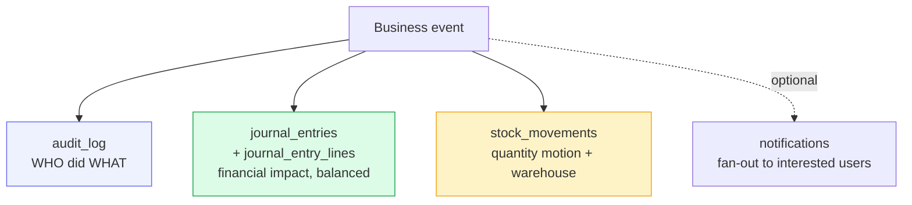
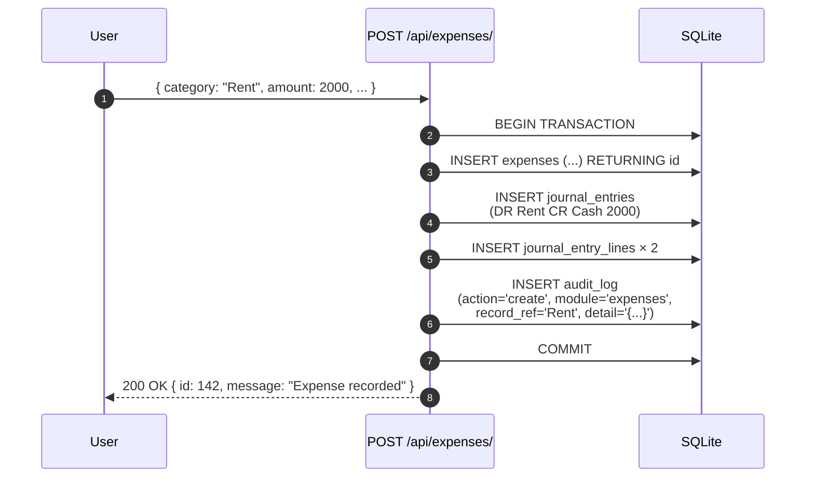

# Audit trail

What the system records about every action, where it lives, and how an auditor
verifies any historical change.

## Purpose

> **Every write that matters is recorded with who did it, when, where, and what
> changed.**

The audit trail is the single source of truth when "what happened?" comes up
— for a board review, a financial audit, a fraud investigation, or just an
operator's "I didn't change that, did I?".

## Personas

| Persona | Concern |
|---|---|
| **Operator** | "Show me what I did this week so I can write my report." |
| **Administrator** | "Who deleted that supplier yesterday?" |
| **Auditor** | "Prove this invoice was approved by an authorised person before it was paid." |

## The three audit surfaces

The system **isn't** built on one giant audit table. Different kinds of
evidence live in different places, each fit for purpose:



| Surface | Answers | Granularity |
|---|---|---|
| `audit_log` | "Who pressed which button?" | Per request, per business action |
| `journal_entries` + `journal_entry_lines` | "What's the financial impact?" | Per balanced double-entry posting |
| `stock_movements` | "Where did the units go?" | Per quantity change, per warehouse |

A POS sale (the [data-flow example](../architecture/data-flow.md)) writes to
**all three**: one `audit_log` row, two journal entries (sale + COGS), one
`stock_movements` row.

---

=== "Operator's view"

    ### Your own activity

    Top right menu → **My activity** → see everything you did, paginated by
    date, with module + record reference. You can filter by module.

    ### "What does the system know about this invoice?"

    Open the invoice → **History** button (top right). You get:

    - Every status change with who and when
    - Every payment recorded
    - The auto-posted journal entry (if Accounting permission)

    Same pattern on Purchases, Expenses, Projects, Production Orders.

=== "Administrator's view"

    ### Admin Panel → Audit Log

    Free-text search + filters: User, Module, Action, Date range. Each row
    expands to show the JSON detail captured at the time of the action.

    ### Common queries

    **"Who deleted that supplier?"**

    1. Admin Panel → Audit Log
    2. Filter: Module=`suppliers`, Action=`delete`
    3. Sort by date desc
    4. The `record_ref` column shows the supplier name; the `user_id` shows
       who did it

    **"What did this user do last Tuesday?"**

    1. Filter: User=<user>, Date=specific day
    2. Group by module to see the day's pattern

    **"What changed in this period?"**

    1. Filter: Date range covering the period
    2. Export to Excel via the Export button on the audit log page

    ### Retention

    The `audit_log` table is **never truncated**. Even on archive operations
    (Archives page), the underlying records soft-archive but their audit
    history persists.

=== "Auditor's view"

    ### Tables you'll spend time in

    | Table | What it proves | Indexes |
    |---|---|---|
    | `audit_log` | Who did what, when | `(module, created_at)`, `(user_id, created_at)` |
    | `journal_entries` | Financial events posted | `(entry_date)`, `(source_type, source_id)` |
    | `journal_entry_lines` | Per-account debits/credits | `(journal_entry_id)`, `(account_id)` |
    | `stock_movements` | Inventory motion | `(inventory_id)`, `(warehouse_id, created_at)` |
    | `user_sessions` | Session-level evidence | `(jti)`, `(user_id, created_at)` |
    | `approval_steps` | Multi-step approvals trace | `(request_id, step_number)` |

    ### Standard queries

    **Top 10 most-deleted modules:**

    ```sql
    SELECT module, COUNT(*) AS c FROM audit_log
    WHERE action = 'delete'
    GROUP BY module ORDER BY c DESC LIMIT 10;
    ```

    **Every action by a specific user on a specific day:**

    ```sql
    SELECT created_at, module, action, record_ref, detail
    FROM audit_log
    WHERE user_id = ? AND DATE(created_at) = '2026-05-30'
    ORDER BY created_at;
    ```

    **All journal entries from a single business event:**

    ```sql
    SELECT je.id, je.entry_number, je.entry_date, je.memo, je.status,
           jel.debit, jel.credit, a.code, a.name
    FROM journal_entries je
    JOIN journal_entry_lines jel ON jel.journal_entry_id = je.id
    JOIN chart_of_accounts a ON a.id = jel.account_id
    WHERE je.source_type = 'invoice_payment' AND je.source_id = ?
    ORDER BY jel.line_no;
    ```

    **Reconcile inventory motion to the GL:**

    ```sql
    -- For each item, total quantity moved by type
    SELECT i.name, sm.type, SUM(sm.delta) AS net_delta
    FROM stock_movements sm
    JOIN inventory i ON i.id = sm.inventory_id
    WHERE DATE(sm.created_at) BETWEEN ? AND ?
    GROUP BY i.id, sm.type;
    ```

    ### Controls in place

    - The `audit_log` table is **append-only** in practice — no UI exposes
      DELETE; no router writes UPDATE.
    - Journal entries are **never deleted, never edited**. Corrections happen
      via balanced reversals (see [Accounting](../finance/index.md), Phase 4).
    - Stock movements are **never deleted, never edited**. Corrections happen
      via offsetting movements (negative delta of the same type, or a
      transfer cancel).
    - Period locks (`accounting_periods.locked_at`) block any new journal
      entry with `entry_date` inside a locked month/year.
    - Backups (see [Backups](backups.md)) are atomic snapshots — restore
      gets you to a clean past state.

---

## Workflow — a single write produces three records



The three writes happen in **one transaction**. There is no scenario where
an audit row exists for an expense that wasn't actually written, or vice
versa.

## Data model

```mermaid
erDiagram
    USERS ||--o{ AUDIT_LOG : "performs"
    AUDIT_LOG }o..|| SOURCE_TABLE : "references via record_ref"

    AUDIT_LOG {
        int  id PK
        int  user_id FK
        text username
        text action
        text module
        int  record_id
        text record_ref
        text detail
        text created_at
    }

    SOURCE_TABLE {
        int  id PK
        text record_ref
        _ "any business table:<br/>invoices, expenses, etc."
    }
```

Why both `record_id` (FK-ish) and `record_ref` (human label):

| Column | Purpose |
|---|---|
| `record_id` | Stable foreign key to the source row, even if the human label changes |
| `record_ref` | Human-readable label captured **at the time of the action** — survives if the row is later renamed or deleted |

The combination means the audit log stays readable even when the source data
moves around.

## Integration with the rest of the system

- **Every router** that performs a state-changing operation calls
  `log_action(db, user, action, module, record_id, record_ref, detail)`
  inside the same transaction as the business write.
- The `detail` field is a **JSON blob** capturing the relevant before/after
  values (e.g. `{ "amount": 2000, "currency": "USD" }`).
- The Admin Panel's audit view is the only UI that reads from `audit_log`.

## Things the audit trail does NOT record

By design:

- ❌ Read operations (GETs). Capturing every page view would 100× the log
  without giving an auditor more leverage than session timestamps already do.
- ❌ Login failures of unknown usernames. (Recorded only as
  `login_attempts` for rate-limiting, no audit log row, to avoid disclosing
  whether a username exists.)
- ❌ Cosmetic UI changes (theme switch, language toggle, sort preference).

## API surface

| Endpoint | Purpose |
|---|---|
| `GET /api/audit/` | Paginated, filterable audit log |
| `GET /api/audit/export.xlsx` | Excel export of the current filter |
| `GET /api/users/{id}/activity` | A single user's actions |

The audit log page is gated by the `audit` module permission. Operators
generally don't have it; finance managers and the administrator do; auditors
get it via the **Auditor** role (read-only across the system).
