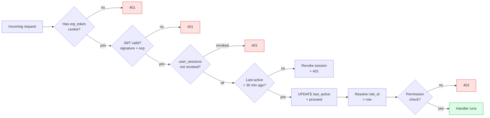
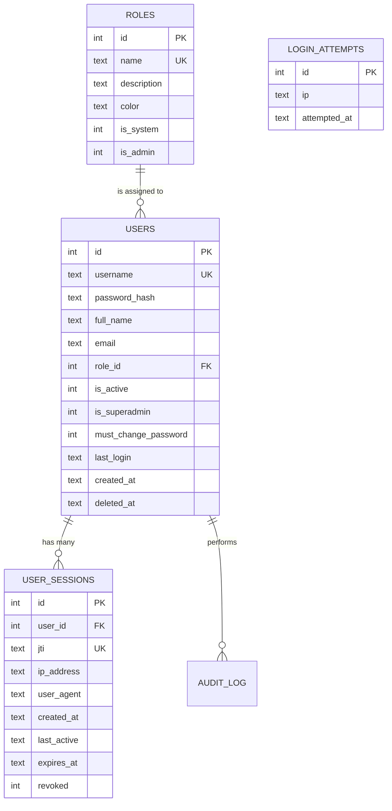

# Authentication

How users prove they are who they say they are, and how the system tracks
their session afterwards.

## Purpose

Authentication is **the front door**. It produces a session that every
subsequent request validates against. The session also carries the user's
`role_id`, which is what RBAC checks downstream.

## Personas

| Persona | What they care about |
|---|---|
| **Operator** | "Log in once a day, stay logged in, change my password without bothering IT." |
| **Administrator** | "Force password resets, kill stolen sessions, set sane lockout thresholds." |
| **Auditor** | "Prove who logged in when, from which IP, and that revoked sessions are honoured." |

## Quick reference

- Endpoint: `POST /api/auth/login`
- Token: **JWT (HS256)** in an **HttpOnly** cookie called `erp_token`
- Password hash: **PBKDF2-SHA256**, 200k iterations
- Default session timeout: 30 minutes of inactivity
- Default token expiry: 24 hours
- Force-change on first login is enabled per-user

---

=== "Operator's view"

    ### Logging in

    1. Open the ERP URL the administrator gave you (e.g. `http://192.168.1.50:8765/`).
    2. Enter your username and password.
    3. If your account was just created, you'll be redirected to **Change
       Password** before you can do anything else — pick something only you
       know.
    4. You're in. Your name shows in the top right; the sidebar reflects what
       your role can see.

    ### Staying logged in

    The cookie is valid for 24 hours by default. As long as you do something
    once every 30 minutes, the session refreshes itself. If you're away
    longer than 30 minutes, the next click will redirect you to login.

    ### Changing your password

    Top right menu → **Profile** → **Change password**.
    Requirements: 8+ characters, mixed case, at least one digit.

    ### "I'm locked out"

    After several failed attempts from the same IP, that IP is rate-limited
    for a few minutes (per the `login_attempts` table). Wait a few minutes
    and try again, or ask the administrator to clear the limiter from the
    Admin Panel.

=== "Administrator's view"

    ### Forcing a password change

    Users → pick a user → **Force change password**. Next login will redirect
    them through the change-password screen. The old password remains valid
    *until* they successfully change it (so a help-desk reset call doesn't
    leave them locked out mid-shift).

    ### Killing a session

    Users → pick a user → **Active sessions** → **Revoke**. The token is
    invalidated on the next request. Useful if a laptop is lost or a
    contractor leaves.

    ### Inactivity timeout

    Configured in `.env` via `TOKEN_EXPIRE_HOURS` (default 24) and a server
    constant `_SESSION_TIMEOUT` (default 30 minutes). Tighten for
    high-security tenants; loosen for shop-floor terminals.

    ### Cookies and HTTPS

    The cookie is `HttpOnly` (not readable from JavaScript — XSS-resistant)
    and `SameSite=Lax`. If the install is reverse-proxied behind HTTPS,
    set `COOKIE_SECURE=true` in `.env` so the cookie is also `Secure`.

=== "Auditor's view"

    ### What's recorded

    | Table | Columns of interest |
    |---|---|
    | `users` | `last_login`, `is_active`, `is_superadmin`, `role_id`, `must_change_password` |
    | `user_sessions` | `jti` (token ID), `ip_address`, `user_agent`, `created_at`, `last_active`, `expires_at`, `revoked` |
    | `audit_log` | `action='login'` and `action='logout'`, plus every subsequent business action |
    | `login_attempts` | Failed IPs and timestamps; cleared after rate-limit window |

    ### Independent verification

    To answer "who was logged in at 14:32 on 2026-05-30?":

    ```sql
    SELECT u.username, s.ip_address, s.created_at, s.last_active, s.revoked
    FROM user_sessions s JOIN users u ON s.user_id = u.id
    WHERE '2026-05-30 14:32:00' BETWEEN s.created_at AND
                                        COALESCE(s.last_active, s.expires_at)
      AND s.revoked = 0;
    ```

    To prove forced password changes were performed:

    ```sql
    SELECT action, user_id, record_ref, detail, created_at
    FROM audit_log
    WHERE action IN ('force_change_password', 'change_password')
    ORDER BY created_at DESC;
    ```

    ### Controls in place

    - PBKDF2-SHA256 with a high iteration count (key-derivation function is
      designed to be slow → brute force is expensive).
    - Per-IP rate limiting on failed logins.
    - Sessions are revocable from the Admin Panel.
    - Force-change-on-first-login is enabled by default for new users.
    - The shipped "admin" account prints a random initial password to the
      startup log and forces a change on first login.

---

## Workflow — successful login

```mermaid
sequenceDiagram
    autonumber
    participant U as User
    participant SPA as React SPA
    participant API as POST /api/auth/login
    participant DB as SQLite

    U->>SPA: Enter username + password
    SPA->>API: { username, password }
    API->>DB: SELECT FROM users WHERE username=?
    DB-->>API: row (or none)

    alt no row, or hash mismatch
        API->>DB: INSERT login_attempts (ip, attempted_at)
        API-->>SPA: 401 Unauthorized
    else success
        API->>API: Hash check (PBKDF2)
        API->>DB: UPDATE users SET last_login=now
        API->>DB: INSERT user_sessions (jti, ip, ua, …)
        API->>API: Sign JWT { sub: uid, jti, exp }
        API-->>SPA: 200 OK<br/>Set-Cookie: erp_token=…; HttpOnly; SameSite=Lax
    end

    SPA->>SPA: Navigate to /<br/>(or /force-change-password if flagged)

    Note over SPA,API: Every subsequent request<br/>sends the cookie automatically
```

## Workflow — every subsequent request



## Data model — auth-related tables



## Integration with the rest of the system

- The **JWT's `sub` claim** carries the user id; every router resolves it via
  `require_auth` / `require_perm("module", "action")` before doing any work.
- The **`jti` claim** maps to `user_sessions.jti` — that's how revocation
  works without changing the token signing key.
- The **role** carried in the token is **re-resolved on every request** from
  `roles.id → roles.name`, so a role rename or permission edit takes effect
  immediately, not on next login.

## Things that are deliberately NOT supported

- OAuth / SAML SSO — out of scope for the SME segment.
- Multi-factor authentication — possible vendor add-on, not in the base
  product.
- Bearer-token API access for scripts — the cookie is the only auth surface;
  scripts log in interactively against the same endpoint.

## API surface

| Endpoint | Purpose |
|---|---|
| `POST /api/auth/login` | Establish a session |
| `POST /api/auth/logout` | Revoke the current session |
| `GET /api/auth/me` | Identity of the current session |
| `POST /api/auth/change-password` | Self-service password change |
| `POST /api/users/{id}/force-change` | Admin: force user to change on next login |
| `POST /api/users/{id}/revoke-sessions` | Admin: nuke all open sessions for a user |

The OpenAPI surface at `http://<server>:8765/docs` lists exact request/response
shapes for each.
