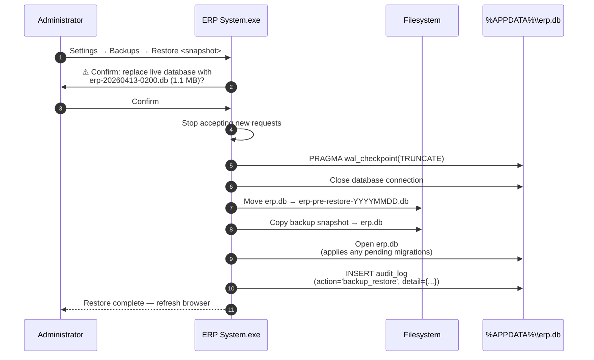
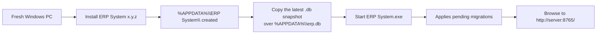
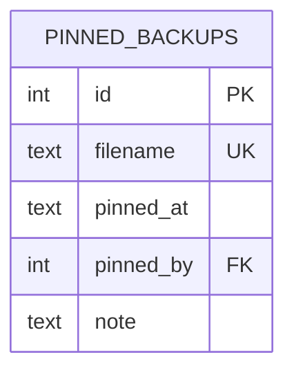

# Backup & recovery

How the system protects business data, and what to do if you need to roll
back.

## Purpose

The entire ERP's state lives in **one SQLite file**: `%APPDATA%\ERP
System\erp.db`. That's a feature (one thing to back up) and a risk (one
thing to lose). Backups exist so a hardware failure, ransomware, or honest
mistake doesn't end the business.

## Personas

| Persona | Concern |
|---|---|
| **Operator** | "I just need to know it's happening — I shouldn't have to think about it." |
| **Administrator** | "Configure the schedule, the destination, and retention. Verify quickly that backups work." |
| **Auditor** | "Show me proof of backup runs and a successful restore drill." |

## Quick reference

- **Auto-backup**: enabled by default, daily at 02:00 server time
- **Destination**: `%APPDATA%\ERP System\backups\` by default; configurable
  to a USB stick or network share
- **Format**: SQLite `VACUUM INTO` snapshot — a full, defragmented copy of
  `erp.db`
- **Filename**: `erp-YYYYMMDD-HHMMSS.db`
- **Retention**: last 30 daily snapshots, plus any manual backups you pin
- **Restore**: stop the app, replace the live `erp.db`, restart

## How backup works under the hood

```mermaid
flowchart LR
    LIVE[erp.db<br/>WAL mode] -->|VACUUM INTO| TEMP[Snapshot<br/>(temp .db file)]
    TEMP --> MOVE[Atomic rename]
    MOVE --> DEST[backups/<br/>erp-YYYYMMDD-HHMMSS.db]
    DEST --> ROT{Retention<br/>policy}
    ROT -->|over limit| DEL[Delete oldest<br/>non-pinned backups]
```

`VACUUM INTO` is the **right** way to back up a live SQLite database:

- It runs against an active connection without blocking writers.
- It produces a **physically defragmented** copy — small and clean.
- It folds in any pending WAL pages, so the snapshot is always consistent.

This is the same mechanism the build pipeline uses to snapshot `erp.db` →
`default.db` for the installer.

---

=== "Operator's view"

    There's nothing for you to do. The auto-backup runs in the background
    daily. If the administrator configured a USB or network destination,
    they'll handle the off-site copy.

    If you want to manually trigger one (you're about to do something
    risky), ask the administrator. **Don't copy `erp.db` yourself while
    the server is running** — the on-disk file is open. Use the in-app
    "Backup now" button, which uses `VACUUM INTO` (safe).

=== "Administrator's view"

    ### Where to configure

    **Settings → Backups**. The page shows:

    - The current backup destination
    - The retention setting
    - A list of recent backups (with file size + timestamp)
    - A **Backup now** button (manual snapshot)
    - A **Pin** toggle per backup (excludes it from retention deletion)
    - A **Restore** button (admin-only, see below)

    ### Recommended destinations

    | Tier | Where | Why |
    |---|---|---|
    | Always | `%APPDATA%\ERP System\backups\` | The default — survives application crashes. |
    | Strongly recommended | A network share or NAS path | Survives the server PC's disk failure. |
    | Strongly recommended | A USB stick taken off-site weekly | Survives the office burning down. |
    | Optional | A cloud-synced folder (OneDrive, Dropbox, …) | Easy, but check that the sync respects file locking. |

    The principle: **two copies on two different physical devices** is the
    minimum. Three (server + NAS + USB) is comfortable.

    ### Verifying a backup works

    The only fully-trusted verification is a **restore drill**: take a
    backup, restore it onto a test machine, log in, and check that the
    last invoice / journal entry / inventory total looks right. Do this
    once a quarter.

    ### Manual backup checklist (do this before any upgrade)

    1. Settings → Backups → **Backup now**
    2. Pin the snapshot (so retention doesn't sweep it away)
    3. Run the new installer
    4. Verify the new version starts and looks correct
    5. (Optional) Unpin the snapshot after a week of clean operation

=== "Auditor's view"

    ### Evidence that backups happen

    | Source | What it proves |
    |---|---|
    | `backups/` folder listing | Snapshots actually exist on disk, with timestamps |
    | `backup_manager.log` (in startup log) | The scheduler ran and what it produced |
    | `audit_log` rows with `action='backup_now'` | Manual backups, with operator id |
    | `audit_log` rows with `action='backup_restore'` | Restore operations, with operator id |

    ### Drill record

    The administrator should keep a log of restore drills:

    | Date | Snapshot tested | Outcome | Operator |
    |---|---|---|---|
    | 2026-04-15 | erp-20260413-0200.db | Restored OK, last invoice INV-2026-0421 visible | Admin |
    | 2026-07-22 | … | … | … |

    The drill itself isn't recorded by the system (it happens on a separate
    machine), but its sign-off should live in the customer's BCP/DR
    documentation.

    ### Controls in place

    - Backups are **atomic snapshots** (via `VACUUM INTO`) — no torn writes.
    - Backup writes happen on a **background thread**, never blocking the
      operational request path.
    - Manual restore is gated by the `admin` capability and recorded in
      `audit_log`.
    - The `default.db` shipped with the installer is *not* a backup — it's
      a vendor-controlled seed for first-run, and is never written to.

---

## Workflow — restore from backup



## Restore — when to do it, and when not to

| Situation | Restore is the right answer? |
|---|---|
| The server's hard drive failed | ✅ — restore on a new machine from the latest snapshot |
| Ransomware encrypted `erp.db` | ✅ — restore from an **off-site** backup that wasn't on the same disk |
| Someone accidentally deleted a single client | ❌ — use the **Recycle Bin** to restore the row, not the whole database |
| The user wants yesterday's numbers back | ❌ — a manual journal entry adjustment, not a restore |
| A bad upgrade introduced a regression | ✅ — restore the pre-upgrade snapshot you pinned (see the upgrade checklist) |
| "We don't trust the last few hours" | ⚠️ — restore loses every transaction since the snapshot. Have a recovery plan for the customer before pulling the trigger. |

## Manual restore on a fresh machine (worst case)

If the original server is destroyed:



The **same installer version** must be used to start with — the migration
chain assumes it's running forward, not backward. If the snapshot was on an
older version, upgrade the installer **after** restoring (the migration
chain will catch up).

## Data model

`backups/` is a filesystem folder, not a database table. The contents are
the live `erp.db`'s snapshots, named with a timestamp.

There is a small bookkeeping table for **pinned** snapshots (so the retention
job leaves them alone) — written when the administrator clicks **Pin**:



## API surface

| Endpoint | Purpose |
|---|---|
| `GET /api/settings/backups` | List snapshots + their pin state + size + date |
| `POST /api/settings/backups/now` | Run a manual backup |
| `POST /api/settings/backups/{filename}/pin` | Pin a snapshot |
| `POST /api/settings/backups/{filename}/unpin` | Unpin |
| `POST /api/settings/backups/{filename}/restore` | Restore (admin-gated) |
| `GET /api/settings/backups/{filename}/download` | Download a snapshot for off-site storage |

## What's deliberately NOT supported

- Point-in-time recovery (WAL log replay). Daily granularity is enough for
  the SME use case; the recovery procedure is "restore yesterday's
  snapshot".
- Continuous replication to a hot standby. Out of scope for a single-process,
  single-PC install. Customers needing this go to the vendor.
- Encrypted backups at rest. The snapshot is a plain SQLite file; encrypt the
  destination (BitLocker, encrypted USB, encrypted file share) if you need
  data-at-rest encryption.
