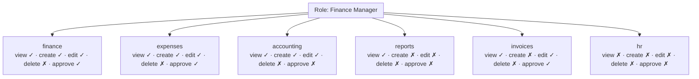
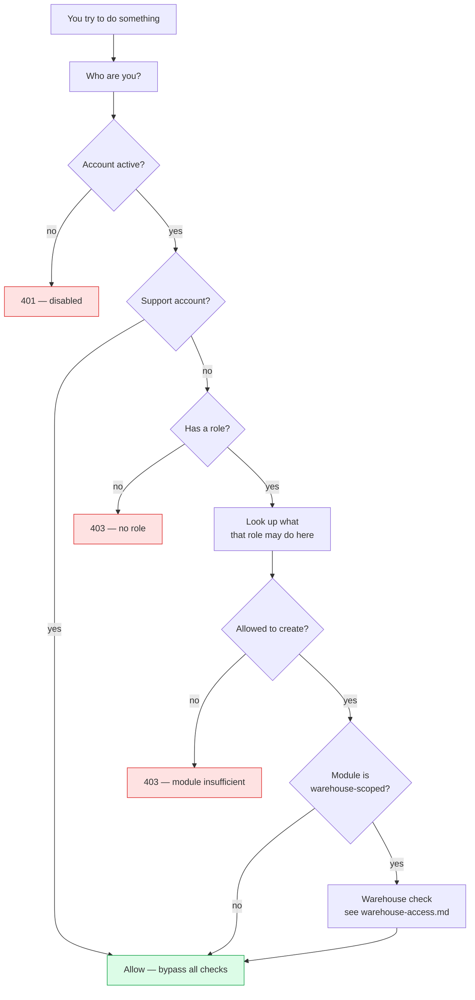

# Roles & permissions

Who can see what, and who can do what.

## Purpose

Every person has a **role**, and the role decides which parts of the system
they can open and what they can do there. This is what answers questions
like:

- *Can the Cashier see the General Ledger?* (No.)
- *Can the Sales Manager approve a $50,000 expense?* (Depends on the policy.)
- *Can the HR Manager see employee salaries?* (Yes.)
- *Can the Auditor change anything?* (No — they're read-only across the board.)

It is the **single mechanism** by which the system fences off sensitive
operations.

## Personas

| Persona | What they care about |
|---|---|
| **Operator** | The buttons they can click. Nothing else exists for them. |
| **Administrator** | Designing the matrix so people see exactly what they should. |
| **Auditor** | Proving the matrix matches the customer's documented segregation of duties. |

## Quick reference

```
Permission = Role × Module × Action
```

- **18 seeded roles**: Admin, Manager, Finance Manager, Accountant, Sales
  Manager, Sales, Cashier, Project Manager, Operations Manager, HR Manager,
  Recruiter, Procurement Officer, Inventory, Production Manager, CRM
  Specialist, Auditor, Viewer.
- **28 modules** (the full list is in the [module index](../reference/module-index.md)).
- **5 actions per module**: `view`, `create`, `edit`, `delete`, `approve`.
- One **support** account bypasses all checks (used by the vendor or
  the company owner).

## The permission matrix

There are **28 × 5 = 140 cells per role**, but most cells follow obvious
patterns. The "Roles & Permissions" admin page renders the full matrix with
checkbox toggles per role.



Yes, that's just six modules out of 28 — the same shape applies to every
role × module combination.

---

=== "Operator's view"

    You don't see the matrix. You see the **sidebar**, and you see **buttons
    on each page**.

    - If a module is absent from your sidebar, your role doesn't have `view`
      permission for it.
    - If a button on a page is disabled or hidden, that is your role again — at
      the action level.
    - If you click something and see *"You don't have permission to do
      that"*, send the screenshot to your administrator with a one-line
      "I need to do X to do my job" — they can adjust the matrix.

=== "Administrator's view"

    ### Where to configure

    **Roles** (admin sidebar) → **Permissions** button on any role → matrix
    modal opens. Check / uncheck cells per module × action.

    ### Role groups in the matrix UI

    The Roles & Permissions page groups modules so it's scannable.

    | Group | Modules |
    |---|---|
    | Dashboard | dashboard |
    | Sales | crm, clients, quotations, invoices, pos |
    | Delivery | projects, planning |
    | Procurement / stock | suppliers, purchases, inventory, **warehouses**, manufacturing |
    | Finance | expenses, assets, finance, cash, **accounting**, reports |
    | People | HR, **Contracts**, **HR Activities**, **Recruitment** |
    | Communications | announcements |
    | Administration | settings, users, roles, audit |

    The bolded modules are the ones the latest update fixed — they were
    missing from earlier matrices.

    ### Per-warehouse access is separate

    Your role says *"can the user touch the Inventory module at
    all?"*. Warehouse access says
    *"which warehouses specifically?"*. See [Multi-warehouse
    access](warehouse-access.md) for that layer.

    ### Custom roles

    Click **+ Add role** at the top of Roles & Permissions. Give it a name,
    color (used for badges), and description. Then assign the per-module
    cells. **System roles** (the 18 seeded ones) cannot be edited — clone
    one into a new role if you need to tweak a system role's defaults.

    ### Effect timing

    Permission changes take effect on the **next request** the user makes —
    not on next login. The token carries role, and that's
    re-resolved on every call.

=== "Auditor's view"

    ### Tables that document the design

    | Where | What it proves |
    |---|---|
    | Roles | Every role, its description, and whether it is built in or admin-tier |
    | Permissions | The full grid — for every role and every module, whether it may view, create, edit, delete or approve |
    | Users | Which role each person has |

    ### Standard reports for an audit

    "Show me every user who can post journal entries".

    "Show me every user with delete permission anywhere".

    ### Segregation of duties checklist

    For a tight install, verify NO single role has all of.

    | Module | Should NOT all be checked on one role |
    |---|---|
    | purchases | create + approve |
    | expenses | create + approve |
    | invoices | create + approve |
    | `accounting` | create + edit + delete |
    | users | edit + delete |

    The default Sales / Procurement Officer / etc. roles already split these.
    Custom roles need to be reviewed.

    ### Controls

    - System roles are immutable (built-in roles cannot be edited or deleted).
    - Permission changes are recorded in the audit trail with `module='roles'`.
    - The support account can grant the same to another user, but the action is
      logged.

---

## Resolution pipeline

When you try to do something — say, create an invoice — this is the order
of checks.



## The 18 seeded roles at a glance

| Role | Tier | Primary scope |
|---|---|---|
| **Admin** | Admin | Full operational access; reserved for the customer's owner |
| **Business Owner** | Admin-tier | All-modules read/write, can't delete |
| **Manager** | Standard | Cross-functional supervisor |
| **Finance Manager** | Standard | Finance + Accounting + Reports + approvals |
| **Accountant** | Standard | Bookkeeping, no master-data edit |
| **Sales Manager** | Standard | CRM + Quotations + Invoices + Sales approvals |
| **Sales** | Standard | CRM + Quotations only |
| **Cashier** | Standard | POS + Cash drawer they're on |
| **Project Manager** | Standard | Projects + Planning + their team's expenses |
| **Operations Manager** | Standard | Supplies, purchases, manufacturing |
| **HR Manager** | Standard | All HR + contracts + recruitment + payroll |
| **Recruiter** | Standard | Recruitment only |
| **Procurement Officer** | Standard | Suppliers + Purchases create, no approval |
| **Inventory** | Standard | Inventory + warehouses + stock moves |
| **Production Manager** | Standard | Manufacturing + BOMs + QC |
| **CRM Specialist** | Standard | CRM only |
| **Auditor** | Standard | Read-only across **everything** |
| **Viewer** | Standard | Read-only sidebar nav, no detail access |

## Things that are deliberately NOT supported

- Permission grants directly to users (only to roles). Keeps the matrix small
  and auditable.
- Conditional permissions ("only on Mondays"). Doesn't suit SMEs.
- Time-limited permissions. Switch a user off instead.
