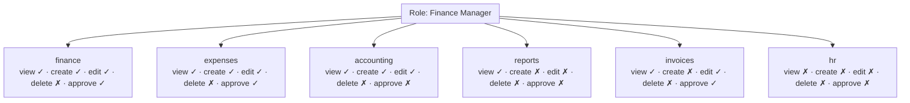
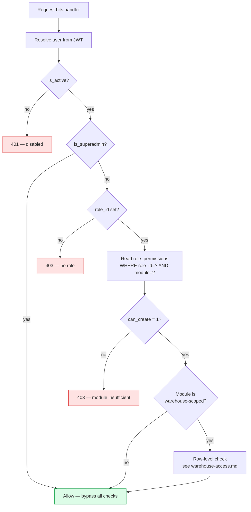
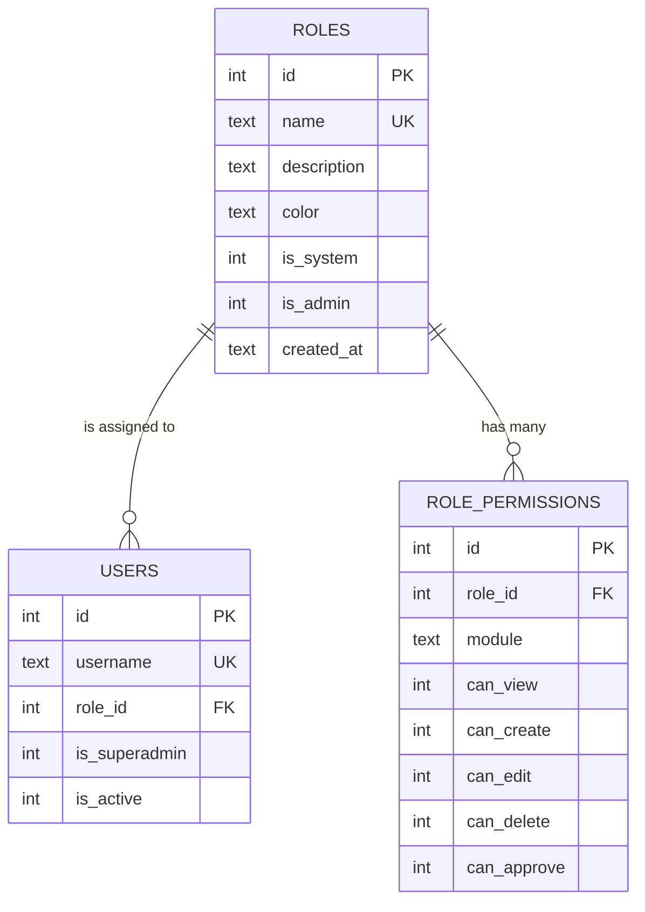

# Role-Based Access Control (RBAC)

The permission model that decides whether the logged-in user can perform a
specific action on a specific module.

## Purpose

RBAC answers questions like:

- *Can the Cashier see the General Ledger?* (No.)
- *Can the Sales Manager approve a $50,000 expense?* (Depends on the policy.)
- *Can the HR Manager see employee salaries?* (Yes.)
- *Can the Auditor change anything?* (No — they're read-only across the board.)

It is the **single mechanism** by which the system fences off sensitive
operations.

## Personas

| Persona | What they care about |
|---|---|
| **Operator** | The buttons they can click. Nothing else exists for them. |
| **Administrator** | Designing the matrix so people see exactly what they should. |
| **Auditor** | Proving the matrix matches the customer's documented segregation of duties. |

## Quick reference

```
Permission = Role × Module × Action
```

- **18 seeded roles**: Admin, Manager, Finance Manager, Accountant, Sales
  Manager, Sales, Cashier, Project Manager, Operations Manager, HR Manager,
  Recruiter, Procurement Officer, Inventory, Production Manager, CRM
  Specialist, Auditor, Viewer.
- **28 modules** (the full catalogue is on the [module map](../architecture/module-map.md)).
- **5 actions per module**: `view`, `create`, `edit`, `delete`, `approve`.
- One **superadmin** account bypasses all checks (intended for the vendor or
  the company owner).

## The permission matrix

There are **28 × 5 = 140 cells per role**, but most cells follow obvious
patterns. The "Roles & Permissions" admin page renders the full matrix with
checkbox toggles per role.



Yes, that's just six modules out of 28 — the same shape applies to every
role × module combination.

---

=== "Operator's view"

    You don't see the matrix. You see the **sidebar**, and you see **buttons
    on each page**.

    - If a module is absent from your sidebar, your role doesn't have `view`
      permission for it.
    - If a button on a page is disabled or hidden, that's RBAC again — at
      the action level.
    - If you click something and see *"You don't have permission to do
      that"*, send the screenshot to your administrator with a one-line
      "I need to do X to do my job" — they can adjust the matrix.

=== "Administrator's view"

    ### Where to configure

    **Roles** (admin sidebar) → **Permissions** button on any role → matrix
    modal opens. Check / uncheck cells per module × action.

    ### Role groups in the matrix UI

    The Roles & Permissions page groups modules so it's scannable:

    | Group | Modules |
    |---|---|
    | Dashboard | dashboard |
    | Sales | crm, clients, quotations, invoices, pos |
    | Delivery | projects, planning |
    | Procurement / stock | suppliers, purchases, inventory, **warehouses**, manufacturing |
    | Finance | expenses, assets, finance, cash, **accounting**, reports |
    | People | hr, **hr_contracts**, **hr_activities**, **recruitment** |
    | Communications | announcements |
    | Administration | settings, users, roles, audit |

    The bolded modules are the ones the latest update fixed — they were
    missing from earlier matrices.

    ### Per-warehouse access is separate

    Module-level RBAC says *"can the user touch the Inventory module at
    all?"*. Row-level access (the `user_warehouse_access` table) says
    *"which warehouses specifically?"*. See [Multi-warehouse
    access](warehouse-access.md) for that layer.

    ### Custom roles

    Click **+ Add role** at the top of Roles & Permissions. Give it a name,
    color (used for badges), and description. Then assign the per-module
    cells. **System roles** (the 18 seeded ones) cannot be edited — clone
    one into a new role if you need to tweak a system role's defaults.

    ### Effect timing

    Permission changes take effect on the **next request** the user makes —
    not on next login. The token carries `role_id`, and that's
    re-resolved on every call.

=== "Auditor's view"

    ### Tables that document the design

    | Table | What it proves |
    |---|---|
    | `roles` | Every role and its description (incl. `is_system`, `is_admin`) |
    | `role_permissions` | The full grant matrix — every cell with `can_view`, `can_create`, `can_edit`, `can_delete`, `can_approve` flags |
    | `users.role_id` | Which role each user has |

    ### Standard reports for an audit

    "Show me every user who can post journal entries":

    ```sql
    SELECT u.username, r.name AS role
    FROM users u
    JOIN roles r ON r.id = u.role_id
    JOIN role_permissions rp
      ON rp.role_id = r.id
     AND rp.module = 'accounting'
     AND rp.can_create = 1
    WHERE u.deleted_at IS NULL AND u.is_active = 1;
    ```

    "Show me every user with delete permission anywhere":

    ```sql
    SELECT u.username, r.name AS role, rp.module
    FROM users u
    JOIN roles r ON r.id = u.role_id
    JOIN role_permissions rp ON rp.role_id = r.id
    WHERE rp.can_delete = 1
      AND u.deleted_at IS NULL AND u.is_active = 1
    ORDER BY u.username, rp.module;
    ```

    ### Segregation of duties checklist

    For a tight install, verify NO single role has all of:

    | Module | Should NOT all be checked on one role |
    |---|---|
    | `purchases` | create + approve |
    | `expenses` | create + approve |
    | `invoices` | create + approve |
    | `accounting` | create + edit + delete |
    | `users` | edit + delete |

    The default Sales / Procurement Officer / etc. roles already split these.
    Custom roles need to be reviewed.

    ### Controls

    - System roles are immutable (`is_system=1` blocks edit + delete in the UI).
    - Permission changes are recorded in `audit_log` with `module='roles'`.
    - Superadmin can grant superadmin to another user, but the action is
      logged.

---

## Resolution pipeline

When an endpoint declares `require_perm("invoices", "create")`, this is what
runs:



## Data model



A user's effective permissions are the **single row** in `role_permissions`
matching their `role_id` × the requested `module`. Five booleans on that row
gate the five action verbs.

## The 18 seeded roles at a glance

| Role | Tier | Primary scope |
|---|---|---|
| **Admin** | Admin | Full operational access; reserved for the customer's owner |
| **Business Owner** | Admin (is_admin=1) | All-modules read/write, can't delete |
| **Manager** | Standard | Cross-functional supervisor |
| **Finance Manager** | Standard | Finance + Accounting + Reports + approvals |
| **Accountant** | Standard | Bookkeeping, no master-data edit |
| **Sales Manager** | Standard | CRM + Quotations + Invoices + Sales approvals |
| **Sales** | Standard | CRM + Quotations only |
| **Cashier** | Standard | POS + Cash drawer they're on |
| **Project Manager** | Standard | Projects + Planning + their team's expenses |
| **Operations Manager** | Standard | Supplies, purchases, manufacturing |
| **HR Manager** | Standard | All HR + contracts + recruitment + payroll |
| **Recruiter** | Standard | Recruitment only |
| **Procurement Officer** | Standard | Suppliers + Purchases create, no approval |
| **Inventory** | Standard | Inventory + warehouses + stock moves |
| **Production Manager** | Standard | Manufacturing + BOMs + QC |
| **CRM Specialist** | Standard | CRM only |
| **Auditor** | Standard | Read-only across **everything** |
| **Viewer** | Standard | Read-only sidebar nav, no detail access |

## Things that are deliberately NOT supported

- Permission grants directly to users (only to roles). Keeps the matrix small
  and auditable.
- Conditional permissions ("only on Mondays"). Doesn't suit SMEs.
- Time-limited permissions. Use `is_active=0` to expire a user.

## API surface

| Endpoint | Purpose |
|---|---|
| `GET /api/roles/` | List roles + per-module permission grid |
| `POST /api/roles/` | Create a custom role |
| `PUT /api/roles/{id}` | Update name/description/color |
| `PUT /api/roles/{id}/permissions` | Replace the permissions matrix for a role |
| `DELETE /api/roles/{id}` | Delete a custom role (system roles refused) |
| `GET /api/users/{id}/effective-permissions` | Resolved cells for a single user |
