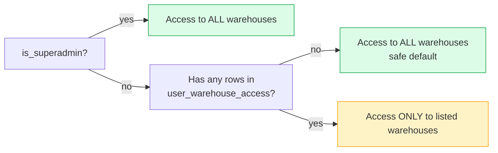
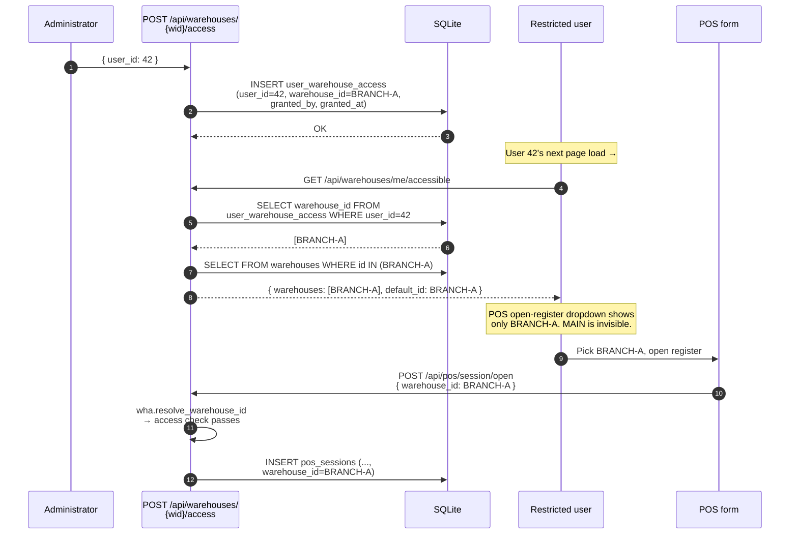
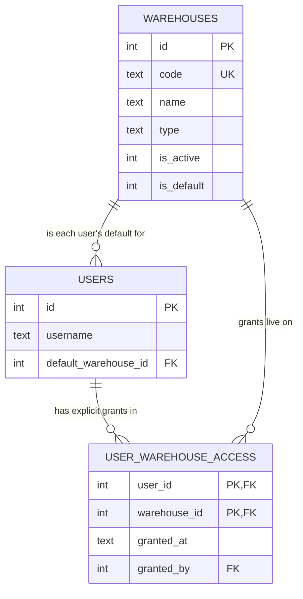
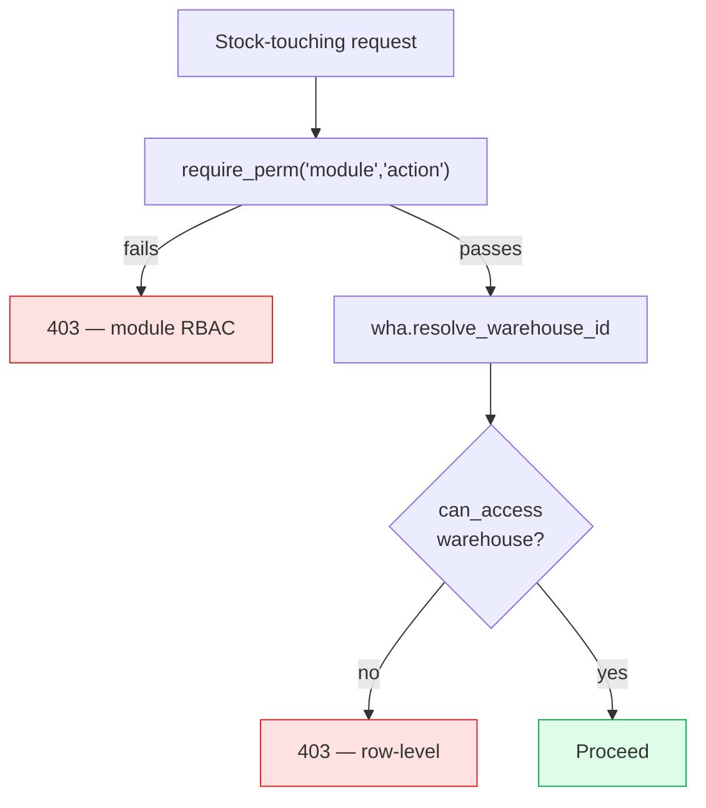

# Multi-warehouse access

A **row-level** permission layer that operates *underneath* module RBAC. Module
RBAC says "can the user open Inventory at all?" — multi-warehouse access says
"which warehouses specifically?"

## Purpose

In a multi-location install (Main warehouse, Branch A, Workshop, Returns),
you usually want **the cashier at Branch A** to:

- See / sell from / count Branch A's stock
- **Not** see Main's stock balances
- **Not** be able to dispatch a transfer from Workshop

Module RBAC alone can't express this — it's all-or-nothing per module.
Row-level access supplies the missing dimension.

## Personas

| Persona | Concern |
|---|---|
| **Operator** | "Only show me the warehouse I work at." |
| **Administrator** | "Grant Branch A access to these three users; revoke when they leave." |
| **Auditor** | "Prove that the Branch A clerk never touched Workshop stock." |

## The default policy (safety-first)

> **A user with no explicit grants has access to all warehouses.**
>
> The moment you add the first grant for a user **anywhere**, that user's
> access becomes restricted to the explicit allow-list.

This makes the migration safe — every existing user keeps working
unchanged. You opt-in to per-warehouse restriction by adding rows to
`user_warehouse_access`.



---

=== "Operator's view"

    Open **Warehouses** in the sidebar. You'll see only the warehouses your
    administrator has authorised you for (or all of them, if they didn't
    restrict you).

    The same restriction filters every form with a "warehouse" selector:

    - Purchases: "Receive at warehouse" dropdown
    - POS: "Selling from" on Open Register
    - Manufacturing: "Warehouse" on production order
    - Inventory adjust: "Warehouse" dropdown
    - Project material consumption: "Warehouse" dropdown

    If you should see a warehouse and don't, your administrator simply hasn't
    granted access — one click in the Access tab fixes it.

=== "Administrator's view"

    ### Granting access

    Warehouses → **Access** tab → click the warehouse on the left → **+
    Grant access** → pick a user from the list. The user's view shrinks
    immediately on their next request.

    ### Revoking access

    Same screen, **Revoke** button on each granted user. If you revoke
    **every** grant for a user, they go back to "access all" (per the
    safety default).

    ### Where this fits with module RBAC

    | Layer | Question | Lives in |
    |---|---|---|
    | Module RBAC | "Can the user touch Inventory?" | `role_permissions` |
    | Row-level | "Which warehouses specifically?" | `user_warehouse_access` |

    Both must pass. A user without module-level Inventory access doesn't
    benefit from a warehouse grant.

    ### Resolving the default warehouse

    Every stock-touching endpoint defaults to the user's **default
    warehouse** when no `warehouse_id` is specified. Resolution order:

    1. `users.default_warehouse_id` if set AND the user can access it
    2. The company default (`warehouses.is_default = 1`) if accessible
    3. The first warehouse the user has access to
    4. 400 error — the user has access to nothing

    Set per-user defaults in Users → pick user → **Default warehouse**
    dropdown.

=== "Auditor's view"

    ### What records movement

    `stock_movements.warehouse_id` is stamped on **every** quantity change
    after migration 122. To verify a user never touched a specific
    warehouse:

    ```sql
    -- Every movement performed at WORKSHOP that was initiated by a non-
    -- WORKSHOP-authorised user (look for surprises):
    SELECT sm.created_at, sm.type, sm.reference, u.username
    FROM stock_movements sm
    JOIN audit_log a ON a.created_at = sm.created_at
                    AND a.record_ref = sm.reference
    JOIN users u ON u.id = a.user_id
    JOIN warehouses w ON w.id = sm.warehouse_id
    WHERE w.code = 'WORKSHOP'
      AND u.id NOT IN (
            SELECT user_id FROM user_warehouse_access WHERE warehouse_id = w.id
          )
      AND a.action != 'transfer_receive';   -- transfers in are OK
    ```

    ### Stock transfer evidence

    Every transfer leaves two `stock_movements` rows (an "out" on the source
    and an "in" on the destination) plus a `stock_transfers` row with
    `dispatched_by`, `received_by`, timestamps, and any cancellation
    reason. See [Operations → Warehouses](../operations/index.md) (Phase 3).

---

## Workflow — "grant access and watch it take effect"



## Data model



The composite primary key `(user_id, warehouse_id)` guarantees no double
grants and makes the "is this user allowed here?" lookup an O(1) index seek.

## Integration with module RBAC



Both checks must pass. Order matters — module RBAC fails fast on the cheap
check, then we do the database hit for warehouse access.

## API surface

| Endpoint | Purpose |
|---|---|
| `GET /api/warehouses/me/accessible` | The list a SPA selector should show |
| `GET /api/warehouses/{id}/access` | Who has explicit access to warehouse `id` |
| `POST /api/warehouses/{id}/access` | Grant access to a user |
| `DELETE /api/warehouses/{id}/access/{user_id}` | Revoke a grant |
| `PUT /api/users/{id}` (with `default_warehouse_id`) | Set per-user default |

## Things to remember

- Granting access **anywhere** flips the user from "see all" to "see only the
  list". Plan the rollout deliberately.
- Module RBAC is **always** the first gate. Granting Branch A to a Cashier
  who has no Inventory `view` permission grants them nothing.
- The default warehouse falls back to the company default (`is_default=1`)
  if the user's personal default isn't set or isn't accessible — never to
  "no warehouse at all" unless the user has no access anywhere.
