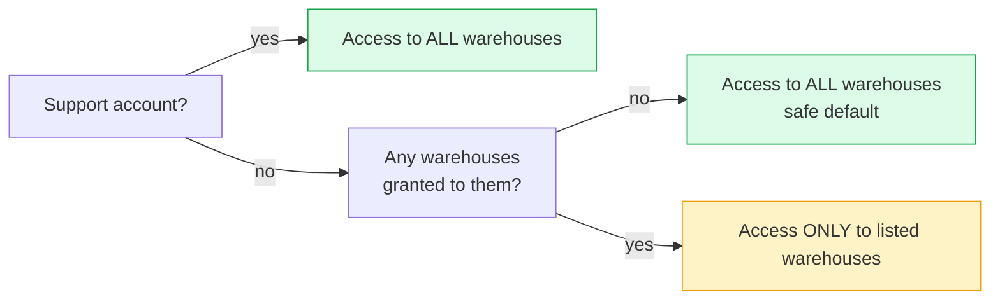
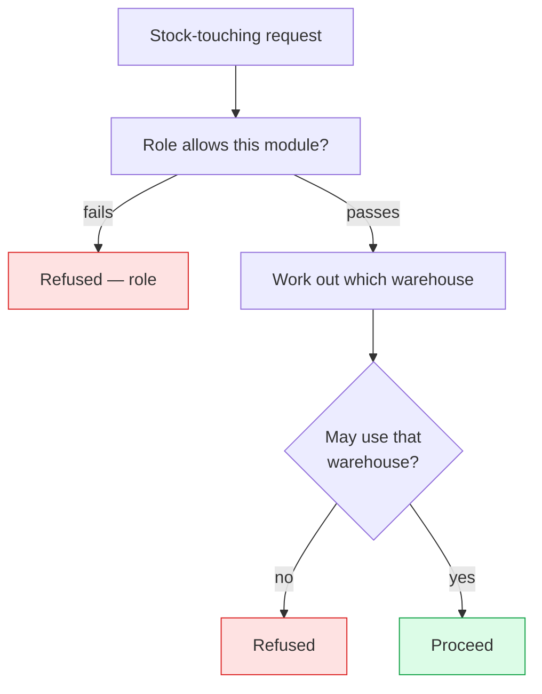

# Multi-warehouse access

Two different questions. Your **role** decides whether you can open
Inventory at all. **Warehouse access** decides which warehouses you can work
in once you are there.

So a clerk at one branch can be given full use of Inventory, and still only
see and move the stock at their own branch.

## Purpose

In a multi-location install (Main warehouse, Branch A, Workshop, Returns),
you usually want **the cashier at Branch A** to.

- See / sell from / count Branch A's stock
- **Not** see Main's stock balances
- **Not** be able to dispatch a transfer from Workshop

A role alone can't express this — it is all-or-nothing per module.
Warehouse access supplies that second answer.

## Personas

| Persona | Concern |
|---|---|
| **Operator** | "Only show me the warehouse I work at." |
| **Administrator** | "Grant Branch A access to these three users; revoke when they leave." |
| **Auditor** | "Prove that the Branch A clerk never touched Workshop stock." |

## The default policy (safety-first)

> **A user with no explicit grants has access to all warehouses.**
>
> The moment you add the first grant for a user **anywhere**, that user's
> access becomes restricted to the explicit allow-list.

This makes turning it on safe — every existing user keeps working
unchanged. You opt in to per-warehouse restriction by granting warehouses in
warehouse access.

---

=== "Operator's view"

    Open **Warehouses** in the sidebar. You'll see only the warehouses your
    administrator has authorised you for (or all of them, if they didn't
    restrict you).

    The same restriction filters every form with a "warehouse" selector.

    - Purchases: "Receive at warehouse" dropdown
    - POS: "Selling from" on Open Register
    - Manufacturing: "Warehouse" on production order
    - Inventory adjust: "Warehouse" dropdown
    - Project material consumption: "Warehouse" dropdown

    If you should see a warehouse and don't, your administrator simply hasn't
    granted access — one click in the Access tab fixes it.

=== "Administrator's view"

    ### Granting access

    Warehouses → **Access** tab → click the warehouse on the left → **+
    Grant access** → pick a user from the list. The user's view shrinks
    immediately on their next request.

    ### Revoking access

    Same screen, **Revoke** button on each granted user. If you revoke
    **every** grant for a user, they go back to "access all" (per the
    safety default).

    ### Where this fits with roles

    | Layer | Question | Lives in |
    |---|---|---|
    | Role | "Can the user touch Inventory?" | role permissions |
    | Warehouse | "Which warehouses specifically?" | warehouse access |

    Both must pass. A user without module-level Inventory access doesn't
    benefit from a warehouse grant.

    ### Resolving the default warehouse

    When a form does not ask you which warehouse, the system picks one for
    you, in this order.

    1. Your own default warehouse, if you have one and can access it
    2. The company default warehouse, if you can access it
    3. The first warehouse the user has access to
    4. 400 error — the user has access to nothing

    Set per-user defaults in Users → pick user → **Default warehouse**
    dropdown.

=== "Auditor's view"

    ### What records movement

    the warehouse is recorded on **every** stock change
    from the moment it was switched on. To verify a user never touched a specific
    warehouse.

    ### Stock transfer evidence

    Every transfer leaves two stock movements — an "out" at the source and
    an "in" at the destination — plus the transfer itself, recording who
    dispatched it, who received it, when, and any reason it was
    cancelled. See [Operations → Warehouses](../operations/index.md).

---

## How it works with roles

Both checks must pass. The role is checked first, on the cheap
check, then we do the database hit for warehouse access.

## Things to remember

- Granting access **anywhere** flips the user from "see all" to "see only the
  list". Plan the rollout deliberately.
- The role is **always** the first gate. Granting Branch A to a Cashier
  who has no Inventory `view` permission grants them nothing.
- The default warehouse falls back to the company default (marked as the default)
  if the user's personal default isn't set or isn't accessible — never to
  "no warehouse at all" unless the user has no access anywhere.
