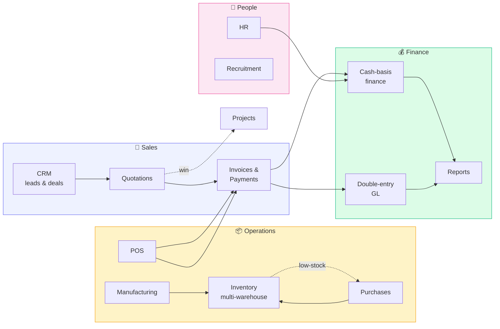

# ERP System — User Manual

How to use the system, part by part. Every page answers the same three
questions in turn: <strong>how do I do my job</strong>, <strong>how do I set
this up</strong>, and <strong>what record does it leave</strong> — so you can
read only the part that is yours.

---

!!! tip "New here? Read one page."

    **[Everyday tasks](everyday.md)** answers the things people actually do
    every day — quote a customer, send an invoice, take a payment, find an
    old record — in plain language, with no background needed.

    The rest of this manual is the detail behind it.

## Quick orientation

-   :material-account-cog:{ .lg .middle } **Operator**

    ---

    *"How do I do my job today?"*

    Step-by-step workflows for clerks, cashiers, project managers, accountants
    and HR staff. Look for the **Operator's view** tab on every module page.

    [:octicons-arrow-right-24: Start with Everyday tasks](everyday.md)

-   :material-shield-account:{ .lg .middle } **Administrator**

    ---

    *"How do I configure and govern this?"*

    Permissions, warehouse access, settings, integrations and
    operational controls. Look for the **Administrator's view** tab.

    [:octicons-arrow-right-24: Signing in & permissions](foundation/rbac.md)

-   :material-magnify-scan:{ .lg .middle } **Auditor**

    ---

    *"What evidence is recorded?"*

    Audit trails, journal entries, period locks, segregation of duties,
    immutable history. Look for the **Auditor's view** tab on every module.

    [:octicons-arrow-right-24: Audit trail](foundation/audit-trail.md)

---

## What the system does

The arrows aren't just navigation hints — they reflect **real data flow**.
A POS sale becomes an invoice + a payment + a stock movement + a journal
entry, all in one atomic transaction. The manual maps each of these for you.

---

## Headline capabilities

-   :material-warehouse: **Multi-warehouse stock**

    First-class warehouses with per-warehouse access, transfers,
    per-warehouse balances. One company-wide Inventory GL account.

-   :material-currency-usd: **Dual-currency (USD + LBP)**

    Functional currency is USD; LBP is fully supported for POS tenders,
    invoice payments, payroll, cash drawers, and period-end FX revaluation.

-   :material-book-multiple: **Double-entry accounting**

    Real general ledger. Trial balance always ties, Income Statement and
    Balance Sheet are derived from journal entries, never inflated.

-   :material-account-key: **Roles and warehouse access**

    18 seeded roles × 28 modules × 5 actions, plus per-warehouse access for
    inventory operations.

-   :material-history: **Comprehensive audit trail**

    Every write recorded with user, `action`, the record it refers to, `detail`,
    creation date. Reversal-only corrections — nothing is silently deleted.

-   :material-check-decagram: **Approval workflows**

    Rule-based multi-step approvals on expenses, purchases, invoices,
    projects, and fixed-asset capex.

-   :material-translate: **Bilingual (EN + AR)**

    Full Arabic with RTL layout. Every UI string flows through one
    translation dictionary; perfect parity verified.

-   :material-database-arrow-right: **Resilient backups**

    Automatic + manual backups, one-click backup to a USB stick or network
    share, restore on a fresh install.

---

## How to read this manual

Each module page in the manual follows the same shape, so once you've read
one you know where to look in every other:

| Section | What it answers |
|---|---|
| **Purpose** | What problem the module solves |
| **Personas** | Who uses it day-to-day |
| **Operator's view** | The buttons you click and what they do |
| **Administrator's view** | Configuration, permissions, controls |
| **Auditor's view** | What records are written and how to verify them |
| **Data model** | ER diagram of the tables involved |
| **Workflow** | Sequence/flow diagram of the most common operation |
| **Permissions** | Which roles can do what |
| **Integrations** | Which other parts of the system this one affects |

!!! tip "Searching the manual"
    Hit ++slash++ (or click the magnifying glass) at any time to open the
    full-text search. Results highlight matching terms across every page.

!!! info "Version covered"
    This manual describes the ERP at version **2.1.0+** — multi-warehouse,
    multi-currency handling, and the expanded role catalogue are all
    in scope.
