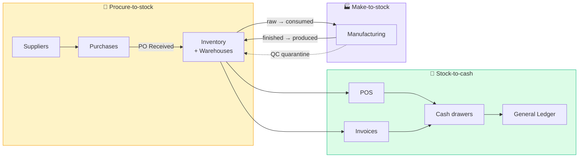

# Operations

The six modules that govern **physical things**: what's on hand, where it
lives, how it got there, how it gets made, and how it gets sold.

| Page | What it covers |
|---|---|
| [Procure-to-stock workflow](procure-to-stock.md) | End-to-end diagrams. Read first. |
| [Inventory](inventory.md) | Items, lots (FEFO), FIFO/LIFO/avg costing, low-stock alerts |
| [Warehouses & Transfers](warehouses.md) | Multi-location stock, row-level access, transfer workflow |
| [Suppliers](suppliers.md) | Vendor master + 360° detail |
| [Purchases](purchases.md) | PO lifecycle Ordered → Received → Paid |
| [Manufacturing](manufacturing.md) | BOMs, production orders, QC, resources, costing |
| [POS](pos.md) | Register sessions, sales, returns, dual-currency tender |

## The two operational pipelines

Each pipeline crosses several modules. The diagrams on the next page show
exactly which writes happen where.

## Personas

| Persona | Where they live |
|---|---|
| **Procurement Officer** | Suppliers + Purchases — creates POs, marks received, pays |
| **Inventory clerk** | Inventory + Warehouses — counts, adjusts, transfers |
| **Production Manager** | Manufacturing — sets up BOMs, opens production orders |
| **Production worker** | Manufacturing → MO Complete — books actual consumption |
| **QC inspector** | Manufacturing → QC tab — passes/rejects batches |
| **Cashier** | POS — opens session, sells, returns, closes |
| **Operations Manager** | Across the chapter — approves discounts, transfers, BOM changes |
| **Auditor** | Cross-cutting — reconciles physical stock against GL Inventory account |

## The four "always true" invariants

The Operations chapter assumes these never break — every audit query below
relies on them:

1. **`inventory.quantity` = SUM of `inventory_stock.quantity` across warehouses** — maintained on every write
2. **Every stock-touching write produces a `stock_movements` row** — with `warehouse_id` stamped after migration 122
3. **The GL Inventory account (1200) ties to the sum of inventory value** — `Σ(quantity × unit_cost)` per item, summed across items
4. **Internal warehouse transfers never post to GL** — they're motion within one account, not value movement

Phase 1's [audit trail](../foundation/audit-trail.md) page gives you the SQL
to verify each invariant against live data.
