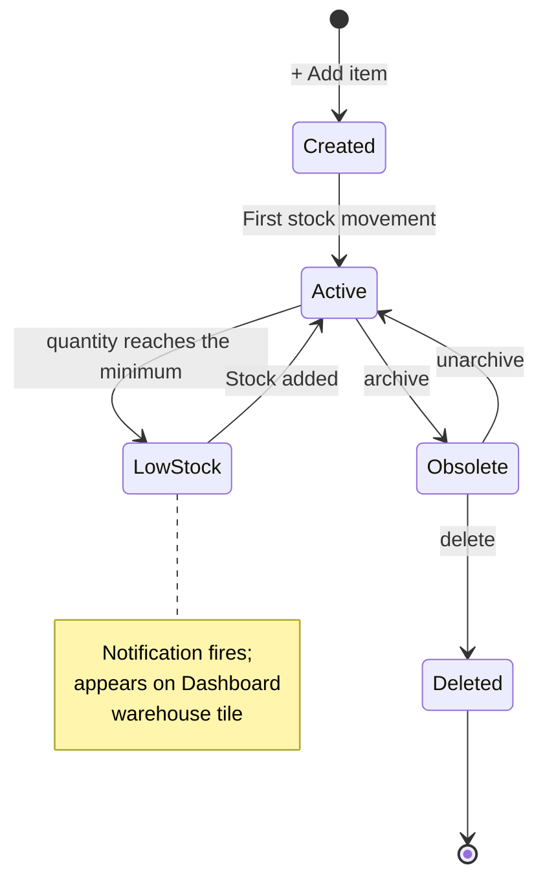

# Inventory

The master record of every physical thing the company owns. Items, quantities,
costs, lots, and the movements that change them — all under one module.

## Purpose

Inventory holds **what exists** (the item catalogue), **how much exists**
(quantities per location), and **what it cost** (per-layer or per-lot). Every
other operational module either reads from here (POS, Manufacturing) or
writes to here (Purchases, Manufacturing, Project consumption, Transfers).

## Personas

| Persona | What they do here |
|---|---|
| **Inventory clerk** | Adjusts counts, runs cycle counts, attaches lots, archives obsolete items |
| **Operations Manager** | Sets min-stock levels, picks costing method, reads low-stock alerts |
| **Production worker** | Reads remaining qty of components before drawing them |
| **Cashier** | Indirectly — the till reads the selling price and quantity |
| **Auditor** | Reconciles quantities to GL Inventory account |

## Quick reference

- **Two grains of "quantity"** — company total (`inventory.quantity`) +
  per warehouse. The two are maintained in
  lock-step.
- **Product types** — raw material, semi finished, `finished`, `consumable`
- **Costing methods** — weighted avg (default), `fifo`, `lifo`. Set
  in Settings.
- **Lot tracking** — opt-in per item. Lot-tracked items consume **FEFO**
  (First Expired First Out).
- **Reservation + Quarantine** — separate balances on each stock per warehouse
  record, and never change "available" directly.

---

=== "Operator's view"

    ### The Inventory list

    Sidebar → **Inventory**. Filter / search by name, category, barcode,
    `Low stock` toggle.

    ### Barcodes and scanners

    A barcode scanner behaves like a keyboard: it types the code and then
    presses Enter for you.

    - **In the search box** — scan and the item is found. Barcodes match
      exactly, so a scan lands on the one right item.
    - **At the till** — scanning adds the item straight to the sale.
    - **When adding a product** — you can scan into the **Barcode** box.
      The form will not save when the scanner beeps; you finish filling in
      the rest and save yourself.

    Each barcode belongs to one item. Reusing one is refused, with a
    message saying which item already has it.

    !!! note "Printing labels"
        The system stores and reads barcodes that already exist on your
        products. It does not generate or print barcode labels.

    Columns: Name · Category · Quantity · Min stock · Unit cost · Sale
    price · Unit. Click a row to open detail.

    ### Item detail — tabs

    1. **Overview** — name, category, type, current quantity, unit cost,
       barcode
    2. **Movements** — every stock movement for this item, newest
       first
    3. **Lots** (if the item is lot-tracked) — FEFO list of lots with expiry status
    4. **Cost layers** (FIFO/LIFO) — open layers with cost basis
    5. **Per-warehouse** — breakdown across stock per warehouse

    ### Adjusting a count

    Open the item → **Adjust stock**. Pick:
    - **Warehouse** (your default is pre-selected)
    - **Delta** — positive (found stock) or negative (write-off)
    - **Type** — `adjustment`, `loss`, `usage`, `return`, `purchase`
    - **Note** — required for negative deltas; optional otherwise

    The modal **shows on-hand per warehouse** before you submit, so you
    can't accidentally draw from the wrong location.

    ### Low-stock alerts

    Set minimum stock on each item. When the quantity falls to the minimum (company-wide)
    the dashboard fires a low stock notification. After Phase 1, you also
    get **per-warehouse alerts** (BRANCH-A low even while MAIN is full).

    ### Lot-tracked items

    For an item with lot tracking switched on:
    - **Receipts** (purchases, production) attach a **lot** with optional
      expiry date and manufacture date
    - **Consumption** draws **FEFO** — soonest expiring goes out first
    - **Expiring soon** items surface on the **Lots** tab with a yellow
      badge
    - **Already expired** items are auto-flagged but **not auto-removed** —
      that's an inventory adjustment decision

=== "Administrator's view"

    ### Permissions

    | Role | view | create | edit | delete |
    |---|---|---|---|---|
    | Inventory | ✅ | ✅ | ✅ | ✗ |
    | Operations Manager | ✅ | ✅ | ✅ | ✅ |
    | Procurement Officer | ✅ | ✗ | ✗ | ✗ |
    | Production Manager | ✅ | ✗ | ✗ | ✗ |
    | Cashier | ✅ (read-only) | ✗ | ✗ | ✗ |
    | Auditor | ✅ | ✗ | ✗ | ✗ |

    Plus **per-warehouse access** restricts which warehouses the user can
    transact at (see [Multi-warehouse access](../foundation/warehouse-access.md)).

    ### Choosing a costing method

    **Settings → Inventory → Costing method**.

    | Method | When to use | Stored where |
    |---|---|---|
    | weighted avg (default) | Most SMEs. Simple. Blends every receipt. | one unit cost per item |
    | `fifo` | Goods that age (food, pharma). Tax-efficient when prices rise. | cost layers |
    | `lifo` | When permitted by jurisdiction; not common. | cost layers |

    Changing methods mid-life is a rare operation — see vendor docs.

    ### Reservation vs. quarantine

    Two extra balances exist for each item in each warehouse.

    | Balance | Bumps when | Drains when |
    |---|---|---|
    | reserved quantity | Production order confirmed | Production order completed or cancelled |
    | quarantine quantity | QC quarantine on a finished batch | Inspector resolves the QC |

    They're informational — the **available** quantity for selling is
    `quantity - reserved - quarantine`, but the system computes that
    on-the-fly; it's not a stored column.

    ### Product types

    | Type | Typical use |
    |---|---|
    | raw material | Components consumed in production |
    | semi finished | Sub-assemblies that feed downstream production |
    | `finished` | Sellable end products |
    | `consumable` | Office supplies, cleaning materials — usually not sold |

    Filters on the Inventory list let you scope by type.

=== "Auditor's view"

    ### Inventory ties to the GL

    The headline control — Σ inventory value should equal the GL
    1200 Inventory balance.

    The two numbers should agree within rounding. **Material drift** = a
    write somewhere that updated inventory but didn't post a journal entry
    (or vice versa). Drift detection is the most valuable inventory audit.

    ### Per-warehouse sum invariant

    The system maintains `inventory.quantity = SUM(per-warehouse stock.quantity)`
    on every write. Verify.

    The result should be empty. Anything listed is worth investigating.

    ### Checking movements against the ledger

    Every stock movement of type `purchase`, `sale`, or `production` should
    have a matching journal entry.

    Result should be empty for sales (POS posts COGS) and purchases (DR
    Inventory). Internal transfers and adjustments correctly post nothing to the ledger.

---

## Status lifecycle (item)

## Stock-movement types

Every quantity change writes one stock movement, of one of these
types.

| Type | Source module | GL effect |
|---|---|---|
| `purchase` | Purchases (receipt) | DR Inventory CR Cash |
| `sale` | POS (checkout) | DR COGS CR Inventory (plus DR Cash CR Revenue separately) |
| `production` | Manufacturing (complete) | None directly — value moves between items |
| qc quarantine | Manufacturing (complete with QC) | None |
| qc release | Manufacturing (QC pass) | None |
| qc reject | Manufacturing (QC reject) | Scrap cost recognised |
| `return` | POS (return) | Reverses sale entry |
| `adjustment` | Inventory adjust modal | None — operator's choice to write off elsewhere |
| transfer out | Warehouses (dispatch) | None |
| transfer in | Warehouses (receive) | None |

## What's NOT supported (deliberately)

- Per-bin / per-aisle location within a warehouse. Warehouses are atomic
  locations; bin tracking is a WMS feature, out of scope.
- Cycle counting workflows with frozen counts. Adjustments handle ad-hoc
  recounts; structured cycle counts are an operational procedure on top.
- Auto-reorder POs (just-in-time procurement). The system fires low-stock
  alerts; the procurement officer decides when and how much to order.
