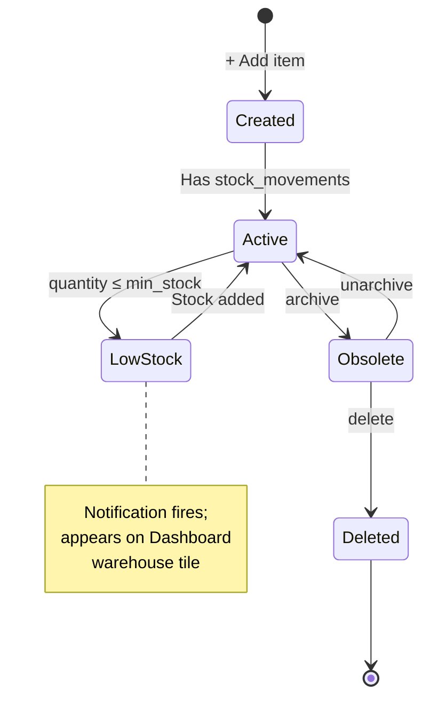
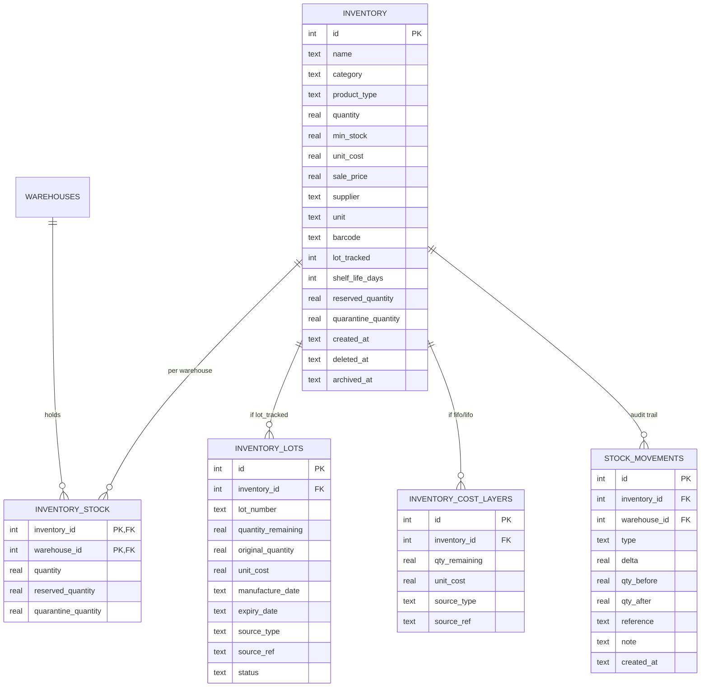

# Inventory

The master record of every physical thing the company owns. Items, quantities,
costs, lots, and the movements that change them — all under one module.

## Purpose

Inventory holds **what exists** (the item catalogue), **how much exists**
(quantities per location), and **what it cost** (per-layer or per-lot). Every
other operational module either reads from here (POS, Manufacturing) or
writes to here (Purchases, Manufacturing, Project consumption, Transfers).

## Personas

| Persona | What they do here |
|---|---|
| **Inventory clerk** | Adjusts counts, runs cycle counts, attaches lots, archives obsolete items |
| **Operations Manager** | Sets min-stock levels, picks costing method, reads low-stock alerts |
| **Production worker** | Reads remaining qty of components before drawing them |
| **Cashier** | Indirectly — POS reads sale_price and quantity |
| **Auditor** | Reconciles quantities to GL Inventory account |

## Quick reference

- **Two grains of "quantity"** — company total (`inventory.quantity`) +
  per-warehouse (`inventory_stock.quantity`). The two are maintained in
  lock-step.
- **Product types** — `raw_material`, `semi_finished`, `finished`, `consumable`
- **Costing methods** — `weighted_avg` (default), `fifo`, `lifo`. Set
  in Settings.
- **Lot tracking** — opt-in per item. Lot-tracked items consume **FEFO**
  (First Expired First Out).
- **Reservation + Quarantine** — separate balances on each `inventory_stock`
  row, never affect "available" math directly.

---

=== "Operator's view"

    ### The Inventory list

    Sidebar → **Inventory**. Filter / search by name, category, barcode,
    `Low stock` toggle.

    ### Barcodes and scanners

    A barcode scanner behaves like a keyboard: it types the code and then
    presses Enter for you.

    - **In the search box** — scan and the item is found. Barcodes match
      exactly, so a scan lands on the one right item.
    - **At the till** — scanning adds the item straight to the sale.
    - **When adding a product** — you can scan into the **Barcode** box.
      The form will not save when the scanner beeps; you finish filling in
      the rest and save yourself.

    Each barcode belongs to one item. Reusing one is refused, with a
    message saying which item already has it.

    !!! note "Printing labels"
        The system stores and reads barcodes that already exist on your
        products. It does not generate or print barcode labels.

    Columns: Name · Category · Quantity · Min stock · Unit cost · Sale
    price · Unit. Click a row to open detail.

    ### Item detail — tabs

    1. **Overview** — name, category, type, current quantity, unit cost,
       barcode
    2. **Movements** — every `stock_movements` row for this item, newest
       first
    3. **Lots** (if lot_tracked) — FEFO list of lots with expiry status
    4. **Cost layers** (FIFO/LIFO) — open layers with cost basis
    5. **Per-warehouse** — breakdown across `inventory_stock`

    ### Adjusting a count

    Open the item → **Adjust stock**. Pick:
    - **Warehouse** (your default is pre-selected)
    - **Delta** — positive (found stock) or negative (write-off)
    - **Type** — `adjustment`, `loss`, `usage`, `return`, `purchase`
    - **Note** — required for negative deltas; optional otherwise

    The modal **shows on-hand per warehouse** before you submit, so you
    can't accidentally draw from the wrong location.

    ### Low-stock alerts

    Set `min_stock` on each item. When `quantity ≤ min_stock` (company-wide)
    the dashboard fires a `low_stock` notification. After Phase 1, you also
    get **per-warehouse alerts** (BRANCH-A low even while MAIN is full).

    ### Lot-tracked items

    For an item with `lot_tracked=1`:
    - **Receipts** (purchases, production) attach a **lot** with optional
      `expiry_date` and `manufacture_date`
    - **Consumption** draws **FEFO** — soonest expiring goes out first
    - **Expiring soon** items surface on the **Lots** tab with a yellow
      badge
    - **Already expired** items are auto-flagged but **not auto-removed** —
      that's an inventory adjustment decision

=== "Administrator's view"

    ### Permissions

    | Role | view | create | edit | delete |
    |---|---|---|---|---|
    | Inventory | ✅ | ✅ | ✅ | ✗ |
    | Operations Manager | ✅ | ✅ | ✅ | ✅ |
    | Procurement Officer | ✅ | ✗ | ✗ | ✗ |
    | Production Manager | ✅ | ✗ | ✗ | ✗ |
    | Cashier | ✅ (read-only) | ✗ | ✗ | ✗ |
    | Auditor | ✅ | ✗ | ✗ | ✗ |

    Plus **per-warehouse access** restricts which warehouses the user can
    transact at (see [Multi-warehouse access](../foundation/warehouse-access.md)).

    ### Choosing a costing method

    **Settings → Inventory → Costing method**:

    | Method | When to use | Stored where |
    |---|---|---|
    | `weighted_avg` (default) | Most SMEs. Simple. Blends every receipt. | `inventory.unit_cost` |
    | `fifo` | Goods that age (food, pharma). Tax-efficient when prices rise. | `inventory_cost_layers` |
    | `lifo` | When permitted by jurisdiction; not common. | `inventory_cost_layers` |

    Changing methods mid-life is a rare operation — see vendor docs.

    ### Reservation vs. quarantine

    Two extra balances exist on every `inventory_stock` row:

    | Balance | Bumps when | Drains when |
    |---|---|---|
    | `reserved_quantity` | Production order confirmed | Production order completed or cancelled |
    | `quarantine_quantity` | QC quarantine on a finished batch | Inspector resolves the QC |

    They're informational — the **available** quantity for selling is
    `quantity - reserved - quarantine`, but the system computes that
    on-the-fly; it's not a stored column.

    ### Product types

    | Type | Typical use |
    |---|---|
    | `raw_material` | Components consumed in production |
    | `semi_finished` | Sub-assemblies that feed downstream production |
    | `finished` | Sellable end products |
    | `consumable` | Office supplies, cleaning materials — usually not sold |

    Filters on the Inventory list let you scope by type.

=== "Auditor's view"

    ### Inventory ties to the GL

    The headline control — Σ inventory value should equal the GL
    1200 Inventory balance:

    ```sql
    -- Total inventory value at current unit cost
    SELECT ROUND(SUM(quantity * COALESCE(unit_cost, 0)), 2) AS book_value
    FROM inventory
    WHERE deleted_at IS NULL AND archived_at IS NULL;

    -- GL 1200 balance (trial-balance debit side)
    SELECT ROUND(SUM(jel.debit) - SUM(jel.credit), 2) AS gl_inventory
    FROM journal_entry_lines jel
    JOIN journal_entries je ON je.id = jel.journal_entry_id
    JOIN chart_of_accounts a ON a.id = jel.account_id
    WHERE a.code = '1200' AND je.status = 'posted';
    ```

    The two numbers should agree within rounding. **Material drift** = a
    write somewhere that updated `inventory` but didn't post a journal entry
    (or vice versa). Drift detection is the most valuable inventory audit.

    ### Per-warehouse sum invariant

    The system maintains `inventory.quantity = SUM(inventory_stock.quantity)`
    on every write. Verify:

    ```sql
    SELECT i.id, i.name, i.quantity AS company,
           COALESCE(SUM(s.quantity), 0) AS per_wh_sum
    FROM inventory i
    LEFT JOIN inventory_stock s ON s.inventory_id = i.id
    WHERE i.deleted_at IS NULL
    GROUP BY i.id, i.name
    HAVING ABS(i.quantity - per_wh_sum) > 0.0001;
    ```

    Result should be empty. Any row = a sync bug worth investigating.

    ### Movement → JE reconciliation

    Every stock movement of type `purchase`, `sale`, or `production` should
    have a matching journal entry:

    ```sql
    SELECT sm.id, sm.type, sm.reference, sm.created_at,
           je.entry_number
    FROM stock_movements sm
    LEFT JOIN journal_entries je
      ON je.source_ref = sm.reference
     AND je.source_type IN ('invoice_payment', 'purchase', 'pos_cogs')
    WHERE sm.type IN ('purchase', 'sale', 'production')
      AND DATE(sm.created_at) = '2026-05-30'
      AND je.id IS NULL;
    ```

    Result should be empty for sales (POS posts COGS) and purchases (DR
    Inventory). Internal transfers and adjustments correctly have no JE.

---

## Status lifecycle (item)



## Data model



## Stock-movement types

Every quantity change writes one `stock_movements` row with one of these
types:

| Type | Source module | GL effect |
|---|---|---|
| `purchase` | Purchases (receipt) | DR Inventory CR Cash |
| `sale` | POS (checkout) | DR COGS CR Inventory (plus DR Cash CR Revenue separately) |
| `production` | Manufacturing (complete) | None directly — value moves between items |
| `qc_quarantine` | Manufacturing (complete with QC) | None |
| `qc_release` | Manufacturing (QC pass) | None |
| `qc_reject` | Manufacturing (QC reject) | Scrap cost recognised |
| `return` | POS (return) | Reverses sale entry |
| `adjustment` | Inventory adjust modal | None — operator's choice to write off elsewhere |
| `transfer_out` | Warehouses (dispatch) | None |
| `transfer_in` | Warehouses (receive) | None |

## API surface

| Endpoint | Purpose |
|---|---|
| `GET /api/inventory/` | List (filter by category, low-stock, search) |
| `POST /api/inventory/` | Create item |
| `GET /api/inventory/{id}` | Detail |
| `PUT /api/inventory/{id}` | Update item master |
| `PATCH /api/inventory/{id}/stock` | Adjust stock at a specific warehouse |
| `POST /api/inventory/{id}/deduct-to-project` | Material consumption to a project |
| `GET /api/inventory/{id}/by-warehouse` | Per-warehouse breakdown |
| `GET /api/inventory/{id}/movements` | Movement history |
| `GET /api/inventory/lots` | Lots (lot-tracked items only) |
| `PATCH /api/inventory/{id}/archive` | Soft-archive |

## What's NOT supported (deliberately)

- Per-bin / per-aisle location within a warehouse. Warehouses are atomic
  locations; bin tracking is a WMS feature, out of scope.
- Cycle counting workflows with frozen counts. Adjustments handle ad-hoc
  recounts; structured cycle counts are an operational procedure on top.
- Auto-reorder POs (just-in-time procurement). The system fires low-stock
  alerts; the procurement officer decides when and how much to order.
