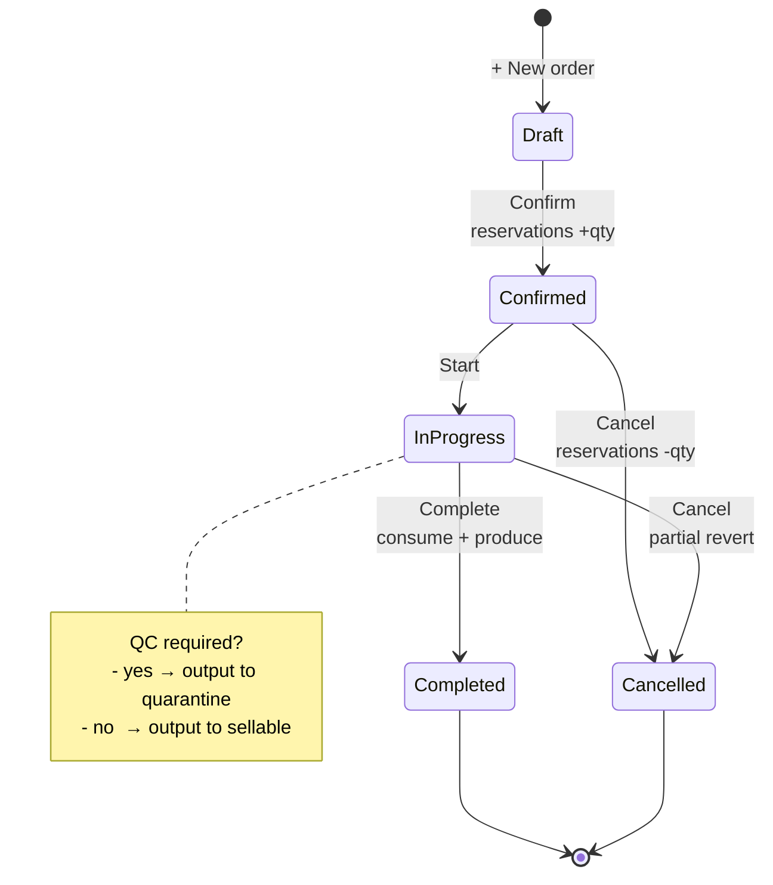
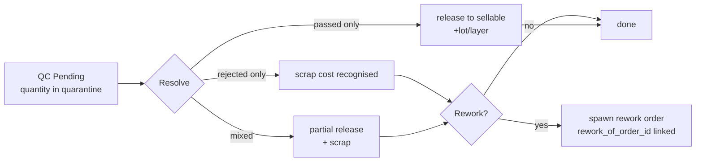
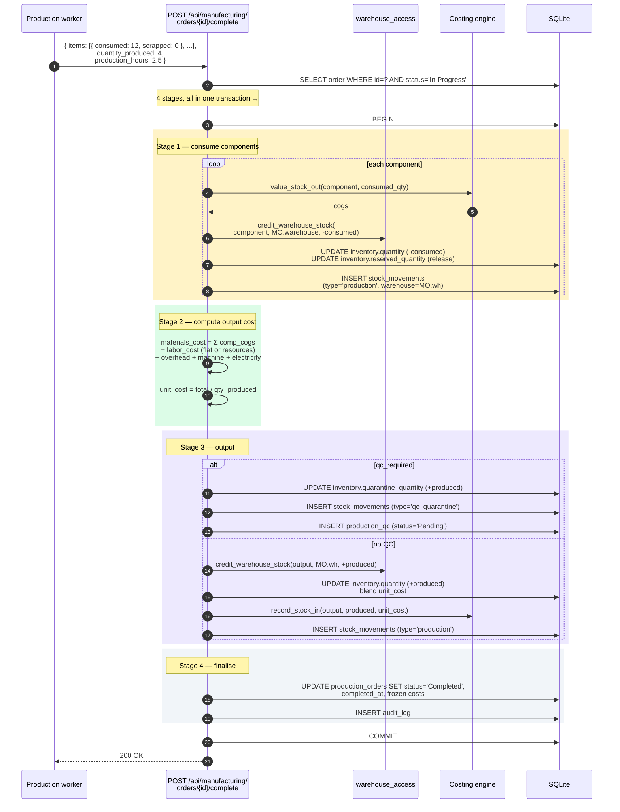
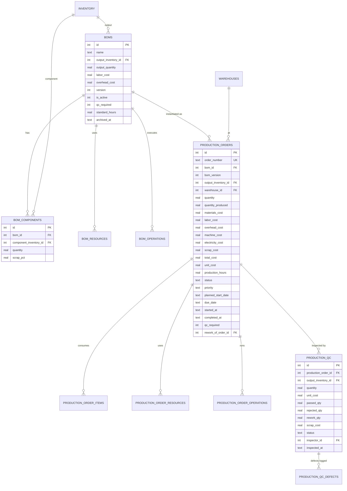

# Manufacturing

The make-to-stock pipeline. BOMs define the recipe; production orders
execute the recipe; QC gates the output. Costs flow through automatically.

## Purpose

Manufacturing turns raw materials and labour into finished or semi-finished
goods. The system models:

| Concept | What it is |
|---|---|
| **BOM** (Bill of Materials) | The recipe: components + resources + optional operations |
| **Production Order (MO)** | A specific run of a BOM, with planned + actual quantities |
| **QC inspection** | Gate between "produced" and "sellable" — when the BOM requires it |
| **Resources** | Labour, machine, electricity cost-per-hour buckets |
| **Work centers** | Physical workstations (optional) with their own labour/machine rates |

A 10-unit run of "Widget v2" with QC turns into one `production_orders`
row, several `production_order_items` (components), an optional
`production_qc` row, and stock movements on every component (in) and the
output (out).

## Personas

| Persona | What they do here |
|---|---|
| **Production Manager** | Sets up BOMs, opens production orders, schedules priorities |
| **Production worker** | Marks consumption + output (on the MO Complete dialog) |
| **QC inspector** | Resolves quarantined batches (passed / rejected / rework) |
| **Operations Manager** | Reviews margins, scrap rates, resource utilisation |
| **Auditor** | Reconciles output cost to input cost + labour + overhead |

## Quick reference

- **BOM versions** — every change creates a new version (immutable history)
- **Costing inputs** — components (FIFO/LIFO/avg from inventory), labour
  (flat or per-resource), overhead, machine + electricity
- **MO status** — `Draft → Confirmed → In Progress → Completed` (or
  `Cancelled`)
- **QC** — opt-in per BOM (`qc_required=1`)
- **Warehouse** — one per MO (consume + produce in the same location, by
  Phase 1 design)
- **Reservation** — confirming a draft order reserves component quantities

---

=== "Operator's view"

    ### Creating a BOM

    Manufacturing → **BOMs** tab → **+ New BOM**:

    1. Name + output inventory item + output quantity
    2. Add **components** — each is an inventory item with a quantity per
       output unit + optional scrap percentage
    3. Optionally add **resources** (labour, machine) — each at an hourly
       rate
    4. Optionally add **operations** — each linked to a work center with
       setup minutes + run minutes per unit
    5. Set `qc_required` if the output needs inspection before going to
       sellable stock
    6. Save. Version 1 is created and active.

    ### Editing a BOM

    Open the BOM → **+ New version**. The previous version stays for
    historical production orders that referenced it. The new version
    becomes the default for future orders.

    ### Opening a production order

    Manufacturing → **Orders** tab → **+ New order**:

    | Field | Notes |
    |---|---|
    | BOM | Pick the active version |
    | Quantity to produce | Scales components proportionally |
    | Priority | Low / Normal / High / Urgent |
    | Planned start, Due date | For the scheduling board |
    | Labor / overhead override | Optional — defaults to BOM × scale |
    | **Warehouse** | Components draw from here; output lands here |

    Save. Order lands in **Draft**.

    ### MO lifecycle

    | Action | Status moves to | Side effects |
    |---|---|---|
    | **Confirm** | Confirmed | Components reserved (added to `reserved_quantity`) |
    | **Start** | In Progress | Just timestamps; no stock motion |
    | **Complete** | Completed | Atomic: consume components, produce output |
    | **Cancel** | Cancelled | Reservations released |

    ### Completing the run

    On the In Progress order → **Complete**:

    1. Edit per-line **actual consumed** and **scrapped** quantities
       (defaults to planned)
    2. Enter **production hours** (drives resource cost)
    3. Set **quantity produced** (defaults to planned)
    4. Click **Complete**

    Atomic writes:
    - Each component: `inventory.quantity -consumed`, `inventory_stock at
      MO.warehouse -consumed`, cost layers drawn
    - Output: `inventory.quantity +produced`, `inventory_stock +produced`,
      new lot/layer at calculated unit cost
    - `production_order_items` frozen with actual qty + cost
    - `production_order_resources` cost = hours × rate
    - `stock_movements` rows for every motion

    ### QC quarantine + release

    If `qc_required=1`:
    - On Complete, the output goes to `quarantine_quantity` (not sellable)
    - A `production_qc` row is created in **Pending** status

    QC inspector opens the QC → **Resolve**:

    | Outcome | Quantity bucket | Effect |
    |---|---|---|
    | passed | sellable | `quarantine -qty`, `quantity +qty`, new lot/layer |
    | rejected | scrapped | `quarantine -qty`, scrap cost recognised |
    | rework | spawned | New MO created (`rework_of_order_id` linked) |

    `passed + rejected` must equal the batch quantity. `rework` ≤
    `rejected`.

=== "Administrator's view"

    ### Permissions

    | Role | view | create | edit | delete | approve |
    |---|---|---|---|---|---|
    | Production Manager | ✅ | ✅ | ✅ | ✅ | ✅ |
    | Operations Manager | ✅ | ✅ | ✅ | ✅ | ✅ |
    | Inventory clerk | ✅ | ✗ | ✗ | ✗ | ✗ |
    | Auditor | ✅ | ✗ | ✗ | ✗ | ✗ |

    Per-warehouse access applies — a Production Manager restricted to
    WORKSHOP can only open MOs at WORKSHOP.

    ### Costing model

    The output unit cost is the sum of:

    1. **Components** — Σ(component_qty × component_unit_cost), with cost
       drawn per the costing method (FIFO/LIFO/avg)
    2. **Labour** — either the flat `labor_cost` on the MO, or Σ(resource
       hourly_rate × hours) if resources are assigned
    3. **Overhead** — flat MO field, or per-resource (e.g. electricity at
       kW × hours × tariff)
    4. **Machine + Electricity** — same pattern for resources of those
       cost types

    Total ÷ `quantity_produced` = output unit cost.

    ### Resources

    Manufacturing → **Resources** tab. A resource is a labour/machine pool
    with a cost type and an hourly rate. Examples:

    | Name | Cost type | Hourly rate |
    |---|---|---|
    | Senior Welder | labor | 25 |
    | CNC Machine | machine | 15 |
    | Electricity (kW) | electricity | 0.15 |

    Attach to a BOM. When the MO runs, total cost = rate × hours.

    ### Work centers

    Manufacturing → **Work centers**. Optional — only used if you model
    operations explicitly. Each work center has its own labour, machine,
    overhead, and electricity rates that override BOM-level rates.

=== "Auditor's view"

    ### Output cost = input cost (within rounding)

    Material conservation check:

    ```sql
    SELECT po.order_number, po.quantity_produced,
           po.unit_cost AS output_unit_cost,
           po.quantity_produced * po.unit_cost AS output_value,
           po.materials_cost + po.labor_cost
                              + po.overhead_cost + po.machine_cost
                              + po.electricity_cost AS input_value,
           ROUND(po.quantity_produced * po.unit_cost
                 - (po.materials_cost + po.labor_cost
                    + po.overhead_cost + po.machine_cost
                    + po.electricity_cost), 2) AS rounding_diff
    FROM production_orders po
    WHERE po.status = 'Completed'
    HAVING ABS(rounding_diff) > 0.5
    ORDER BY po.completed_at DESC;
    ```

    Differences > $0.50 should be investigated — usually a partial-completion
    scenario or a manual cost override.

    ### Scrap rate per BOM

    ```sql
    SELECT b.id, b.name, b.version,
           AVG(poi.quantity_scrapped * 100.0 / NULLIF(poi.quantity_required, 0)) AS avg_scrap_pct
    FROM boms b
    JOIN production_orders po ON po.bom_id = b.id AND po.status = 'Completed'
    JOIN production_order_items poi ON poi.production_order_id = po.id
    GROUP BY b.id, b.version
    HAVING avg_scrap_pct > 5;
    ```

    BOMs with persistent > 5% scrap need design review.

    ### QC pass/fail rate

    ```sql
    SELECT b.name, COUNT(qc.id) AS inspections,
           SUM(qc.passed_qty) AS passed,
           SUM(qc.rejected_qty) AS rejected,
           ROUND(100.0 * SUM(qc.passed_qty)
                       / NULLIF(SUM(qc.passed_qty + qc.rejected_qty), 0), 1) AS pass_pct
    FROM production_qc qc
    JOIN production_orders po ON po.id = qc.production_order_id
    JOIN boms b ON b.id = po.bom_id
    WHERE qc.status != 'Pending'
    GROUP BY b.id ORDER BY pass_pct;
    ```

    ### Genealogy (lot-tracked items)

    For a finished lot, trace which input lots fed it:

    ```sql
    SELECT out_lot.lot_number AS output_lot,
           in_lot.lot_number  AS input_lot,
           lc.quantity        AS consumed_qty
    FROM lot_consumption lc
    JOIN inventory_lots out_lot ON out_lot.id = lc.output_lot_id
    JOIN inventory_lots in_lot  ON in_lot.id  = lc.lot_id
    WHERE lc.production_order_id = ?;
    ```

    Full traceability for food/pharma compliance.

---

## MO lifecycle



## QC resolution



## Workflow — complete MO with QC



## Data model



## API surface

| Endpoint | Purpose |
|---|---|
| `GET /api/manufacturing/boms` | List BOMs |
| `POST /api/manufacturing/boms` | Create BOM |
| `POST /api/manufacturing/boms/{id}/new-version` | Bump version |
| `GET /api/manufacturing/orders` | List MOs |
| `POST /api/manufacturing/orders` | Create MO |
| `POST /api/manufacturing/orders/{id}/confirm` | Reserve components |
| `POST /api/manufacturing/orders/{id}/start` | Status → In Progress |
| `POST /api/manufacturing/orders/{id}/complete` | The big atomic write |
| `POST /api/manufacturing/orders/{id}/cancel` | Release reservations |
| `POST /api/manufacturing/qc/{id}/resolve` | Resolve QC inspection |
| `GET /api/manufacturing/resources` | List resources |
| `GET /api/manufacturing/work-centers` | List work centers |
| `GET /api/manufacturing/summary` | KPIs |

## What's NOT supported (deliberately)

- Different source/destination warehouses for one MO. Phase 1 design choice
  — keeps the model simple.
- Multi-output BOMs (one BOM producing two distinct items). Use two BOMs
  with a shared component graph.
- Real-time machine telemetry. The system records what the operator types
  at completion; integrating MES sensors is out of scope.
