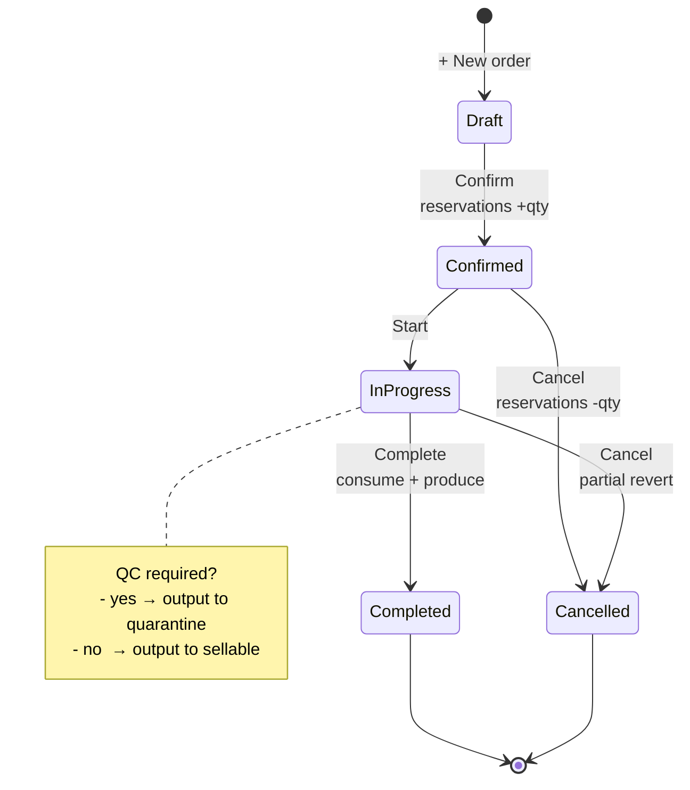
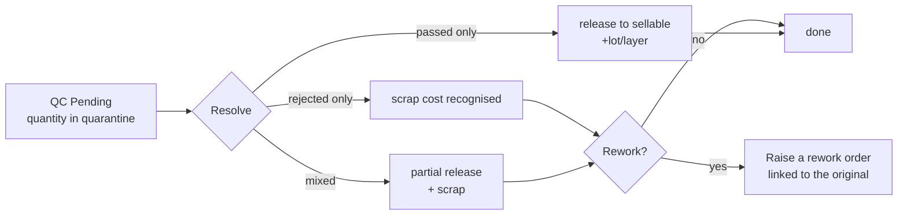

# Manufacturing

Making finished goods out of raw materials.

## Purpose

If you buy parts and sell a product built from them, this is where that
happens.

| Term | What it means |
|---|---|
| **BOM** (Bill of Materials) | The recipe — what goes into one unit, and how much |
| **Production order** | One actual run of that recipe: make 10 of these |
| **QC inspection** | A check before the output can be sold, when the recipe requires it |
| **Resources** | Labour, machine time and power, costed per hour |
| **Work centres** | Where the work happens, each with its own rates |

Running a production order takes the components out of stock, adds the
finished goods in, and works out what each unit cost you to make — including
labour and machine time, not just materials.

## Personas

| Persona | What they do here |
|---|---|
| **Production Manager** | Sets up BOMs, opens production orders, schedules priorities |
| **Production worker** | Marks consumption + output (on the MO Complete dialog) |
| **QC inspector** | Resolves quarantined batches (passed / rejected / rework) |
| **Operations Manager** | Reviews margins, scrap rates, resource utilisation |
| **Auditor** | Reconciles output cost to input cost + labour + overhead |

## Quick reference

- **BOM versions** — every change creates a new version (immutable history)
- **Costing inputs** — components (FIFO/LIFO/avg from inventory), labour
  (flat or per-resource), overhead, machine + electricity
- **MO status** — `Draft → Confirmed → In Progress → Completed` (or
  `Cancelled`)
- **QC** — opt-in per BOM (QC switched on)
- **Warehouse** — one per MO (consume + produce in the same location, by
  by design)
- **Reservation** — confirming a draft order reserves component quantities

---

=== "Operator's view"

    ### Creating a BOM

    Manufacturing → **BOMs** tab → **+ New BOM**.

    1. Name + output inventory item + output quantity
    2. Add **components** — each is an inventory item with a quantity per
       output unit + optional scrap percentage
    3. Optionally add **resources** (labour, machine) — each at an hourly
       rate
    4. Optionally add **operations** — each linked to a work center with
       setup minutes + run minutes per unit
    5. Set qc required if the output needs inspection before going to
       sellable stock
    6. Save. Version 1 is created and active.

    ### Editing a BOM

    Open the BOM → **+ New version**. The previous version stays for
    historical production orders that referenced it. The new version
    becomes the default for future orders.

    ### Opening a production order

    Manufacturing → **Orders** tab → **+ New order**.

    | Field | Notes |
    |---|---|
    | BOM | Pick the active version |
    | Quantity to produce | Scales components proportionally |
    | Priority | Low / Normal / High / Urgent |
    | Planned start, Due date | For the scheduling board |
    | Labor / overhead override | Optional — defaults to BOM × scale |
    | **Warehouse** | Components draw from here; output lands here |

    Save. Order lands in **Draft**.

    ### MO lifecycle

    | Action | Status moves to | Side effects |
    |---|---|---|
    | **Confirm** | Confirmed | Components reserved (added to reserved quantity) |
    | **Start** | In Progress | Just timestamps; no stock motion |
    | **Complete** | Completed | Atomic: consume components, produce output |
    | **Cancel** | Cancelled | Reservations released |

    ### Completing the run

    On the In Progress order → **Complete**.

    1. Edit per-line **actual consumed** and **scrapped** quantities
       (defaults to planned)
    2. Enter **production hours** (drives resource cost)
    3. Set **quantity produced** (defaults to planned)
    4. Click **Complete**

    Atomic writes:
    - Each component: the item's total goes down, `per-warehouse stock at
      MO.warehouse -consumed`, cost layers drawn
    - Output: the item's total goes up, `per-warehouse stock +produced`,
      new lot/layer at calculated unit cost
    - production order items frozen with actual qty + cost
    - production order resources cost = hours × rate
    - a stock movement for everything that moved

    ### QC quarantine + release

    If QC switched on:
    - On Complete, the output goes to quarantine quantity (not sellable)
    - A QC check is created, in **Pending** status

    QC inspector opens the QC → **Resolve**.

    | Outcome | Quantity bucket | Effect |
    |---|---|---|
    | passed | sellable | `quarantine -qty`, `quantity +qty`, new lot/layer |
    | rejected | scrapped | `quarantine -qty`, scrap cost recognised |
    | rework | spawned | New MO created (rework of order id linked) |

    `passed + rejected` must equal the batch quantity. `rework` ≤
    `rejected`.

=== "Administrator's view"

    ### Permissions

    | Role | view | create | edit | delete | approve |
    |---|---|---|---|---|---|
    | Production Manager | ✅ | ✅ | ✅ | ✅ | ✅ |
    | Operations Manager | ✅ | ✅ | ✅ | ✅ | ✅ |
    | Inventory clerk | ✅ | ✗ | ✗ | ✗ | ✗ |
    | Auditor | ✅ | ✗ | ✗ | ✗ | ✗ |

    Per-warehouse access applies — a Production Manager restricted to
    WORKSHOP can only open MOs at WORKSHOP.

    ### Costing model

    The output unit cost is the sum of.

    1. **Components** — the total of each component's quantity × its cost, with cost
       drawn per the costing method (FIFO/LIFO/avg)
    2. **Labour** — either the flat labor cost on the MO, or Σ(resource
       hourly rate × hours) if resources are assigned
    3. **Overhead** — flat MO field, or per-resource (e.g. electricity at
       kW × hours × tariff)
    4. **Machine + Electricity** — same pattern for resources of those
       cost types

    Total ÷ quantity produced = output unit cost.

    ### Resources

    Manufacturing → **Resources** tab. A resource is a labour/machine pool
    with a cost type and an hourly rate. Examples.

    | Name | Cost type | Hourly rate |
    |---|---|---|
    | Senior Welder | labor | 25 |
    | CNC Machine | machine | 15 |
    | Electricity (kW) | electricity | 0.15 |

    Attach to a BOM. When the MO runs, total cost = rate × hours.

    ### Work centers

    Manufacturing → **Work centers**. Optional — only used if you model
    operations explicitly. Each work center has its own labour, machine,
    overhead, and electricity rates that override BOM-level rates.

=== "Auditor's view"

    ### Output cost = input cost (within rounding)

    Material conservation check.

    Differences > $0.50 should be investigated — usually a partial-completion
    scenario or a manual cost override.

    ### Scrap rate per BOM

    BOMs with persistent > 5% scrap need design review.

    ### QC pass/fail rate

    ### Genealogy (lot-tracked items)

    For a finished lot, trace which input lots fed it.

    Full traceability for food/pharma compliance.

---

## MO lifecycle

## QC resolution

## What's NOT supported (deliberately)

- Different source/destination warehouses for one MO. a deliberate design choice
  — keeps the model simple.
- Multi-output BOMs (one BOM producing two distinct items). Use two BOMs
  with a shared component graph.
- Real-time machine telemetry. The system records what the operator types
  at completion; integrating MES sensors is out of scope.
