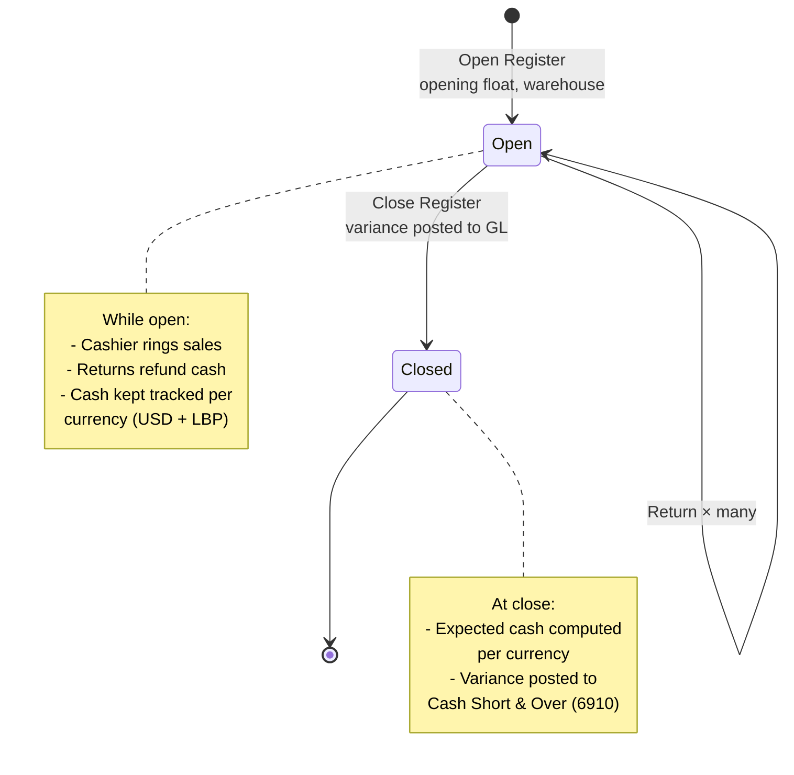

# POS (Point of Sale)

The till. Ring up a sale over the counter, take cash in USD or LBP, print a
receipt, and cash up at the end of the day.

## Purpose

POS is the fast version of selling: one screen instead of a quotation, an
invoice and a payment.

Behind the counter it is still the same system. A till sale creates a real
invoice (numbered `POS-…`), records the payment, takes the items off your
stock and posts everything to the accounts — all in one go. It is not a
separate set of books, so your reports include till sales without you doing
anything.

## Personas

| Persona | What they do here |
|---|---|
| **Cashier** | Opens session, rings up sales, accepts tenders, closes session |
| **Cash Manager** | Reviews variances at session close, sets cash drawer config |
| **Inventory clerk** | Verifies POS-deducted stock against physical count |
| **Accountant** | Reads `Cash Short & Over` entries from till variances |
| **Auditor** | Reconciles POS sales to GL, verifies dual-currency math |

## Quick reference

- **Session lifecycle** — `open → checkout (many) → close` (one open
  session per cashier at a time)
- **Tender currencies** — USD or LBP
- **Auto-creates** — every checkout creates an invoice with prefix
  `POS-`
- **Per-warehouse selling** — session is opened against a specific
  warehouse; sales deduct from there
- **Variance posting** — closing a session posts any difference to
  `Cash Short & Over` (account 6910)
- **Returns** — void the original invoice + restock atomically

---

=== "Operator's view"

    ### Opening a session

    POS → **Open Register** panel.

    | Field | Notes |
    |---|---|
    | **Selling from warehouse** | Defaults to your default warehouse (only shown if multiple are accessible) |
    | Opening float USD | Cash you start with in the drawer |
    | Opening float LBP | LBP starting balance |

    Click **Open Register**. Status: **Open**. You're ready to ring sales.

    !!! info "One session at a time"
        You can only have one open session at a time. If you forgot to close
        yesterday's, close it before starting today's.

    ### Ringing a sale

    On the POS screen.

    1. Scan barcode OR type item name (autocomplete from inventory)
    2. The line lands in the cart with default unit price
    3. Adjust qty, price, or apply line discount
    4. Repeat for more items
    5. Apply order-level discount if needed
    6. Pick **payment method** (Cash / Card / Bank)
    7. For cash: pick **currency** (USD or LBP), enter **amount tendered**
       (rate auto-applied for LBP)
    8. Click **Checkout**

    The receipt prints. The next sale starts immediately.

    ### Mixed-currency tender

    Customer pays $45 cash plus LBP 500,000 (worth $5.62 at rate 89,000)?

    The current UI accepts a single currency per checkout. For mixed
    tender, either:
    - Make two separate sales (one $45 USD, one $5.62 LBP equivalent)
    - Or do one full-currency checkout and the cashier reconciles the
      mixed bills offline

    ### Returning a sale

    Find the original sale: POS → **History** tab → search by invoice
    number → row menu → **Return**.

    Returns are **all-or-nothing** for the entire sale:
    - The original invoice is **voided** with the reason "POS return: …"
    - Stock is restocked at the session's warehouse (`stock movements
      type='return'`)
    - The return records the refund amount
    - Cash refund is recorded as a negative cash movement on the current
      session

    ### Closing the session

    End of shift / day:
    1. POS → **Close Register**
    2. Count physical cash and enter:
       - **Closing count USD** — what you counted in dollars
       - **Closing count LBP** — what you counted in pounds
    3. Click **Close Register**

    The system shows:
    - **Expected** USD + LBP — opening float ± cash sales ± returns
    - **Variance** — counted − expected, per currency

    If it is not zero, the system posts:
    - Variance < 0 (till short): `DR Cash Short & Over / CR Cash`
    - Variance > 0 (till over): `DR Cash / CR Cash Short & Over`

    A cash variance notification is sent if the variance crosses a
    threshold ($5 USD or 100,000 LBP).

=== "Administrator's view"

    ### Permissions

    | Role | view | create | edit | delete |
    |---|---|---|---|---|
    | Cashier | ✅ | ✅ | ✗ | ✗ |
    | Operations Manager | ✅ | ✅ | ✅ | ✅ |
    | Accountant | ✅ | ✗ | ✗ | ✗ |
    | Finance Manager | ✅ | ✗ | ✗ | ✗ |
    | Auditor | ✅ | ✗ | ✗ | ✗ |

    `delete` typically only allowed by Operations Manager + the customer
    owner — POS records are usually preserved indefinitely.

    Per-warehouse access also applies — a Cashier restricted to BRANCH-A
    can only open sessions selling from BRANCH-A.

    ### Cash drawer configuration

    POS sessions don't directly write to cash drawers — but the
    associated the payment's cash drawer does. Configure cash
    drawers in **Cash → Drawers**.

    Exactly one drawer should have auto-capture switched on — that's the default
    target when no specific drawer is picked on a cash payment.

    ### POS invoice prefix

    Configurable in Settings → POS settings. Default: `POS-`. Distinct
    from regular invoice prefix (`INV-`) so the two sales paths are
    visually separated in reports + search.

    ### Exchange rate

    LBP tenders use the latest rate from **Settings → Exchange Rate**.
    The rate is saved on the payment at the time of
    the sale — so future rate changes don't retroactively affect the
    posted entry.

=== "Auditor's view"

    ### Headline reconciliation — POS revenue → GL

    Every completed POS sale should appear in the GL `4000 Sales Revenue`
    account.

    Numbers should match exactly.

    ### COGS posting check

    Every POS sale of stock-backed items should also have a COGS post.

    Rows = sales that should have COGS but don't. Should be empty.

    ### Variance trail

    Every non-zero variance should have a matching entry. A missing one on a
    a non-zero variance with nothing posted is worth investigating.

    ### LBP routing to account 1010

    LBP POS sales should post Cash to **1010**, not **1000**.

    cash account should consistently show `1010`. Any `1000` is an older
    leak.

---

    ### Selling on instalments

    The customer takes the goods today and pays the rest over agreed months.

    At **Checkout**, pick the customer — an instalment sale needs one, because
    the balance is owed by somebody — then tick **Pay by instalments** and fill
    in:

    | Field | Notes |
    |---|---|
    | Deposit | What they hand over now. The till asks for this, not the full price |
    | Instalments | How many payments follow the deposit. Four means a deposit and four |
    | Every | Month, quarter or year |
    | First due | When the first instalment falls due |

    The balance is shown before you commit, and the receipt the customer takes
    away carries the deposit, the balance and every due date.

    **The deposit box is the one that takes their money**, not *Amount
    tendered*. On an instalment sale the till is only collecting the deposit,
    so *Amount tendered* follows it — and anything above it is change, the
    same as a customer paying a 100 deposit with a 300 note. Put nothing in
    the deposit and the till collects nothing: money typed into *Amount
    tendered* would be handed straight back, so the sale is refused with a
    message saying which box it belongs in.

    What happens behind it:

    - **The goods leave.** Stock is deducted and its cost recognised at the
      till, exactly as on any other sale.
    - **The balance becomes a receivable** against the customer, the same way a
      credit invoice works. It shows on their statement and in the aging report.
    - **Only the deposit is revenue.** Revenue is recognised as money arrives,
      so a $300 sale with $100 down earns $100 now and the rest as they pay.
    - **The drawer expects the deposit**, not the sale price, so the register
      still balances at close.

    Later payments are taken like any other invoice payment — from the
    customer's record, or against the invoice itself. The plan is the ordinary
    payment plan, so the invoice screen, the customer statement and the arrears
    reporting all read it without knowing it came from a till.

    Returning an instalment sale voids it whole: the goods come back, the
    receivable is cancelled, and the schedule stops so nobody is chased for a
    sale that was undone.

## Session lifecycle



## Receipt printing

The receipt is laid out for thermal paper and printed through the browser.

**Paper width.** Settings → Financial → *Receipt paper width* switches between
**80 mm** (default) and **58 mm**. Set it to match the roll in the printer: a
receipt laid out for 80 mm prints clipped on a 58 mm roll, and a 58 mm layout on
an 80 mm roll wastes half the paper. This is a per-company setting, so a business
with mixed hardware should standardise the rolls rather than the setting.

**One-click printing.** Printing always opens the browser's print dialog, and
no web page is allowed to skip it — that is the browser protecting you, not a
missing feature. For a dedicated till, launch Chrome with kiosk printing and the dialog
disappears; the receipt goes straight to the default printer on click.

```
chrome --kiosk-printing --app=https://<your-subdomain>.quilit.dev/pos
```

Set the thermal printer as the machine's **default** printer first, since that is
where kiosk printing sends the job. This is the recommended setup for a fixed
counter and needs no changes to the ERP.

**What this does not do.** There is no ESC/POS control, so the ERP cannot cut the
paper, kick the cash drawer, or beep. Those need raw byte access to the printer —
either a local print agent, or a native mobile app using Bluetooth. Most thermal
printers cut automatically on a page boundary, which is why this is rarely a
problem in practice.

**Mobile.** A phone browser cannot drive a Bluetooth receipt printer reliably, so
one-tap printing from a phone requires a native wrapper. Printing from a mobile
browser goes through the OS print dialog like any other page.

## What's NOT supported (deliberately)

- Layaway — the customer paying in advance and collecting later. An
  instalment sale here hands the goods over on the day (see **Selling on
  instalments** above); holding stock against a customer who has not taken
  it is a different arrangement and is not supported.
- Cashier login per checkout. The session is opened by the cashier and
  every checkout in that session is attributed to them.
- Per-line return (partial returns). Returns void the entire original
  sale and restock everything. For a partial keep + partial return, do a
  full return + ring a fresh sale for what the customer keeps.
- Tipping/gratuity. Not in scope.
- Loyalty programmes / customer points. Not in scope.
