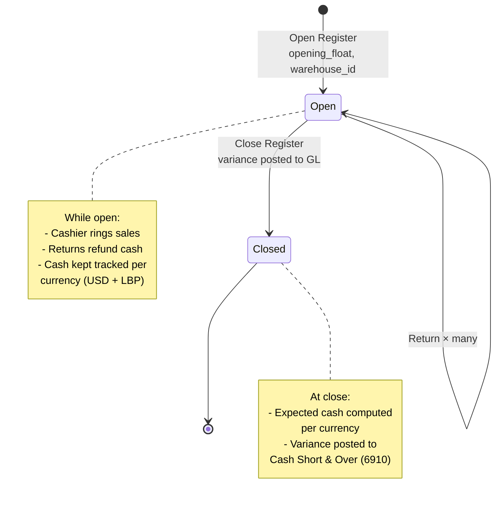
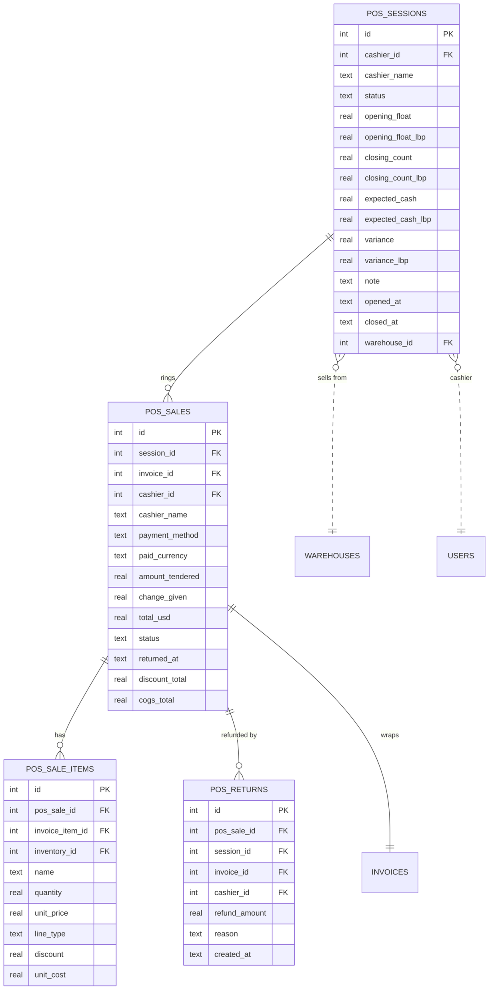

# POS (Point of Sale)

The over-the-counter selling fast-path. Cashier opens a register session,
rings up sales, accepts cash (USD or LBP), prints a receipt, closes the
till at end-of-day.

## Purpose

POS condenses the sales cycle into a single screen. One transaction
produces an invoice, an invoice payment, a stock deduction, two journal
entries (sale + COGS), and a POS-specific record — all atomic, all
audit-logged. See [Data flow](../architecture/data-flow.md) for the
8-write breakdown.

The POS module is fully integrated with the rest of the ERP — it's not a
parallel sales pipeline. A POS sale **is** an invoice (with prefix
`POS-`) backed by the same `invoices` + `invoice_payments` +
`stock_movements` infrastructure as regular sales.

## Personas

| Persona | What they do here |
|---|---|
| **Cashier** | Opens session, rings up sales, accepts tenders, closes session |
| **Cash Manager** | Reviews variances at session close, sets cash drawer config |
| **Inventory clerk** | Verifies POS-deducted stock against physical count |
| **Accountant** | Reads `Cash Short & Over` entries from till variances |
| **Auditor** | Reconciles POS sales to GL, verifies dual-currency math |

## Quick reference

- **Session lifecycle** — `open → checkout (many) → close` (one open
  session per cashier at a time)
- **Tender currencies** — USD or LBP
- **Auto-creates** — every checkout creates an `invoices` row with prefix
  `POS-`
- **Per-warehouse selling** — session is opened against a specific
  warehouse; sales deduct from there
- **Variance posting** — F-3 audit fix: end-of-session variance posts to
  `Cash Short & Over` (account 6910)
- **Returns** — void the original invoice + restock atomically

---

=== "Operator's view"

    ### Opening a session

    POS → **Open Register** panel:

    | Field | Notes |
    |---|---|
    | **Selling from warehouse** | Defaults to your default warehouse (only shown if multiple are accessible) |
    | Opening float USD | Cash you start with in the drawer |
    | Opening float LBP | LBP starting balance |

    Click **Open Register**. Status: **Open**. You're ready to ring sales.

    !!! info "One session at a time"
        You can only have one open session at a time. If you forgot to close
        yesterday's, close it before starting today's.

    ### Ringing a sale

    On the POS screen:

    1. Scan barcode OR type item name (autocomplete from inventory)
    2. The line lands in the cart with default unit price
    3. Adjust qty, price, or apply line discount
    4. Repeat for more items
    5. Apply order-level discount if needed
    6. Pick **payment method** (Cash / Card / Bank)
    7. For cash: pick **currency** (USD or LBP), enter **amount tendered**
       (rate auto-applied for LBP)
    8. Click **Checkout**

    The receipt prints. The next sale starts immediately.

    ### Mixed-currency tender

    Customer pays $45 cash plus LBP 500,000 (worth $5.62 at rate 89,000)?

    The current UI accepts a single currency per checkout. For mixed
    tender, either:
    - Make two separate sales (one $45 USD, one $5.62 LBP equivalent)
    - Or do one full-currency checkout and the cashier reconciles the
      mixed bills offline

    ### Returning a sale

    Find the original sale: POS → **History** tab → search by invoice
    number → row menu → **Return**.

    Returns are **all-or-nothing** for the entire sale:
    - The original invoice is **voided** with `void_reason='POS return: …'`
    - Stock is restocked at the session's warehouse (`stock_movements
      type='return'`)
    - A `pos_returns` row records the refund amount
    - Cash refund is recorded as a negative cash movement on the current
      session

    ### Closing the session

    End of shift / day:
    1. POS → **Close Register**
    2. Count physical cash and enter:
       - **Closing count USD** — what you counted in dollars
       - **Closing count LBP** — what you counted in pounds
    3. Click **Close Register**

    The system shows:
    - **Expected** USD + LBP — opening float ± cash sales ± returns
    - **Variance** — counted − expected, per currency

    If non-zero, the F-3 audit fix posts:
    - Variance < 0 (till short): `DR Cash Short & Over / CR Cash`
    - Variance > 0 (till over): `DR Cash / CR Cash Short & Over`

    A `cash_variance` notification is sent if the variance crosses a
    threshold ($5 USD or 100,000 LBP).

=== "Administrator's view"

    ### Permissions

    | Role | view | create | edit | delete |
    |---|---|---|---|---|
    | Cashier | ✅ | ✅ | ✗ | ✗ |
    | Operations Manager | ✅ | ✅ | ✅ | ✅ |
    | Accountant | ✅ | ✗ | ✗ | ✗ |
    | Finance Manager | ✅ | ✗ | ✗ | ✗ |
    | Auditor | ✅ | ✗ | ✗ | ✗ |

    `delete` typically only allowed by Operations Manager + the customer
    owner — POS records are usually preserved indefinitely.

    Per-warehouse access also applies — a Cashier restricted to BRANCH-A
    can only open sessions selling from BRANCH-A.

    ### Cash drawer configuration

    POS sessions don't directly write to cash drawers — but the
    associated `invoice_payments.cash_drawer_id` does. Configure cash
    drawers in **Cash → Drawers**.

    Exactly one drawer should have `auto_capture=1` — that's the default
    target when no specific drawer is picked on a cash payment.

    ### POS invoice prefix

    Configurable in Settings → POS settings. Default: `POS-`. Distinct
    from regular invoice prefix (`INV-`) so the two sales paths are
    visually separated in reports + search.

    ### Exchange rate

    LBP tenders use the latest rate from **Settings → Exchange Rate**.
    The rate is snapshotted on the `invoice_payments` row at the time of
    the sale — so future rate changes don't retroactively affect the
    posted entry.

=== "Auditor's view"

    ### Headline reconciliation — POS revenue → GL

    Every completed POS sale should appear in the GL `4000 Sales Revenue`
    account:

    ```sql
    -- POS revenue from pos_sales (one truth)
    SELECT SUM(total_usd) FROM pos_sales
    WHERE status = 'completed' AND DATE(created_at) = '2026-05-30';

    -- POS revenue from GL (other truth)
    SELECT SUM(jel.credit)
    FROM journal_entries je
    JOIN journal_entry_lines jel ON jel.journal_entry_id = je.id
    JOIN chart_of_accounts a ON a.id = jel.account_id
    WHERE je.source_type = 'invoice_payment'
      AND DATE(je.entry_date) = '2026-05-30'
      AND a.code = '4000'
      AND je.source_id IN (
        SELECT ip.id FROM invoice_payments ip
        JOIN invoices i ON i.id = ip.invoice_id
        WHERE i.invoice_number LIKE 'POS-%'
      );
    ```

    Numbers should match exactly.

    ### COGS posting check

    Every POS sale of stock-backed items should also have a COGS post:

    ```sql
    SELECT ps.id, ps.created_at, ps.total_usd, ps.cogs_total,
           je.entry_number AS revenue_je,
           cogs_je.entry_number AS cogs_je
    FROM pos_sales ps
    LEFT JOIN invoice_payments ip ON ip.invoice_id = ps.invoice_id
    LEFT JOIN journal_entries je
      ON je.source_type='invoice_payment' AND je.source_id=ip.id
    LEFT JOIN journal_entries cogs_je
      ON cogs_je.source_type='pos_cogs' AND cogs_je.source_id=ps.invoice_id
    WHERE ps.status='completed' AND ps.cogs_total > 0
      AND cogs_je.id IS NULL;
    ```

    Rows = sales that should have COGS but don't. Should be empty.

    ### Variance trail

    ```sql
    -- Every session close and the variance posted to GL
    SELECT s.id, s.cashier_name, s.closed_at,
           s.variance AS variance_usd,
           s.variance_lbp,
           je.entry_number AS variance_je
    FROM pos_sessions s
    LEFT JOIN journal_entries je
      ON je.source_type LIKE 'cash_variance%' AND je.source_id = s.id
    WHERE s.status = 'closed'
      AND (ABS(COALESCE(s.variance, 0)) > 0.005
        OR ABS(COALESCE(s.variance_lbp, 0)) > 1)
    ORDER BY s.closed_at DESC;
    ```

    Every non-zero variance should have a corresponding JE. NULL JE on a
    non-zero variance = F-3 audit fix not yet applied.

    ### LBP routing to account 1010

    LBP POS sales should post Cash to **1010**, not **1000**:

    ```sql
    SELECT je.entry_number, a.code AS cash_acct, jel.debit
    FROM pos_sales ps
    JOIN invoice_payments ip ON ip.invoice_id = ps.invoice_id
                              AND ip.paid_currency = 'LBP'
    JOIN journal_entries je
      ON je.source_type='invoice_payment' AND je.source_id=ip.id
    JOIN journal_entry_lines jel ON jel.journal_entry_id = je.id
    JOIN chart_of_accounts a ON a.id = jel.account_id
    WHERE jel.debit > 0
    ORDER BY ps.created_at DESC LIMIT 10;
    ```

    `cash_acct` should consistently show `1010`. Any `1000` = a pre-F-5
    leak.

---

## Session lifecycle



## Workflow — full POS sale (the 8-step transaction)

Already documented in [Architecture → Data flow](../architecture/data-flow.md).
The TL;DR:

1. Validate session, cart, stock at the session's warehouse
2. Insert `invoices` (POS- prefix)
3. Insert `invoice_items`
4. Insert `invoice_payments` (USD or LBP, rate snapshot)
5. Post **DR Cash CR Revenue** to GL (Cash routes to 1000 or 1010 by
   currency)
6. Deduct stock per costing method → `inventory_stock`, `inventory`,
   `inventory_cost_layers`/`inventory_lots`, `stock_movements`
7. Post **DR COGS CR Inventory** to GL
8. Insert `pos_sales` + `pos_sale_items`, audit-log, COMMIT

## Data model



## API surface

| Endpoint | Purpose |
|---|---|
| `GET /api/pos/session/current` | Caller's open session + running totals |
| `POST /api/pos/session/open` | Open with opening float + warehouse |
| `POST /api/pos/session/close` | Close + compute variances |
| `GET /api/pos/sessions` | History |
| `GET /api/pos/sales` | Sales history |
| `POST /api/pos/checkout` | The 8-step atomic write |
| `POST /api/pos/return/{sale_id}` | Void + restock atomically |
| `GET /api/pos/summary` | KPIs (today's sales, top items, …) |

## What's NOT supported (deliberately)

- Layaway / partial-payment over multiple sessions. POS is for over-the-
  counter; for staged payments use the regular invoices module.
- Cashier login per checkout. The session is opened by the cashier and
  every checkout in that session is attributed to them.
- Per-line return (partial returns). Returns void the entire original
  sale and restock everything. For a partial keep + partial return, do a
  full return + ring a fresh sale for what the customer keeps.
- Tipping/gratuity. Not in scope.
- Loyalty programmes / customer points. Not in scope.
