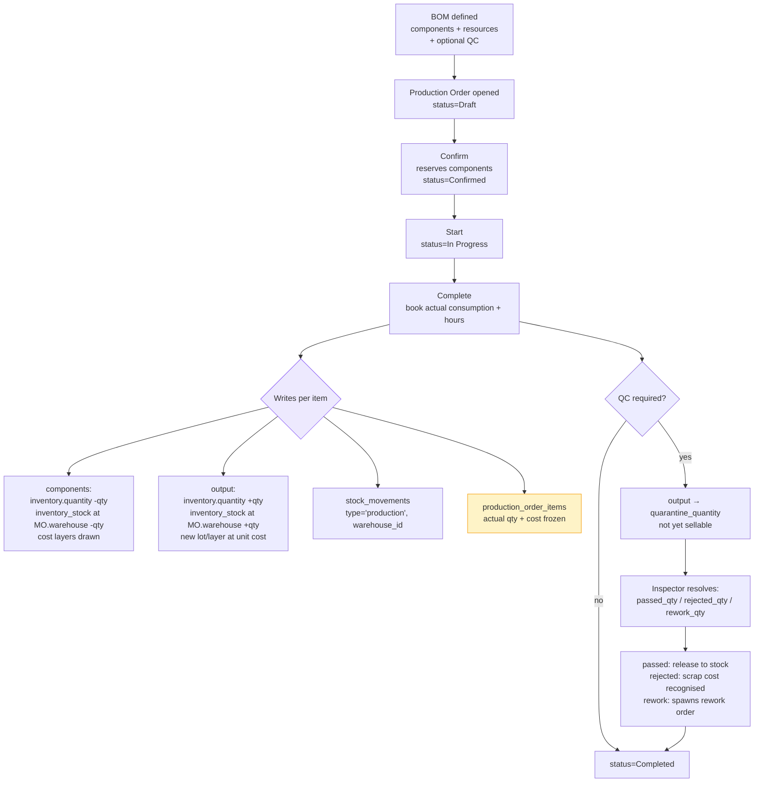
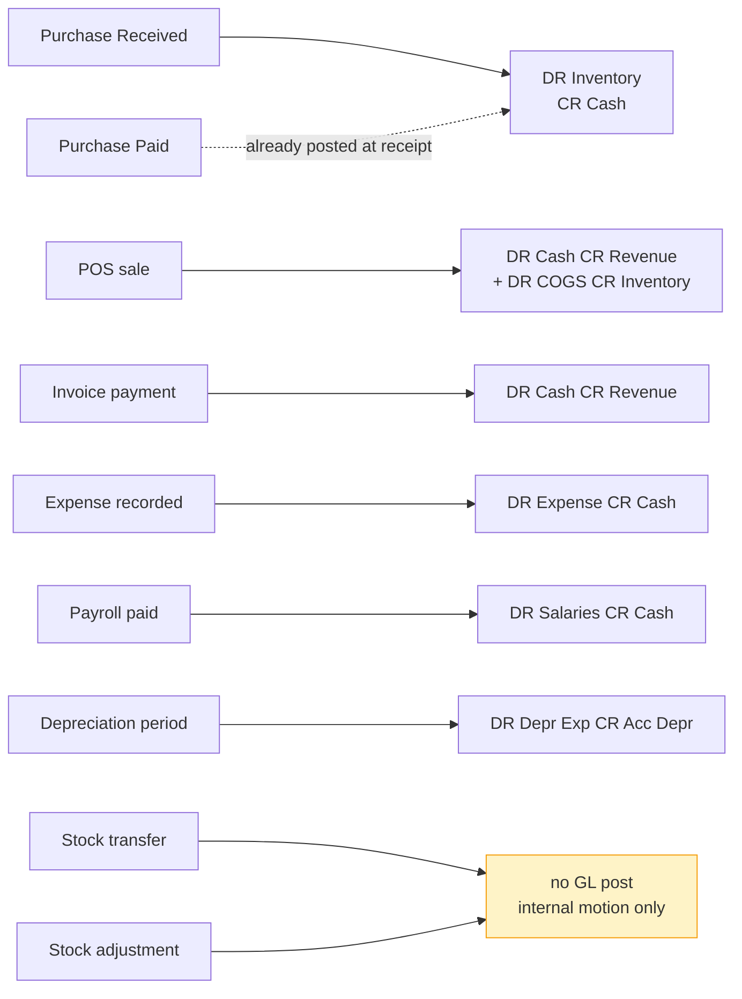

# Procure-to-stock workflow

How goods come in, move around, and go out — and what each step updates
for you.

## Pipeline 1 — Procure-to-stock

```mermaid
flowchart TB
    LSA[Low-stock alert<br/>or operator decides<br/>to restock] --> CRT[Create PO<br/>status=Ordered]
    CRT --> SUP[supplier reads PO]
    SUP --> ARR[Goods arrive]
    ARR --> RCV[Mark Received<br/>status=Received]
    RCV --> WR{Writes}
    WR --> W1[inventory.quantity +qty<br/>inventory_stock at PO.warehouse +qty]
    WR --> W2[inventory_lots or<br/>inventory_cost_layers updated<br/>per costing method]
    WR --> W3[stock_movements<br/>type='purchase', warehouse_id]
    WR --> W4[GL: DR Inventory 1200<br/>CR Cash & Bank 1000]
    RCV --> PAY[Mark Paid<br/>status=Paid]
    PAY --> EXP[expenses row<br/>(cash-basis dashboard)]
    PAY --> AUD[audit_log row]

    style WR fill:#fef3c7,stroke:#f59e0b
    style W4 fill:#dcfce7,stroke:#10b981
```

Every step is one click in the UI. The receipt step does the most writes —
four to inventory tables plus a journal entry plus an audit row, all in one
transaction.

## Pipeline 2 — Make-to-stock (Manufacturing)



## Pipeline 3 — POS sale

A till sale does the whole cycle in one step: it bills the customer, records
the payment, takes the stock off the shelf and posts the sale to the accounts —
all at once. See [POS](pos.md).

## Cross-pipeline timing

When does the GL get written? Different events post differently:



The two **non-posting** events — internal transfers and stock adjustments —
are deliberate. They don't change the **company's** inventory value, just
its location or count. Adjustments need a separate write-off accounting
treatment if the operator chooses (typically via a manual journal entry
debiting "Inventory Adjustment" expense).

## What auditors verify on the operations chapter

Five top-level controls cover most operations audit work:

1. **Inventory ties to the GL** — `Σ(quantity × unit_cost)` per item, summed
   across all items, should equal the GL's `1200 Inventory` balance at any
   moment (after Phase 1's audit remediation).
2. **Every receipt has a stock movement and a journal entry** — both with
   source ref linking to the PO number.
3. **Every sale has a COGS posting** — invoice + DR Cash CR Revenue + DR
   COGS CR Inventory.
4. **Production output equals the sum of consumed inputs valued at their
   costing-method cost** — `output_qty × output_unit_cost` ≈ Σ component
   line_costs + labour + overhead.
5. **Cash drawer variances are posted** — `Cash Short & Over` account
   reflects the actual end-of-day discrepancies.

Each module page below gives the SQL for these.
