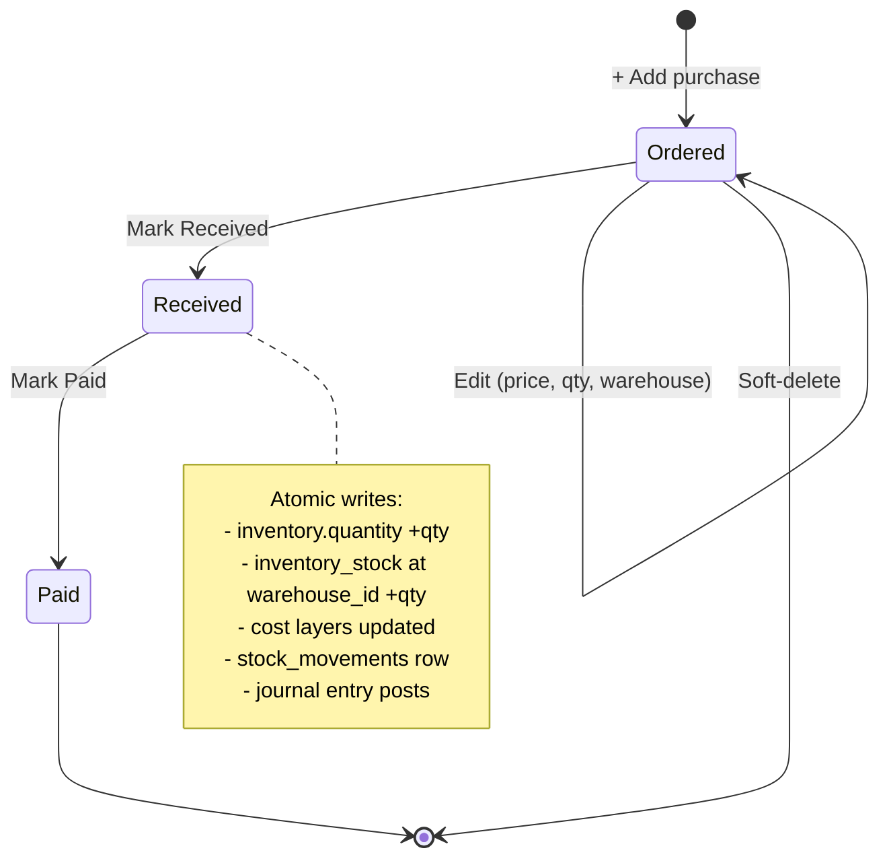

# Purchases

Buying stock and supplies from your suppliers.

## Purpose

A purchase order records what you bought, from whom, for how much, and which
warehouse it arrives at.

It moves through three steps, and each one does something:

| Step | What happens |
|---|---|
| **Ordered** | Recorded only. Your stock and accounts are untouched. |
| **Received** | The goods arrive: stock goes up at that warehouse, and the cost is recorded. |
| **Paid** | You paid the supplier. The payment date is recorded and it appears in your costs. |

Steps only go forwards. You cannot move something back from Received to
Ordered — if a delivery was wrong, record the correction rather than
rewriting history.

## Personas

| Persona | What they do here |
|---|---|
| **Procurement Officer** | Creates POs, marks received when goods arrive |
| **Inventory clerk** | Verifies receipt quantities, attaches lots if lot-tracked |
| **Accountant** | Marks Paid when invoice is settled |
| **Operations Manager** | Reviews open POs, supplier lead times, costs |
| **Auditor** | Reconciles receipts to GL Inventory and to stock movements |

## Quick reference

- **PO number format**: `PO-YYYY-NNNN` (vendor-configurable prefix)
- **Status**: `Ordered → Received → Paid` (forward-only)
- **Currency**: USD (no LBP purchases — by design)
- **Warehouse**: required; defaults to the user's default
- **Tax**: per-PO snapshot (tax rate, tax rate, tax amount)
- **Additional costs**: shipping, customs, handling — added to landed cost
- **Auto-create item**: a PO with no inventory id auto-creates an inventory item

---

=== "Operator's view"

    ### Creating a PO

    Purchases → **+ Add purchase**.

    | Field | Notes |
    |---|---|
    | Supplier | Free-text or pick from suppliers |
    | Inventory item | Pick existing OR leave blank to auto-create |
    | Product name | Required; the description on the PO |
    | Category | Used for inventory categorisation |
    | Quantity, Unit cost, Additional costs | Net + ship/customs |
    | Tax rate | Optional, per the system tax engine |
    | Status | Default Ordered |
    | **Receive at warehouse** | Defaults to your default warehouse |

    Save. PO lands in **Ordered** status.

    ### Receiving

    When goods arrive:
    1. Open the PO → **Receive** (status dropdown → Received)
    2. The system performs the receipt atomically:
       - Inventory `quantity` +qty (company-wide)
       - stock per warehouse +qty at the PO's warehouse
       - inventory lots or cost layers updated (per costing
         method)
       - stock movements row with `type='purchase'`, warehouse
       - journal entries: **DR Inventory 1200 / CR Cash & Bank 1000**

    All five writes in one transaction.

    ### Paying

    Open the Received PO → **Pay** (status → Paid):
    - payment date timestamped
    - An expenses row is created for the cash-basis dashboard
    - No new journal entry — the GL hit was at receipt (perpetual inventory
      model)

    ### Re-routing before receipt

    Need to land the goods at a different warehouse?
    - PO is still `Ordered` → edit and pick a new warehouse
    - PO is `Received` → too late; create an inter-warehouse transfer instead

=== "Administrator's view"

    ### Permissions

    | Role | view | create | edit | delete | approve |
    |---|---|---|---|---|---|
    | Procurement Officer | ✅ | ✅ | ✅ | ✗ | ✗ |
    | Operations Manager | ✅ | ✅ | ✅ | ✅ | ✅ |
    | Accountant | ✅ | ✗ | ✗ | ✗ | ✗ |
    | Auditor | ✅ | ✗ | ✗ | ✗ | ✗ |

    `approve` is used by **approval policies** — e.g. PO > $10,000 requires
    Finance Manager approval before status can move to Received.

    ### Tax engine

    Each PO carries tax rate, tax rate, tax amount snapshots — same
    pattern as quotations / invoices. The snapshot survives any later tax
    rate change.

    ### Perpetual inventory accounting

    The system uses a **perpetual** inventory model:
    - At receipt: DR Inventory / CR Cash
    - At consumption (sale, production, project draw): DR COGS / CR Inventory

    This is the F-2(b) audit fix. The OLD posting (DR COGS / CR Cash at
    purchase) was wrong because it recognised the full cost regardless of
    whether the goods were sold. The current posting only converts
    Inventory → COGS when the goods physically leave.

    ### Auto-create flow

    If inventory id is blank when the PO is created, a new inventory
    row is auto-created with `quantity=0`, `unit_cost=0`. The first
    receipt sets the cost. This is convenient for one-off purchases (a
    new SKU you've never bought before) — no need to pre-define the
    inventory item.

=== "Auditor's view"

    ### Receipt-to-GL reconciliation

    Every `Received` PO should have a matching journal entry.

    The amount posted to inventory should match the value received. A
    receipt with no journal entry behind it is a gap worth asking about.

    ### Stock movement check

    Every receipt should have a stock movements row.

    The quantity that moved into stock should match the quantity received.
    A receipt that did not move stock is a gap worth asking about.

    ### Cash basis vs. accrual

    The dashboard monthly expenses includes purchases via the expenses
    row (created at Paid). The Trial Balance shows the receipt's
    Inventory→Cash post. They legitimately differ — one is the cash-flow
    view, one is the accrual GL.

    ### Forward-only status check

    No PO should regress in status.

    A purchase order should only ever move forwards through its statuses,
    never backwards.

---

## Status lifecycle

## What's NOT supported (deliberately)

- Multi-line POs (one PO = one inventory item). For a multi-item shipment,
  create one PO per line.
- LBP purchases. Suppliers are paid in USD; the system doesn't track foreign
  payable balances.
- Partial receipts. The whole PO moves to Received in one click. For a
  partial delivery, split into separate POs.
- Goods-received-not-invoiced (GRNI). The receipt + supplier invoice
  collapse into one status (Received). Customers needing a separate GRNI
  account use a manual journal entry.
