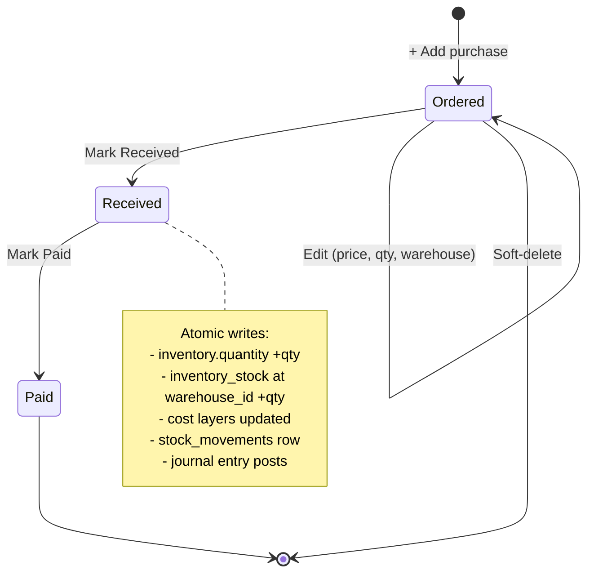
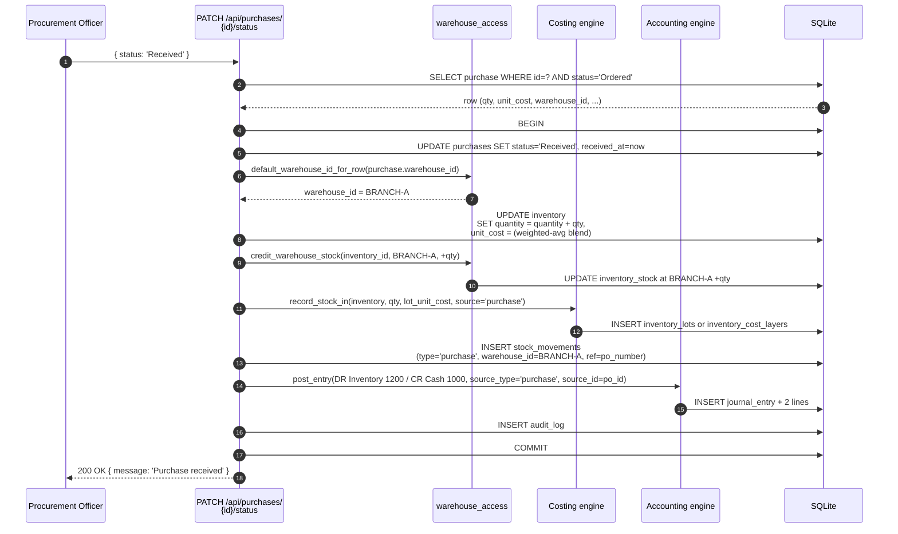
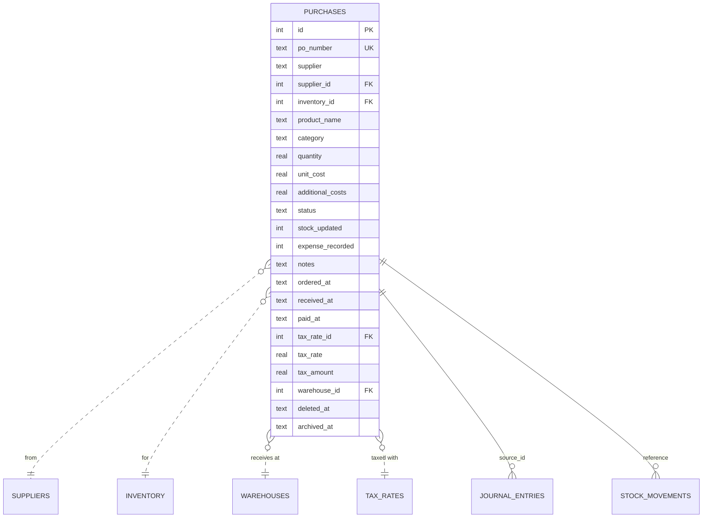

# Purchases

The procurement document. The PO lifecycle from `Ordered` through `Received`
to `Paid` — each transition writing to inventory, the GL, and the audit log.

## Purpose

A purchase order records **what was bought, from whom, at what cost, and where
it's being received**. The lifecycle has three discrete steps; each writes to
specific tables:

| Status | Writes triggered |
|---|---|
| `Ordered` | Just creates the `purchases` row. No inventory or GL effect yet. |
| `Received` | Stock credited at the chosen warehouse + journal entry posts (DR Inventory CR Cash). |
| `Paid` | Marks `paid_at`; records the `expenses` row for the cash-basis dashboard. |

Forward-only — you can't move from Received back to Ordered.

## Personas

| Persona | What they do here |
|---|---|
| **Procurement Officer** | Creates POs, marks received when goods arrive |
| **Inventory clerk** | Verifies receipt quantities, attaches lots if lot-tracked |
| **Accountant** | Marks Paid when invoice is settled |
| **Operations Manager** | Reviews open POs, supplier lead times, costs |
| **Auditor** | Reconciles receipts to GL Inventory and to stock movements |

## Quick reference

- **PO number format**: `PO-YYYY-NNNN` (vendor-configurable prefix)
- **Status**: `Ordered → Received → Paid` (forward-only)
- **Currency**: USD (no LBP purchases — by design)
- **Warehouse**: required; defaults to the user's default
- **Tax**: per-PO snapshot (`tax_rate_id`, `tax_rate`, `tax_amount`)
- **Additional costs**: shipping, customs, handling — added to landed cost
- **Auto-create item**: a PO with no `inventory_id` auto-creates an inventory item

---

=== "Operator's view"

    ### Creating a PO

    Purchases → **+ Add purchase**:

    | Field | Notes |
    |---|---|
    | Supplier | Free-text or pick from `suppliers` |
    | Inventory item | Pick existing OR leave blank to auto-create |
    | Product name | Required; the description on the PO |
    | Category | Used for inventory categorisation |
    | Quantity, Unit cost, Additional costs | Net + ship/customs |
    | Tax rate | Optional, per the system tax engine |
    | Status | Default Ordered |
    | **Receive at warehouse** | Defaults to your default warehouse |

    Save. PO lands in **Ordered** status.

    ### Receiving

    When goods arrive:
    1. Open the PO → **Receive** (status dropdown → Received)
    2. The system performs the receipt atomically:
       - Inventory `quantity` +qty (company-wide)
       - `inventory_stock` +qty at the PO's `warehouse_id`
       - `inventory_lots` or `inventory_cost_layers` updated (per costing
         method)
       - `stock_movements` row with `type='purchase'`, `warehouse_id`
       - `journal_entries`: **DR Inventory 1200 / CR Cash & Bank 1000**

    All five writes in one transaction.

    ### Paying

    Open the Received PO → **Pay** (status → Paid):
    - `paid_at` timestamped
    - An `expenses` row is created for the cash-basis dashboard
    - No new journal entry — the GL hit was at receipt (perpetual inventory
      model)

    ### Re-routing before receipt

    Need to land the goods at a different warehouse?
    - PO is still `Ordered` → edit and pick a new warehouse
    - PO is `Received` → too late; create an inter-warehouse transfer instead

=== "Administrator's view"

    ### Permissions

    | Role | view | create | edit | delete | approve |
    |---|---|---|---|---|---|
    | Procurement Officer | ✅ | ✅ | ✅ | ✗ | ✗ |
    | Operations Manager | ✅ | ✅ | ✅ | ✅ | ✅ |
    | Accountant | ✅ | ✗ | ✗ | ✗ | ✗ |
    | Auditor | ✅ | ✗ | ✗ | ✗ | ✗ |

    `approve` is used by **approval policies** — e.g. PO > $10,000 requires
    Finance Manager approval before status can move to Received.

    ### Tax engine

    Each PO carries `tax_rate_id`, `tax_rate`, `tax_amount` snapshots — same
    pattern as quotations / invoices. The snapshot survives any later tax
    rate change.

    ### Perpetual inventory accounting

    The system uses a **perpetual** inventory model:
    - At receipt: DR Inventory / CR Cash
    - At consumption (sale, production, project draw): DR COGS / CR Inventory

    This is the F-2(b) audit fix. The OLD posting (DR COGS / CR Cash at
    purchase) was wrong because it recognised the full cost regardless of
    whether the goods were sold. The current posting only converts
    Inventory → COGS when the goods physically leave.

    ### Auto-create flow

    If `inventory_id` is blank when the PO is created, a new `inventory`
    row is auto-created with `quantity=0`, `unit_cost=0`. The first
    receipt sets the cost. This is convenient for one-off purchases (a
    new SKU you've never bought before) — no need to pre-define the
    inventory item.

=== "Auditor's view"

    ### Receipt-to-GL reconciliation

    Every `Received` PO should have a matching journal entry:

    ```sql
    SELECT p.po_number, p.status, p.received_at,
           je.entry_number,
           p.quantity * p.unit_cost + p.additional_costs AS gross,
           jel.debit AS posted_to_inventory
    FROM purchases p
    LEFT JOIN journal_entries je
      ON je.source_type = 'purchase' AND je.source_id = p.id
    LEFT JOIN journal_entry_lines jel
      ON jel.journal_entry_id = je.id AND jel.debit > 0
    WHERE p.status IN ('Received', 'Paid')
      AND p.deleted_at IS NULL
    ORDER BY p.received_at DESC LIMIT 20;
    ```

    Each row should show both a `posted_to_inventory` value matching
    `gross`. NULLs = a receipt without a JE (control gap).

    ### Stock movement check

    Every receipt should have a `stock_movements` row:

    ```sql
    SELECT p.po_number, p.quantity AS po_qty,
           sm.delta AS movement_qty,
           sm.warehouse_id, sm.created_at
    FROM purchases p
    LEFT JOIN stock_movements sm
      ON sm.reference = p.po_number AND sm.type = 'purchase'
    WHERE p.status IN ('Received', 'Paid')
      AND p.deleted_at IS NULL
    ORDER BY p.received_at DESC LIMIT 20;
    ```

    `movement_qty` should equal `po_qty`. NULLs = receipt that didn't update
    stock.

    ### Cash basis vs. accrual

    The dashboard `monthly_expenses` includes purchases via the `expenses`
    row (created at Paid). The Trial Balance shows the receipt's
    Inventory→Cash post. They legitimately differ — one is the cash-flow
    view, one is the accrual GL.

    ### Forward-only status check

    No PO should regress in status:

    ```sql
    SELECT p.id, p.po_number, a.action, a.created_at, a.detail
    FROM audit_log a
    JOIN purchases p ON p.id = a.record_id
    WHERE a.module = 'purchase'
      AND a.action = 'update'
      AND a.detail LIKE '%"status":%'
    ORDER BY a.created_at DESC LIMIT 50;
    ```

    Inspect manually — every row should show forward transitions.

---

## Status lifecycle



## Workflow — receipt to ledger



## Data model



## API surface

| Endpoint | Purpose |
|---|---|
| `GET /api/purchases/` | List (filter by status, supplier, date) |
| `POST /api/purchases/` | Create |
| `GET /api/purchases/{id}` | Detail |
| `PUT /api/purchases/{id}` | Update (only while Ordered) |
| `PATCH /api/purchases/{id}/status` | Status transition (forward-only) |
| `PATCH /api/purchases/{id}/archive` | Soft-archive |

## What's NOT supported (deliberately)

- Multi-line POs (one PO = one inventory item). For a multi-item shipment,
  create one PO per line.
- LBP purchases. Suppliers are paid in USD; the system doesn't track foreign
  payable balances.
- Partial receipts. The whole PO moves to Received in one click. For a
  partial delivery, split into separate POs.
- Goods-received-not-invoiced (GRNI). The receipt + supplier invoice
  collapse into one status (Received). Customers needing a separate GRNI
  account use a manual journal entry.
