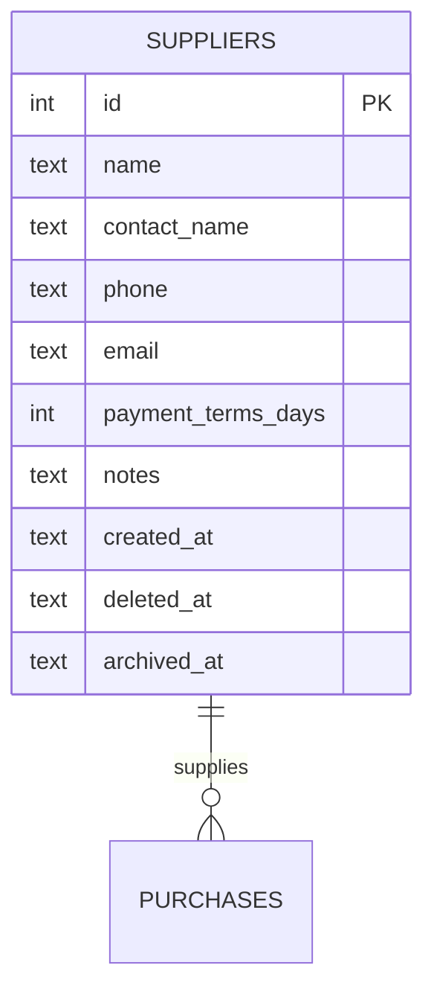
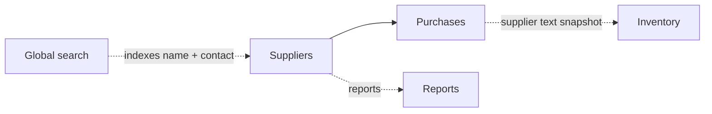

# Suppliers

The vendor master. Every purchase points here. The Supplier detail is the
360° view: every PO ever issued, payment terms, contact info.

## Purpose

Suppliers mirror Clients on the buy side. A single, deduplicated record per
vendor, referenced by every purchase. Lightweight on purpose — just enough
to know who you're buying from and how to pay them.

## Personas

| Persona | What they do here |
|---|---|
| **Procurement Officer** | Adds suppliers, maintains contact info |
| **Accountant** | Reads payment terms, reconciles outstanding payables |
| **Operations Manager** | Reviews supplier performance (delivery times, defect rates) |
| **Auditor** | Verifies no orphan PO records (every `purchases.supplier_id` resolves) |

## Quick reference

- **Required**: `name`. Everything else optional.
- **Payment terms**: `payment_terms_days` — informational (default 30)
- **Soft delete + soft archive**: same pattern as Clients
- **Linked entities**: purchases (one-to-many)
- **No row-level access**: every user who can view the module sees all suppliers

---

=== "Operator's view"

    ### The supplier list

    Sidebar → **Suppliers**. Columns: Name · Contact · Phone · Email ·
    Payment terms · open PO count.

    Click a row to open the 360° detail.

    ### Supplier detail — tabs

    1. **Overview** — contact details, notes, payment terms
    2. **Purchases** — every PO with this supplier (status + amount)
    3. **Activity** — derived: last PO date, total purchase volume

    ### Adding a supplier

    Suppliers → **+ Add supplier** → name + contact + payment terms.
    Save. New supplier appears in the dropdown on new purchase orders.

=== "Administrator's view"

    ### Permissions

    | Role | view | create | edit | delete |
    |---|---|---|---|---|
    | Procurement Officer | ✅ | ✅ | ✅ | ✗ |
    | Operations Manager | ✅ | ✅ | ✅ | ✅ |
    | Accountant | ✅ | ✗ | ✗ | ✗ |
    | Auditor | ✅ | ✗ | ✗ | ✗ |

    ### Merging duplicates

    Same procedure as Clients (no native merge):

    1. Pick the canonical supplier
    2. Re-attach the duplicate's `purchases.supplier_id` to the canonical
    3. Archive the duplicate with `archive_reason="Merged into supplier #X"`

    ### Payment terms

    `payment_terms_days` is **informational only** — the system doesn't
    automatically compute due dates from it. The accountant sets each
    purchase's `paid_at` manually when payment goes out.

=== "Auditor's view"

    ### Orphan check

    ```sql
    SELECT COUNT(*) FROM purchases
    WHERE supplier_id IS NOT NULL
      AND supplier_id NOT IN (SELECT id FROM suppliers);
    -- Expected: 0
    ```

    ### Top suppliers by spend

    ```sql
    SELECT s.name,
           COUNT(p.id) AS po_count,
           SUM(p.quantity * p.unit_cost + p.additional_costs) AS total_spend
    FROM suppliers s
    LEFT JOIN purchases p ON p.supplier_id = s.id
                          AND p.deleted_at IS NULL
                          AND p.status IN ('Received', 'Paid')
    WHERE s.deleted_at IS NULL
    GROUP BY s.id
    ORDER BY total_spend DESC NULLS LAST LIMIT 10;
    ```

    ### Open payables

    ```sql
    SELECT s.name,
           SUM(p.quantity * p.unit_cost + p.additional_costs) AS owed
    FROM suppliers s
    JOIN purchases p ON p.supplier_id = s.id
    WHERE p.status = 'Received' AND p.paid_at IS NULL
      AND p.deleted_at IS NULL
    GROUP BY s.id ORDER BY owed DESC;
    ```

---

## Data model



## Integrations



## API surface

| Endpoint | Purpose |
|---|---|
| `GET /api/suppliers/` | List (search by name/contact/email) |
| `POST /api/suppliers/` | Create |
| `GET /api/suppliers/{id}` | Detail + PO history |
| `PUT /api/suppliers/{id}` | Update |
| `DELETE /api/suppliers/{id}` | Soft-delete (Recycle Bin) |
| `PATCH /api/suppliers/{id}/archive` | Soft-archive |
