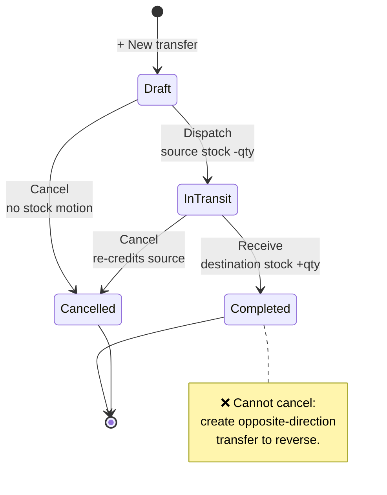
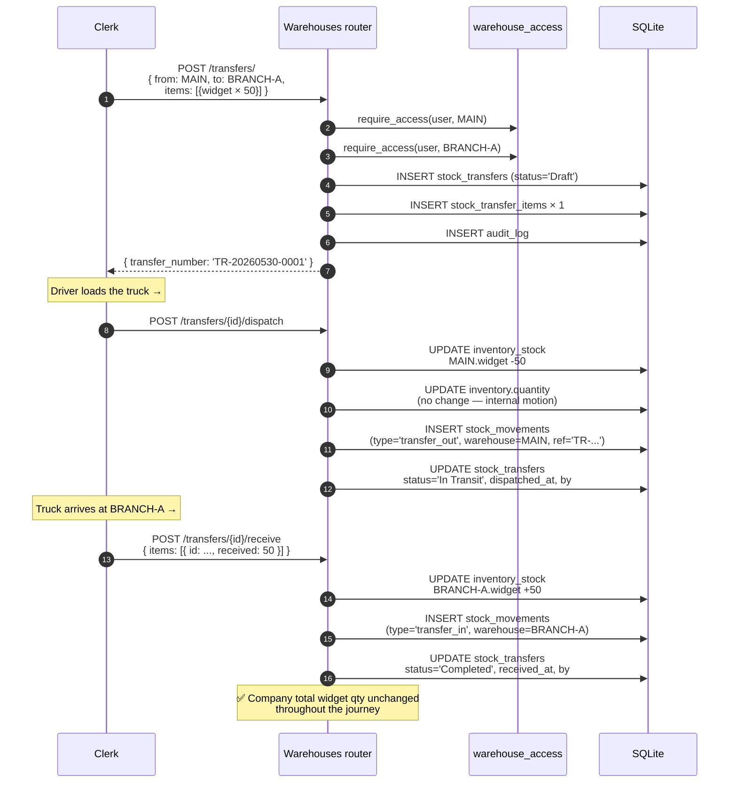
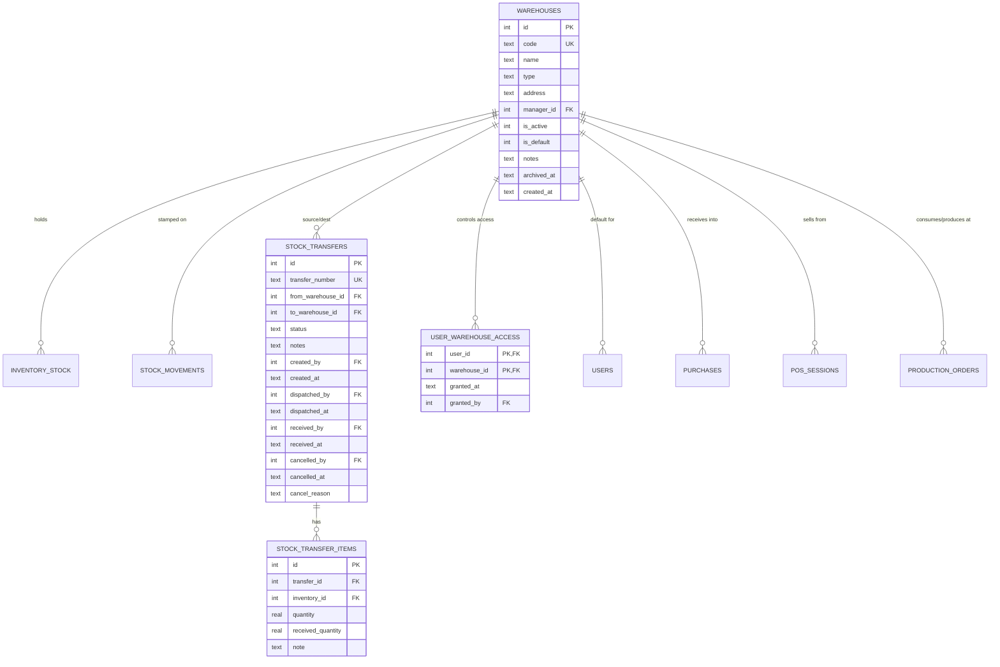

# Warehouses & Transfers

The location dimension on every stock balance. Lets the system answer "what's
at MAIN?" vs "what's at BRANCH-A?" — and move stock between them with an
auditable workflow.

## Purpose

A **warehouse** is a physical location where stock is held. The system treats
warehouses as a **stock dimension**, not an accounting entity:

- One company-wide `1200 Inventory` GL account
- Per-warehouse `inventory_stock.quantity` balances
- Internal transfers reallocate quantities without posting to the GL

This means the multi-warehouse feature gives you operational visibility and
control **without** changing your books-of-record.

## Personas

| Persona | What they do here |
|---|---|
| **Operations Manager** | Defines warehouses, sets the company default, manages access |
| **Inventory clerk** | Initiates transfers, dispatches and receives them |
| **Warehouse manager** | Reads "View stock" for their location, runs adjustments |
| **Administrator** | Grants per-user warehouse access |
| **Auditor** | Reconciles transfers (every dispatch has a receive), verifies access controls |

## Quick reference

- **Types**: `Main`, `Branch`, `Production`, `Damaged`, `Transit`, `Returns`
- **Default warehouse** — exactly one warehouse has `is_default=1`
- **Per-user default** — `users.default_warehouse_id` overrides the company
  default
- **Access model** — zero grants = access to all; first grant flips to allow-list
- **Transfer lifecycle** — `Draft → In Transit → Completed` (or `Cancelled`)
- **GL impact** — **none** for internal transfers

---

=== "Operator's view"

    ### The Warehouses page — three tabs

    1. **Warehouses** — list/create/edit + Set Default + Archive + **View stock**
    2. **Transfers** — Draft / In Transit / Completed / Cancelled
    3. **Access** — admin only

    ### Viewing what's at a warehouse

    Warehouses → row → **View stock**. A modal opens with:

    - Search box (live filter by item name or category)
    - Per-item rows: Quantity, Unit cost, Value (= qty × cost)
    - Badges for Reserved / Quarantined
    - Footer total: SKUs · units · USD value
    - Sorted by value desc (most-capital items first)

    ### Creating a transfer

    Warehouses → Transfers tab → **+ New transfer**:

    1. Pick **From** (source) and **To** (destination) warehouses
    2. Add line items with quantities
    3. Save — lands in **Draft**

    ### Dispatching

    Open the Draft transfer → **Dispatch**.
    - Source warehouse stock is **decremented immediately**
    - A `stock_movements` row with `type='transfer_out'` is written
    - Status → **In Transit**

    The destination warehouse hasn't received it yet — that's the trucker's
    journey.

    ### Receiving

    Open the In Transit transfer → **Receive (full)** when goods arrive.
    Alternatively, edit per-line `received_quantity` if some units were lost
    in transit.

    - Destination stock is **incremented**
    - A `stock_movements` row with `type='transfer_in'` is written
    - Status → **Completed**

    ### Cancelling

    | At status | Effect |
    |---|---|
    | Draft | Just marks Cancelled. No stock motion. |
    | In Transit | Re-credits the source warehouse (un-does the dispatch). |
    | Completed | ❌ Not allowed. Create an opposite-direction transfer to reverse. |

=== "Administrator's view"

    ### Permissions

    | Role | view | create | edit | delete |
    |---|---|---|---|---|
    | Operations Manager | ✅ | ✅ | ✅ | ✅ |
    | Inventory clerk | ✅ | ✅ | ✅ | ✗ |
    | Procurement Officer | ✅ | ✗ | ✗ | ✗ |
    | Auditor | ✅ | ✗ | ✗ | ✗ |

    Plus row-level access via `user_warehouse_access` — see [Multi-warehouse
    access](../foundation/warehouse-access.md).

    ### Setting the default warehouse

    Warehouses → row → **Set default**. Exactly one warehouse has
    `is_default=1` at any time (enforced by a unique partial index).

    The default is the fallback when:
    - A user has no personal default set
    - A purchase/POS/manufacturing form is submitted without `warehouse_id`
    - An inventory adjustment uses the API without specifying a warehouse

    ### Warehouse types

    | Type | Typical role |
    |---|---|
    | `Main` | Primary stock location (the seeded default is type Main) |
    | `Branch` | Secondary selling / holding location |
    | `Production` | Workshop or factory floor — feeds manufacturing |
    | `Damaged` | Damaged or expired stock pending write-off |
    | `Transit` | In-transit stock between warehouses (if you model it explicitly) |
    | `Returns` | Customer returns awaiting QC |

    Types are informational — they don't affect logic. Use them for
    reporting and filtering.

    ### Granting per-user access

    Warehouses → **Access** tab → pick a warehouse → **+ Grant access** →
    pick a user.

    Remember: the *first* grant for a user **anywhere** flips them from
    "see all warehouses" to "see only the explicit list".

    ### Archiving a warehouse

    Two preconditions:
    1. The warehouse is not currently the default
    2. The warehouse holds zero stock (transfer everything out first)

    Both are enforced server-side.

=== "Auditor's view"

    ### Every transfer has matched dispatch + receive

    The completeness control: every `transfer_out` movement should have a
    matching `transfer_in` (same `reference`), and total qtys should match:

    ```sql
    SELECT t.transfer_number, t.status,
           t.dispatched_at, t.received_at,
           SUM(ti.quantity)         AS dispatched_qty,
           SUM(ti.received_quantity) AS received_qty,
           SUM(ti.quantity) - SUM(ti.received_quantity) AS lost_in_transit
    FROM stock_transfers t
    JOIN stock_transfer_items ti ON ti.transfer_id = t.id
    WHERE t.status = 'Completed'
    GROUP BY t.id
    HAVING lost_in_transit != 0
    ORDER BY t.dispatched_at DESC;
    ```

    Non-zero `lost_in_transit` = real loss. Each row needs a write-off
    decision (adjustment + audit note).

    ### Transfers never post to the GL

    Verify the invariant:

    ```sql
    -- No journal entry should reference a stock_transfer as source
    SELECT COUNT(*) FROM journal_entries
    WHERE source_type LIKE 'stock_transfer%';
    -- Expected: 0
    ```

    ### Per-warehouse balances sum to company total

    ```sql
    -- Per-item, per-warehouse balances vs. company-wide total
    SELECT i.id, i.name, i.quantity AS company,
           COALESCE(SUM(s.quantity), 0) AS sum_per_wh
    FROM inventory i
    LEFT JOIN inventory_stock s ON s.inventory_id = i.id
    WHERE i.deleted_at IS NULL
    GROUP BY i.id
    HAVING ABS(i.quantity - sum_per_wh) > 0.0001;
    ```

    Empty result = invariant intact. Any row = sync bug.

    ### Access trail

    Every grant and revoke is in `audit_log`:

    ```sql
    SELECT a.created_at, u.username AS by_user, a.action,
           a.record_ref AS target_user_id,
           w.code AS warehouse
    FROM audit_log a
    LEFT JOIN users u ON u.id = a.user_id
    LEFT JOIN warehouses w ON w.id = a.record_id
    WHERE a.module = 'warehouse_access'
    ORDER BY a.created_at DESC;
    ```

---

## Transfer lifecycle



## Workflow — full transfer cycle



Notice the GL is **never posted to**. The full transfer is just two stock
movements with `inventory.quantity` unchanged at both ends — value didn't
leave the company.

## Data model



## API surface

| Endpoint | Purpose |
|---|---|
| `GET /api/warehouses/` | List warehouses the user can transact at |
| `POST /api/warehouses/` | Create warehouse |
| `GET /api/warehouses/{id}` | Detail |
| `PUT /api/warehouses/{id}` | Update |
| `POST /api/warehouses/{id}/set-default` | Promote to company default |
| `PATCH /api/warehouses/{id}/archive` | Archive (must be empty + non-default) |
| `GET /api/warehouses/{id}/stock` | All items + quantities at this warehouse |
| `GET /api/warehouses/me/accessible` | User's accessible list + resolved default |
| `GET /api/warehouses/{id}/access` | Per-warehouse access grants |
| `POST /api/warehouses/{id}/access` | Grant a user |
| `DELETE /api/warehouses/{id}/access/{user_id}` | Revoke |
| `GET /api/warehouses/transfers/` | List transfers visible to caller |
| `POST /api/warehouses/transfers/` | Create draft transfer |
| `POST /api/warehouses/transfers/{id}/dispatch` | Source -qty + status In Transit |
| `POST /api/warehouses/transfers/{id}/receive` | Destination +qty + status Completed |
| `POST /api/warehouses/transfers/{id}/cancel` | Cancel (Draft or In Transit) |

## What's NOT supported (deliberately)

- Per-warehouse general ledger accounts. One company = one Inventory
  account. If a customer ever needs distinct sub-ledgers, it's a structural
  change, not a configuration.
- Per-warehouse costing. Unit cost stays company-wide (`inventory.unit_cost`)
  — deferred until a clear business need emerges (see Phase 1 design).
- Transfer pricing between warehouses. Internal transfers move stock at
  carrying cost; no markup.
- Per-bin or per-aisle locations within a warehouse. That's a WMS feature,
  out of scope.
- Manufacturing across warehouses. By the Phase 1 design, one production
  order consumes and produces in **the same** warehouse — explicit
  source/destination would be a Phase 4 feature.
