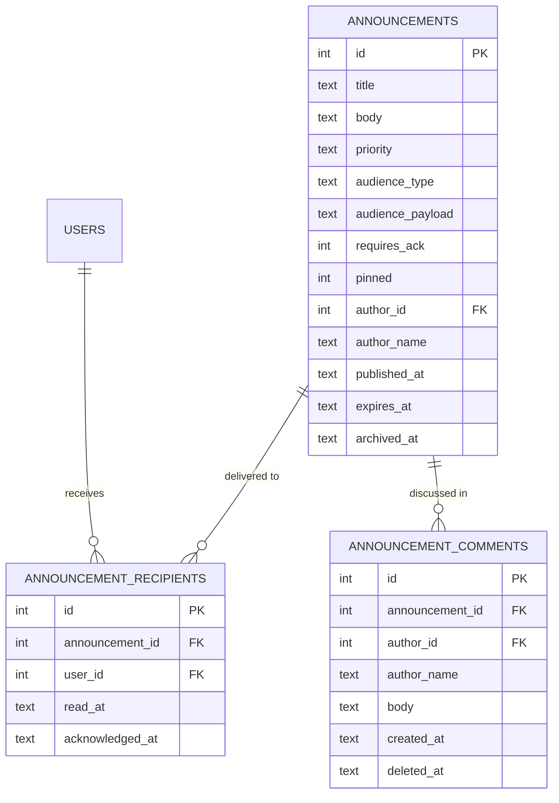

# Announcements

Internal top-down communications. The owner / manager broadcasts a message
to all staff, a role, or a named list. Recipients see it in their
notifications and can acknowledge / comment.

## Purpose

Announcements answer "I need to tell everyone (or a specific group)
something important". Use cases:

- Policy changes ("Casual Friday policy update effective Monday")
- Operational notices ("Office closed for inventory count Saturday")
- Holiday wishes
- Required-acknowledgement notices ("Please confirm you've read the new
  expense policy")

The system tracks **who's received**, **who's read**, and (if required)
**who's acknowledged**.

## Personas

| Persona | What they do here |
|---|---|
| **Owner / Manager** | Authors and publishes |
| **Employee** | Reads inbox, acknowledges, comments |
| **Auditor** | Verifies required acknowledgements were collected |

## Quick reference

- **Priority**: `low`, `medium`, `high`
- **Audience**: `all`, `roles`, `users`
- **Requires ack**: optional boolean
- **Pinned**: pinned announcements stay at top of inbox
- **Expires at**: optional; auto-archives after
- **Recipients**: snapshotted at publish (not dynamic — new users added
  later don't auto-receive past announcements)

---

=== "Operator's view (Author)"

    ### Composing

    Announcements → **+ New announcement**:

    | Field | Notes |
    |---|---|
    | Title | One-liner |
    | Body | Rich text |
    | Priority | low / medium / high (affects sort order) |
    | Audience | `all`, `roles` (pick role names), `users` (pick specific users) |
    | Requires acknowledgement | Toggle |
    | Pinned | Toggle |
    | Publish at | Now (default) or scheduled |
    | Expires at | Optional |

    Save. The system computes the recipients list at publish and inserts
    one `announcement_recipients` row per user. Each user gets a
    notification of type `announcement`.

    ### Reading reach

    Open a published announcement → **Reach** tab:

    | Stat | Source |
    |---|---|
    | Recipients | Count of `announcement_recipients` |
    | Read | Rows where `read_at IS NOT NULL` |
    | Acknowledged | Rows where `acknowledged_at IS NOT NULL` (only if `requires_ack`) |

=== "Operator's view (Reader)"

    ### Your inbox

    Announcements → **Inbox** tab. Sorted by:
    1. Pinned first
    2. Then priority desc (high → low)
    3. Then `published_at` desc

    Click an announcement → marks `read_at`. If `requires_ack`, an
    **Acknowledge** button appears — click it to set `acknowledged_at`.

    ### Commenting

    Public discussion thread per announcement. Anyone with view access
    can comment (`announcement_comments`).

=== "Administrator's view"

    ### Permissions

    | Role | view | create | edit | delete |
    |---|---|---|---|---|
    | Anyone authenticated | ✅ inbox (own recipient rows) | ✗ | ✗ | ✗ |
    | Authors (per the role config) | ✅ all | ✅ | ✅ (own) | ✅ (own) |
    | Administrator | ✅ all | ✅ | ✅ | ✅ |

    The "anyone can read" privilege is **scoped to their recipient
    rows** — you can't peek at other people's announcements. The
    [global search](../reference/index.md) honours this too.

    ### Targeted audiences

    | audience_type | audience_payload |
    |---|---|
    | `all` | (none) — every active user gets a recipient row |
    | `roles` | JSON array of role names, e.g. `["Sales Manager", "Sales"]` |
    | `users` | JSON array of user ids |

=== "Auditor's view"

    ### Required-acknowledgement compliance

    ```sql
    SELECT a.title, a.published_at,
           COUNT(r.id) AS recipients,
           SUM(CASE WHEN r.acknowledged_at IS NOT NULL THEN 1 ELSE 0 END) AS acked,
           COUNT(r.id)
             - SUM(CASE WHEN r.acknowledged_at IS NOT NULL THEN 1 ELSE 0 END)
             AS pending
    FROM announcements a
    JOIN announcement_recipients r ON r.announcement_id = a.id
    WHERE a.requires_ack = 1 AND a.archived_at IS NULL
    GROUP BY a.id;
    ```

    Anyone with `pending > 0` for a still-active announcement is yet to
    sign.

    ### Read rate per audience

    ```sql
    SELECT a.title, a.audience_type,
           ROUND(100.0 * SUM(CASE WHEN r.read_at IS NOT NULL THEN 1 ELSE 0 END)
                       / COUNT(r.id), 1) AS read_pct
    FROM announcements a
    JOIN announcement_recipients r ON r.announcement_id = a.id
    GROUP BY a.id ORDER BY read_pct;
    ```

---

## Data model



## API surface

| Endpoint | Purpose |
|---|---|
| `GET /api/announcements/` | Caller's inbox (own recipient rows) |
| `GET /api/announcements/unread-count` | Badge count |
| `POST /api/announcements/` | Publish (writes recipient rows for all audience members) |
| `POST /api/announcements/{id}/acknowledge` | Caller acknowledges (`requires_ack`) |
| `GET /api/announcements/{id}/comments` | Discussion |
| `POST /api/announcements/{id}/comments` | Add comment |
| `GET /api/announcements/{id}/audience` | Per-recipient delivery + read + ack state (author/admin) |
| `GET /api/announcements/sent` | Author's outbox |
