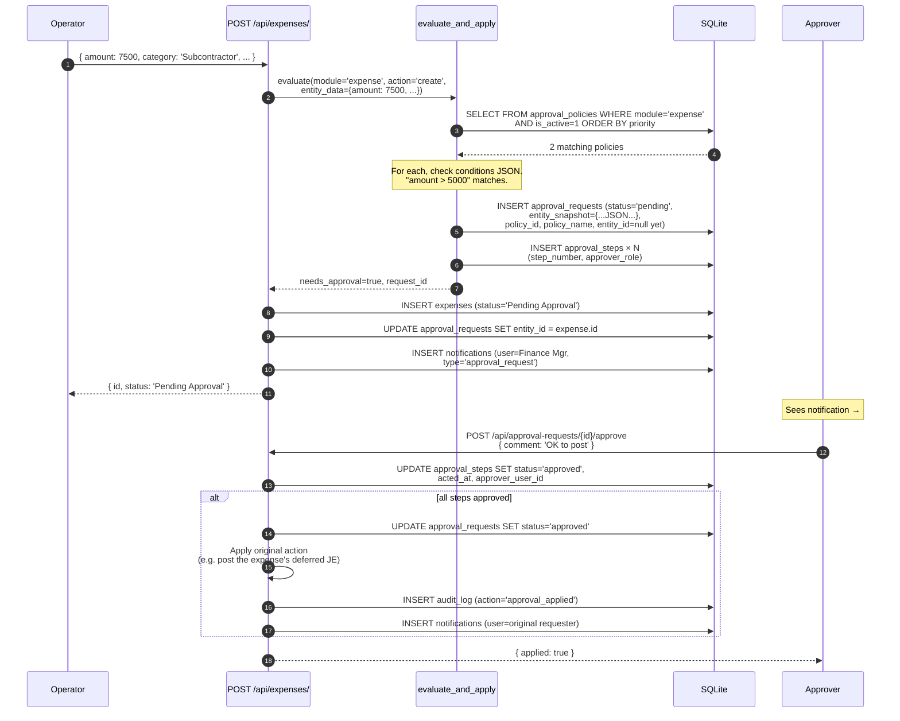
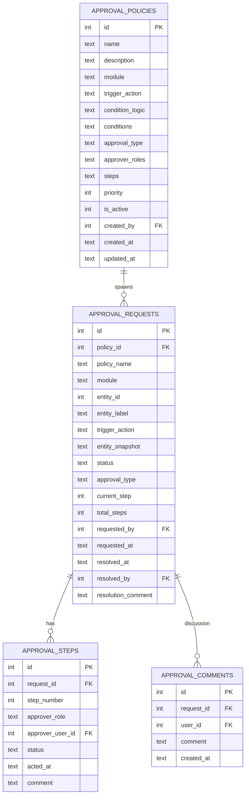

# Approvals

The rule-based multi-step approval engine. Used by Expenses, Purchases,
Invoices, Projects, and Fixed Assets to gate operations that exceed
configurable thresholds.

## Purpose

Approval policies answer "this is too big to slip through unwatched —
make a human sign off". Each policy specifies:

- **Module** + **trigger action** (e.g. `expense` + `create`)
- **Conditions** (e.g. `amount > 5000`)
- **Approver roles** + step ordering
- **Approval type** (`single` — any one of the roles must clear; or
  multi-step where each step must clear in order)

When a triggering action happens, the engine:

1. Evaluates active policies for the module/action
2. If conditions match → opens an `approval_requests` row
3. Defers the side-effects until the request resolves

## Personas

| Persona | What they do here |
|---|---|
| **Administrator** | Designs policies (e.g. "Expenses > $5K need Finance Manager") |
| **Operator** | Triggers requests by doing normal work; sees "Pending Approval" status |
| **Approver** | Receives notifications, opens Approvals page, approves/rejects with comment |
| **Auditor** | Verifies every high-value transaction has approval evidence |

## Quick reference

- **Modules with approval policies**: expenses, purchases, invoices, projects, assets
- **Approval types**: `single` (one-of-roles clears) — multi-step extensible
- **Conditions**: JSON-encoded; common operators: `>`, `<`, `>=`, `<=`, `==`, `IN`
- **Request status**: `pending → approved / rejected / cancelled`
- **Step status**: `pending / approved / rejected / skipped`
- **Idempotent application** — re-approving a closed request is a no-op

---

=== "Operator's view"

    ### Seeing approval status on your work

    When a policy fires, the entity you created shows:

    - **Status badge**: `Pending Approval` (orange)
    - **Approval requests** sidebar: who's holding it, current step, who approved so far

    You can't edit a Pending Approval entity until it clears. To cancel
    your own request before it's approved: open the request → **Cancel**.

    ### Approving a request

    Approvals page (sidebar) shows your queue: every request where you're
    on the current step.

    Open one. The system shows:

    - Entity snapshot (what was created/changed)
    - Previous approvers' comments
    - Approve / Reject buttons + comment field

    Click **Approve** (with optional comment). If you're the last approver
    on the chain (or this is a `single`-type policy), the action applies
    immediately — expense posts to GL, asset becomes Active, etc.

    Click **Reject** with a required comment. The request closes with
    status `rejected`. The original entity stays in `Pending Approval`
    until the operator cancels or re-submits.

=== "Administrator's view"

    ### Permissions

    | Role | view requests | approve | manage policies |
    |---|---|---|---|
    | Approver roles (per policy) | ✅ (own queue) | ✅ | ✗ |
    | Finance Manager | ✅ all | ✅ (configured) | ✅ |
    | Administrator | ✅ all | ✗ unless approver | ✅ |
    | Auditor | ✅ all | ✗ | ✗ |

    Policy management is admin-tier.

    ### Designing a policy

    Approval Policies → **+ New policy**:

    | Field | Notes |
    |---|---|
    | Name | Display name |
    | Description | What this policy guards |
    | Module | `expenses`, `purchases`, `invoices`, `projects`, `assets` |
    | Trigger action | Usually `create`; sometimes `update` or `void` |
    | Conditions | JSON: `{"amount": {">": 5000}}` |
    | Approval type | `single` (any approver) or multi-step |
    | Approver roles | Comma-separated role names |
    | Steps | JSON array for multi-step (each step has its own approver_role) |
    | Priority | Lower = evaluated first when multiple match |
    | Is active | Toggle |

    ### Condition examples

    | Goal | Conditions JSON |
    |---|---|
    | Expenses > $5,000 | `{"amount": {">": 5000}}` |
    | Subcontractor expenses any amount | `{"category": {"==": "Subcontractor"}}` |
    | Purchases > $10K with no inventory link (services) | `{"total_cost": {">": 10000}, "inventory_id": {"==": null}}` |
    | Capex > $25K | (assets) `{"acquisition_cost": {">": 25000}}` |
    | Project budgets > $100K | `{"estimated_cost": {">": 100000}}` |

    ### What happens when an approval is granted

    The engine looks up the original "pending" action and applies it. For
    expenses, that means posting the deferred journal entry. For assets,
    that means flipping status from Pending Approval to Active.

    Each application is one transaction with an `audit_log` row showing
    `action='approval_applied'`.

=== "Auditor's view"

    ### Every high-value transaction has approval

    Sample a high-value expense:

    ```sql
    SELECT e.id, e.category, e.amount, e.status, e.created_at,
           ar.id AS request_id, ar.status AS approval_status,
           ar.resolved_at, u.username AS resolved_by
    FROM expenses e
    LEFT JOIN approval_requests ar
      ON ar.module = 'expense' AND ar.entity_id = e.id
    LEFT JOIN users u ON u.id = ar.resolved_by
    WHERE e.amount > 5000
      AND e.deleted_at IS NULL
    ORDER BY e.created_at DESC LIMIT 20;
    ```

    Each row should show a non-null `request_id` and `resolved_by` if a
    policy was in place. NULLs = policy didn't fire (no policy active at
    the time, or condition didn't match) — fine if intentional, flag if
    surprising.

    ### Approval chain reconstruction

    For a specific approved request:

    ```sql
    SELECT ar.policy_name, ar.module, ar.entity_label,
           ar.requested_at,
           s.step_number, s.approver_role, s.status,
           s.acted_at, u.username AS step_actor, s.comment
    FROM approval_requests ar
    JOIN approval_steps s ON s.request_id = ar.id
    LEFT JOIN users u ON u.id = s.approver_user_id
    WHERE ar.id = ?
    ORDER BY s.step_number;
    ```

    ### Comments trail (negotiation history)

    ```sql
    SELECT c.created_at, u.username, c.comment
    FROM approval_comments c
    LEFT JOIN users u ON u.id = c.user_id
    WHERE c.request_id = ?
    ORDER BY c.created_at;
    ```

---

## Workflow — policy match and approval



## Data model



## API surface

| Endpoint | Purpose |
|---|---|
| `GET /api/approval-policies/` | List policies |
| `POST /api/approval-policies/` | Create |
| `PUT /api/approval-policies/{id}` | Update |
| `PATCH /api/approval-policies/{id}/toggle` | Activate/deactivate |
| `GET /api/approval-requests/` | Filtered list (mine / pending / all) |
| `GET /api/approval-requests/{id}` | Detail + steps + comments |
| `POST /api/approval-requests/{id}/approve` | Approve current step |
| `POST /api/approval-requests/{id}/reject` | Reject the request |
| `POST /api/approval-requests/{id}/cancel` | Requester cancels |
| `POST /api/approval-requests/{id}/comments` | Add discussion |
