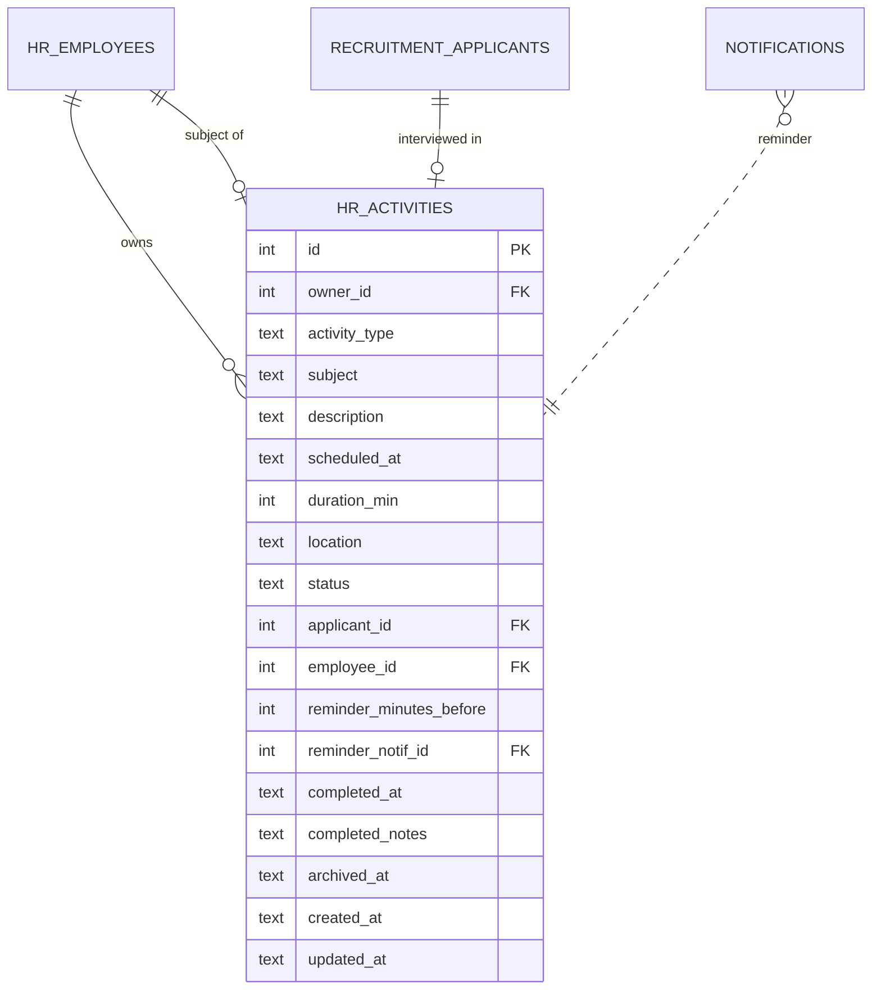

# HR Activities

Per-employee personal calendar. Notes, calls, meetings, interviews — with
optional reminders that fire as notifications.

## Purpose

HR Activities answers "what's on my plate today?" for any employee. It's
separate from CRM activities (which are customer-facing) despite the
similar shape:

| Module | Subject | Who reads |
|---|---|---|
| `crm_activities` | Customers, leads, deals | Sales reps |
| `hr_activities` | Internal — own employees, applicants | Anyone with a personal calendar |

## Personas

| Persona | What they do here |
|---|---|
| **Employee** | Logs their own meetings, notes, todos |
| **HR Manager** | Reviews team workload, attaches interviews to applicants |
| **Recruiter** | Schedules interviews; each one creates an `hr_activities` row |
| **Manager** | Reads direct reports' upcoming activities |

## Quick reference

- **Activity types**: `Call`, `Meeting`, `Note`, `Interview`, `Task`
- **Status**: `Planned`, `Done`, `Cancelled`
- **Owner**: `hr_employees.id` of the activity owner (one owner per activity)
- **Linked to**: optional `applicant_id` (recruitment) or `employee_id` (HR target)
- **Reminders**: `reminder_minutes_before` — fires a notification ahead of `scheduled_at`

---

=== "Operator's view"

    ### Adding an activity

    HR Activities → **+ Add activity** OR from any employee/applicant
    detail page:

    | Field | Notes |
    |---|---|
    | Owner | Defaults to logged-in user's employee record |
    | Type | Call / Meeting / Note / Interview / Task |
    | Subject | One-liner |
    | Description | Long-form |
    | Scheduled at | Date + time |
    | Duration (min) | E.g. 60 |
    | Location | Free text |
    | Reminder | Minutes before to ping; 0 disables |
    | Linked employee | Optional — about another employee |
    | Linked applicant | Optional — interviewing this applicant |

    Save. Lands as **Planned**. Reminder is scheduled if requested.

    ### Marking done

    Open the activity → **Mark done** with optional `completed_notes`.

    ### Reminders

    `reminder_minutes_before` minutes before `scheduled_at`, the system
    fires a notification of type `hr_activity_reminder`. The
    `reminder_notif_id` field links to the spawned notification.

=== "Administrator's view"

    ### Permissions

    | Role | view | create | edit | delete |
    |---|---|---|---|---|
    | Anyone with `hr_activities` view | ✅ (own) | ✅ | ✅ (own) | ✗ |
    | HR Manager | ✅ all | ✅ | ✅ | ✅ |

    The "own" filter means an employee can only see activities where
    `owner_id` matches their employee id. HR Manager bypasses.

    ### Reminder scheduling

    A background thread checks for activities with `scheduled_at` minus
    `reminder_minutes_before` ≤ now AND `reminder_notif_id IS NULL`. For
    each, it spawns a notification and records its id back on the
    activity.

=== "Auditor's view"

    Activities are operational — not typically part of a financial audit.
    Cross-reference for HR controls:

    ```sql
    -- Activities related to a specific applicant (interview trail)
    SELECT a.scheduled_at, a.subject, a.status,
           u.username AS owner, a.completed_notes
    FROM hr_activities a
    JOIN hr_employees e ON e.id = a.owner_id
    LEFT JOIN users u ON u.id = e.user_id
    WHERE a.applicant_id = ?
    ORDER BY a.scheduled_at;
    ```

---

## Data model



## API surface

| Endpoint | Purpose |
|---|---|
| `GET /api/hr-activities/` | List (filter by owner, status, date range) |
| `POST /api/hr-activities/` | Create |
| `PUT /api/hr-activities/{id}` | Update |
| `POST /api/hr-activities/{id}/done` | Mark Done |
| `POST /api/hr-activities/{id}/cancel` | Mark Cancelled |
| `GET /api/hr-activities/summary` | KPIs for the dashboard |
