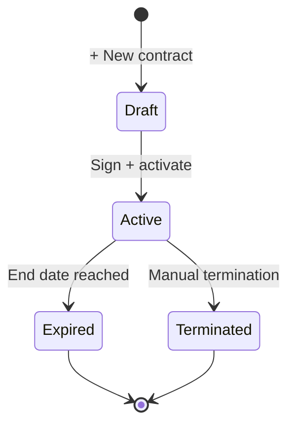

# HR Contracts

Formal employment contracts. Distinct from the employee master because
contracts have a **start/end + terms** — they renew, terminate, and carry
the legal language that goes into printable PDFs.

## Purpose

Where employees says "Jane works here", contracts says "she is
employed under a Permanent contract starting 2024-01-15, salary
$X/year-LBP-Y/month, with these benefits and these terms". Multiple
contracts can exist per employee over time (renewals, role changes).

The currency on the contract (salary currency) is what payroll
snapshots into the payroll line's own currency.

## Personas

| Persona | What they do here |
|---|---|
| **HR Manager** | Drafts contracts, prints them for signature, marks active |
| **Employee** | Signs and returns; later views their own contract |
| **Finance Manager** | Reads salary terms when reviewing comp |
| **Auditor** | Verifies every active employee has an active contract |

## Quick reference

- **Contract types**: `Permanent`, `Fixed-term`, `Probation`, `Internship`, `Consultant`
- **Status**: `Draft → Active → Expired / Terminated`
- **Salary currency**: USD or LBP (drives payroll posting)
- **Print**: server-side PDF render
- **One per employee** active at a time (older contracts archived as historical)

---

=== "Operator's view"

    ### Creating a contract

    HR → **Contracts** → **+ New contract**.

    | Field | Notes |
    |---|---|
    | Employee | Who the contract is for |
    | Contract number | E.g. `EMP-2026-0001` |
    | Contract type | Permanent / Fixed-term / Probation / Internship / Consultant |
    | Start date | |
    | End date | Required for Fixed-term / Probation |
    | Probation end date | Optional for Permanent |
    | Job title | (Snapshots; doesn't auto-update on a change to the employee's job title) |
    | Work schedule | Free text, e.g. "Mon-Fri 9-5" |
    | Weekly hours | E.g. 40 |
    | Salary | Amount |
    | Salary currency | `USD` or `LBP` |
    | Benefits | Free text — list what is included |
    | Terms | Free-text legal language |

    Save. Lands in **Draft**.

    ### Activating

    Open contract → **Activate** when signed. Status → Active. The
    signed at timestamp is captured.

    ### Printing for signature

    Contract detail → **Print PDF**. The server renders a PDF from the
    structured data — same template each time.

    ### Renewing

    For a Fixed-term contract about to expire:
    1. Open the expiring contract → **Renew** (clones it)
    2. Edit new start/end + any updated terms
    3. Save as new Draft, activate when signed
    4. The old contract auto-flips to `Expired` on its end date

=== "Administrator's view"

    ### Permissions

    | Role | view | create | edit | delete |
    |---|---|---|---|---|
    | HR Manager | ✅ | ✅ | ✅ | ✗ |
    | Manager | ✅ (team) | ✗ | ✗ | ✗ |
    | Employee | ✅ (own) | ✗ | ✗ | ✗ |
    | Auditor | ✅ | ✗ | ✗ | ✗ |

    ### One active per employee

    The system doesn't hard-enforce one Active contract at a time, but the
    payroll engine reads the **most recent Active** when computing per-line
    salary currency. Multiple Active contracts on the same employee = a
    data hygiene issue worth flagging.

    ### Termination

    HR → contract → **Terminate** with terminated reason. Status →
    Terminated. Employee status doesn't auto-flip — that's a separate
    decision (end employment vs. just end this contract).

=== "Auditor's view"

    ### Active employees should have an Active contract

    ### Duplicate Active contracts

    ### Currency consistency

    Contract currency should match recent payroll line currency for the
    same employee.

---

## Status lifecycle

