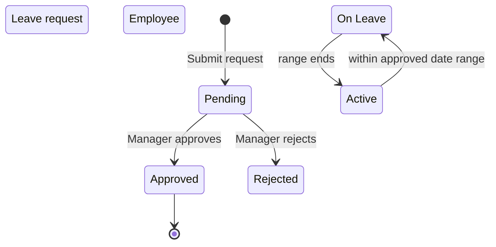

# HR — Human Resources

Your people: their details, their history, their leave, and their pay.

## Purpose

HR holds who works here and what they are owed.

| What | Used for |
|---|---|
| **Employees** | One record per person, with their job and department |
| **Departments** | How the business is organised |
| **Employment history** | Every change of salary, title or department, kept permanently |
| **Leave requests** | Annual, sick and unpaid leave, with approval |
| **Payroll runs** | Monthly pay, with tax, social contributions and overtime |

Salary history is never overwritten. When someone gets a raise the old
figure stays on record, so you can always see what they were paid and when
it changed.

## Personas

| Persona | What they do here |
|---|---|
| **HR Manager** | Adds employees, processes leave, runs monthly payroll |
| **Manager** | Approves leave for direct reports, reviews team composition |
| **Employee** | Submits leave request, reads own payslip |
| **Finance Manager** | Approves payroll runs before mark-paid |
| **Accountant** | Reads the posted payroll expense + journal entry |
| **Auditor** | Verifies salary changes, leave balances, payroll-to-GL reconciliation |

## Quick reference

- **Employee status**: `Active`, `On Leave` (auto-flipped during approved leave dates)
- **Employment type**: `Full-time`, `Part-time`
- **Leave types**: `Annual`, `Sick`, `Unpaid` (+ vendor-extensible)
- **Leave status**: `Pending`, `Approved`, `Rejected`
- **Payroll status**: `Draft → Approved → Paid` (or `Cancelled`)
- **Multi-currency**: per-line salary currency (F-6 fix)
- **Settings-driven**: NSSF rate, employer NSSF rate, tax brackets in Settings → Payroll

---

=== "Operator's view"

    ### Adding an employee

    HR → **Employees** → **+ Add employee**.

    | Field | Notes |
    |---|---|
    | Employee code | `EMP-NNN` or vendor-specific format |
    | Full name | Required |
    | Job title | |
    | Department | Which department |
    | Employment type | Full-time / Part-time |
    | Hire date | |
    | Salary | In USD by default; contract carries currency |
    | Manager | Who they report to |
    | Email, phone, address, notes | |
    | User account | Optional link to `users.id` for self-service |

    Save. An employment-history entry is created automatically for
    a hire capturing the initial values.

    ### Editing salary or title

    Open the employee → **Edit**. Changing salary or title creates a new
    employment-history entry for a raise, an adjustment,
    `'promotion'`, or `'transfer'` — the entire history is queryable.

    ### Submitting a leave request

    The employee (or HR Manager on their behalf).

    1. HR → **Leave** → **+ Request leave**
    2. Pick type + start + end dates
    3. Days field auto-computes from the date range
    4. Optional reason
    5. Submit — status **Pending**

    When approved, the employee's status auto-flips to `On Leave` during
    the date range (a background job updates it daily).

    ### Approving leave

    Manager or HR Manager opens the request → **Approve** or **Reject**
    with optional review note.

    ### Running monthly payroll

    HR → **Payroll** → **+ New run** with period dates.

    The system adds one line per active employee, with.

    - base salary from employee record
    - salary currency from the active contract (F-6 fix)
    - tax amount computed from settings tax brackets
    - nssf employee and nssf employer per settings
    - gross total, net amount computed
    - Bonuses and overtime start at 0

    HR Manager edits per-line bonuses / deductions / overtime. The
    `total_*` fields on the run auto-recompute.

    Then.

    1. **Approve** the run (status → Approved)
    2. **Mark paid** (status → Paid)

    Mark paid is the moment money is recognised. See [Workflows](workflows.md)
    for the full multi-currency sequence.

=== "Administrator's view"

    ### Permissions

    | Role | view | create | edit | delete | approve |
    |---|---|---|---|---|---|
    | HR Manager | ✅ | ✅ | ✅ | ✅ | ✅ |
    | Manager | ✅ (team) | ✗ | ✗ | ✗ | ✅ (own team leave) |
    | Finance Manager | ✅ | ✗ | ✗ | ✗ | ✅ (payroll) |
    | Accountant | ✅ | ✗ | ✗ | ✗ | ✗ |
    | Auditor | ✅ | ✗ | ✗ | ✗ | ✗ |

    ### Payroll settings (Settings → Payroll)

    | Setting | Effect |
    |---|---|
    | nssf employee rate | % of gross deducted from employee |
    | nssf employer rate | % of gross paid by employer (cost only) |
    | Tax brackets | Each band: the amount it runs up to, its rate, and any fixed amount |
    | nssf cap | Maximum nssf-able salary (per period) |

    Stored in the `settings` key/value table; read at every payroll
    calculation.

    ### Auto status flip

    A background thread runs hourly.

    The dashboard's "On Leave Today" tile reads from this status.

    ### Payroll → GL posting (F-6 fix)

    On mark-paid, the system.

    1. Groups payroll lines by salary currency
    2. For USD lines: total USD net → DR Salaries / CR Cash 1000
    3. For LBP lines: divides by latest spot rate → DR Salaries (USD) /
       CR Cash—LBP 1010 (USD-equivalent)
    4. Refuses to post if LBP lines exist but no exchange rate is set

    See [Multi-currency](../finance/multi-currency.md) for the LBP detail.

=== "Auditor's view"

    ### Salary change history

    Every change has a `reason` field; review for unexplained raises.

    ### Payroll-to-GL reconciliation

    the run's total net pay should equal the posted entry (in USD-equivalent after
    F-6 conversion).

    ### Leave entitlement (annual)

    Each employee's contract specifies annual leave days. Days taken
    YTD vs. allowance.

    !!! note
        annual leave days lives on recruitment offers (also). Active
        contract is the source of truth for current employees.

    ### Multi-currency payroll integrity (F-6 verification)

    Run posts after the fix should show the USD post on the GL equal to
    `USD_segment + LBP_segment / rate`.

---

## Status — leave + employee

## What's NOT supported

- Hourly time clock. The system records overtime hours per payroll line
  but doesn't track clock-in/clock-out.
- Per-employee bank account details. Bank transfer happens outside the
  system.
- Multi-period payroll (e.g. weekly + monthly). One frequency per install.
- Stock options / equity comp.
