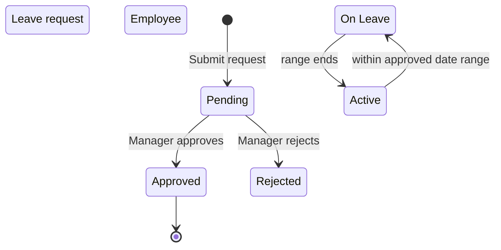
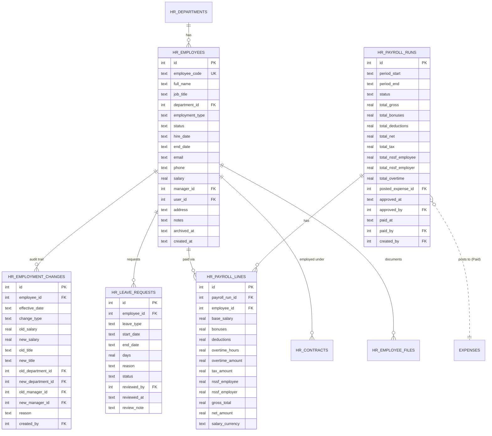

# HR — Human Resources

The employee master, salary/title history, payroll runs, and leave requests.
The biggest module in this chapter; carries the F-6 multi-currency audit
fix for payroll posting.

## Purpose

HR holds **who works here** and **what we owe them**:

- `hr_employees` — the master (one row per employee)
- `hr_departments` — organisational structure
- `hr_employment_changes` — immutable audit trail of every salary / title / department change
- `hr_leave_requests` — annual / sick / unpaid leave with approval
- `hr_payroll_runs` + `hr_payroll_lines` — period payroll with NSSF, tax, overtime, currency snapshot

## Personas

| Persona | What they do here |
|---|---|
| **HR Manager** | Adds employees, processes leave, runs monthly payroll |
| **Manager** | Approves leave for direct reports, reviews team composition |
| **Employee** | Submits leave request, reads own payslip |
| **Finance Manager** | Approves payroll runs before mark-paid |
| **Accountant** | Reads the posted payroll expense + journal entry |
| **Auditor** | Verifies salary changes, leave balances, payroll-to-GL reconciliation |

## Quick reference

- **Employee status**: `Active`, `On Leave` (auto-flipped during approved leave dates)
- **Employment type**: `Full-time`, `Part-time`
- **Leave types**: `Annual`, `Sick`, `Unpaid` (+ vendor-extensible)
- **Leave status**: `Pending`, `Approved`, `Rejected`
- **Payroll status**: `Draft → Approved → Paid` (or `Cancelled`)
- **Multi-currency**: per-line `salary_currency` (F-6 fix)
- **Settings-driven**: NSSF rate, employer NSSF rate, tax brackets in Settings → Payroll

---

=== "Operator's view"

    ### Adding an employee

    HR → **Employees** → **+ Add employee**:

    | Field | Notes |
    |---|---|
    | Employee code | `EMP-NNN` or vendor-specific format |
    | Full name | Required |
    | Job title | |
    | Department | FK to `hr_departments` |
    | Employment type | Full-time / Part-time |
    | Hire date | |
    | Salary | In USD by default; contract carries currency |
    | Manager | FK to another employee |
    | Email, phone, address, notes | |
    | User account | Optional link to `users.id` for self-service |

    Save. An `hr_employment_changes` row is auto-created with
    `change_type='hire'` capturing the initial values.

    ### Editing salary or title

    Open the employee → **Edit**. Changing salary or title creates a new
    `hr_employment_changes` row with `change_type='raise'`, `'adjustment'`,
    `'promotion'`, or `'transfer'` — the entire history is queryable.

    ### Submitting a leave request

    The employee (or HR Manager on their behalf):

    1. HR → **Leave** → **+ Request leave**
    2. Pick type + start + end dates
    3. Days field auto-computes from the date range
    4. Optional reason
    5. Submit — status **Pending**

    When approved, the employee's status auto-flips to `On Leave` during
    the date range (a background job updates it daily).

    ### Approving leave

    Manager or HR Manager opens the request → **Approve** or **Reject**
    with optional `review_note`.

    ### Running monthly payroll

    HR → **Payroll** → **+ New run** with period dates.

    The system seeds one `hr_payroll_lines` row per active employee with:

    - `base_salary` from employee record
    - `salary_currency` from the active contract (F-6 fix)
    - `tax_amount` computed from settings tax brackets
    - `nssf_employee` and `nssf_employer` per settings
    - `gross_total`, `net_amount` computed
    - Bonuses and overtime start at 0

    HR Manager edits per-line bonuses / deductions / overtime. The
    `total_*` fields on the run auto-recompute.

    Then:

    1. **Approve** the run (status → Approved)
    2. **Mark paid** (status → Paid)

    Mark paid is the moment money is recognised. See [Workflows](workflows.md)
    for the full multi-currency sequence.

=== "Administrator's view"

    ### Permissions

    | Role | view | create | edit | delete | approve |
    |---|---|---|---|---|---|
    | HR Manager | ✅ | ✅ | ✅ | ✅ | ✅ |
    | Manager | ✅ (team) | ✗ | ✗ | ✗ | ✅ (own team leave) |
    | Finance Manager | ✅ | ✗ | ✗ | ✗ | ✅ (payroll) |
    | Accountant | ✅ | ✗ | ✗ | ✗ | ✗ |
    | Auditor | ✅ | ✗ | ✗ | ✗ | ✗ |

    ### Payroll settings (Settings → Payroll)

    | Setting | Effect |
    |---|---|
    | `nssf_employee_rate` | % of gross deducted from employee |
    | `nssf_employer_rate` | % of gross paid by employer (cost only) |
    | `tax_brackets` | JSON array: [{up_to, rate, fixed_amount}, ...] |
    | `nssf_cap` | Maximum nssf-able salary (per period) |

    Stored in the `settings` key/value table; read at every payroll
    calculation.

    ### Auto status flip

    A background thread runs hourly:

    ```sql
    UPDATE hr_employees SET status='On Leave'
    WHERE id IN (SELECT employee_id FROM hr_leave_requests
                 WHERE status='Approved'
                   AND date('now') BETWEEN start_date AND end_date);

    UPDATE hr_employees SET status='Active'
    WHERE status='On Leave'
      AND id NOT IN (SELECT employee_id FROM hr_leave_requests
                     WHERE status='Approved'
                       AND date('now') BETWEEN start_date AND end_date);
    ```

    The dashboard's "On Leave Today" tile reads from this status.

    ### Payroll → GL posting (F-6 fix)

    On mark-paid, the system:

    1. Groups `hr_payroll_lines` by `salary_currency`
    2. For USD lines: total USD net → DR Salaries / CR Cash 1000
    3. For LBP lines: divides by latest spot rate → DR Salaries (USD) /
       CR Cash—LBP 1010 (USD-equivalent)
    4. Refuses to post if LBP lines exist but no exchange rate is set

    See [Multi-currency](../finance/multi-currency.md) for the LBP detail.

=== "Auditor's view"

    ### Salary change history

    ```sql
    SELECT e.full_name, h.change_type, h.effective_date,
           h.old_salary, h.new_salary,
           h.old_title, h.new_title, u.username AS changed_by
    FROM hr_employment_changes h
    JOIN hr_employees e ON e.id = h.employee_id
    LEFT JOIN users u ON u.id = h.created_by
    WHERE e.id = ?
    ORDER BY h.effective_date;
    ```

    Every change has a `reason` field; review for unexplained raises.

    ### Payroll-to-GL reconciliation

    ```sql
    -- Per payroll run, the JE posted
    SELECT pr.id, pr.period_end, pr.total_net,
           je.entry_number, je.total_debit, je.total_credit
    FROM hr_payroll_runs pr
    LEFT JOIN journal_entries je
      ON je.source_type = 'payroll' AND je.source_id = pr.id
    WHERE pr.status = 'Paid';
    ```

    `pr.total_net` should equal `je.total_debit` (in USD-equivalent after
    F-6 conversion).

    ### Leave entitlement (annual)

    Each employee's contract specifies `annual_leave_days`. Days taken
    YTD vs. allowance:

    ```sql
    SELECT e.full_name, c.annual_leave_days AS allowance,
           COALESCE(SUM(l.days), 0) AS taken_ytd,
           c.annual_leave_days - COALESCE(SUM(l.days), 0) AS remaining
    FROM hr_employees e
    LEFT JOIN hr_contracts c ON c.employee_id = e.id AND c.status = 'Active'
    LEFT JOIN hr_leave_requests l ON l.employee_id = e.id
                                  AND l.leave_type = 'Annual'
                                  AND l.status = 'Approved'
                                  AND strftime('%Y', l.start_date) = strftime('%Y', 'now')
    GROUP BY e.id, e.full_name, c.annual_leave_days;
    ```

    !!! note
        `annual_leave_days` lives on `recruitment_offers` (also). Active
        contract is the source of truth for current employees.

    ### Multi-currency payroll integrity (F-6 verification)

    ```sql
    SELECT pl.payroll_run_id, pl.salary_currency, COUNT(*),
           SUM(pl.net_amount) AS face_value_sum
    FROM hr_payroll_lines pl
    GROUP BY pl.payroll_run_id, pl.salary_currency;
    ```

    Run posts after the fix should show the USD post on the GL equal to
    `USD_segment + LBP_segment / rate`.

---

## Status — leave + employee



## Workflow — payroll run end-to-end

See [Headline workflow 1](workflows.md#workflow-1-monthly-payroll).

## Data model



## API surface

| Endpoint | Purpose |
|---|---|
| `GET /api/hr/employees` | List employees |
| `POST /api/hr/employees` | Create employee (hire) |
| `PUT /api/hr/employees/{id}` | Update (writes hr_employment_changes if salary/title changed) |
| `GET /api/hr/employees/{id}/history` | Salary/title timeline |
| `GET /api/hr/departments` | List |
| `POST /api/hr/leave-requests` | Submit |
| `PATCH /api/hr/leave-requests/{id}/approve` | Approve |
| `PATCH /api/hr/leave-requests/{id}/reject` | Reject |
| `GET /api/hr/payroll/runs` | List runs |
| `POST /api/hr/payroll/runs` | Create draft (seeds one line per employee) |
| `PATCH /api/hr/payroll/runs/{id}/lines/{lid}` | Tweak a line |
| `POST /api/hr/payroll/runs/{id}/approve` | Status → Approved |
| `POST /api/hr/payroll/runs/{id}/mark-paid` | F-6 multi-currency post + GL |
| `GET /api/hr/summary` | Headcount + KPIs |

## What's NOT supported

- Hourly time clock. The system records `overtime_hours` per payroll line
  but doesn't track clock-in/clock-out.
- Per-employee bank account details. Bank transfer happens outside the
  system.
- Multi-period payroll (e.g. weekly + monthly). One frequency per install.
- Stock options / equity comp.
