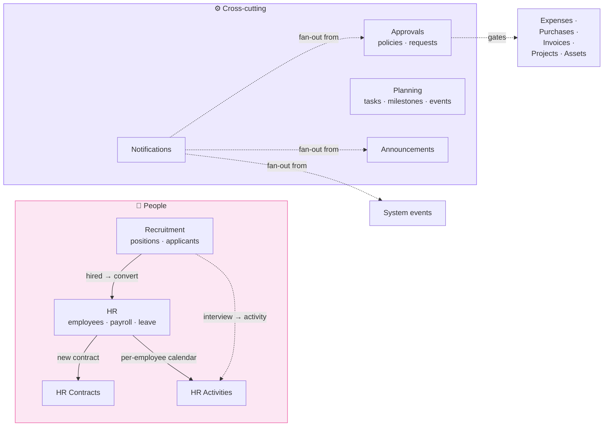

# People & Cross-cutting

Eight modules that manage the human and procedural side of the business.

| Page | What it covers |
|---|---|
| [Headline workflows](workflows.md) | Payroll · Capex approval · Hire-to-employee. Read first. |
| [HR](hr.md) | Employees, departments, salary/title history, payroll runs (NSSF + tax + LBP per F-6), leave |
| [HR Contracts](hr-contracts.md) | Formal employment contracts with print |
| [HR Activities](hr-activities.md) | Per-employee personal calendar with reminders |
| [Recruitment](recruitment.md) | Positions, applicants, interviews, offers, hire conversion |
| [Approvals](approvals.md) | Rule-based multi-step approval policies + per-event requests |
| [Planning](planning.md) | Project Gantt + tasks + milestones + calendar events |
| [Announcements](announcements.md) | Audience-targeted top-down internal communications |
| [Notifications](notifications.md) | Per-user inbox of system events |

## The two halves of this chapter

## Personas

| Persona | Where they live in this chapter |
|---|---|
| **HR Manager** | HR + Recruitment + Contracts |
| **Recruiter** | Recruitment only |
| **Employee** | HR Activities (own calendar), Announcements (inbox), Notifications |
| **Project Manager** | Planning + Approvals (raising or approving) |
| **Finance Manager** | Approvals (clearing finance gates) |
| **Operations Manager** | Approvals + HR for production headcount |
| **Auditor** | All of them — segregation of duties + approval evidence |

## Cross-references with earlier chapters

| Module | Reads/writes to |
|---|---|
| HR payroll | Expenses + Accounting (F-6 multi-currency posting) |
| HR activities | CRM activities (separate tables, same UX) |
| Recruitment | HR (on conversion → new employee) |
| Approvals | Expenses, Purchases, Invoices, Projects, Fixed Assets |
| Planning | Projects (chapter 2 Sales) |
| Notifications | Every module that fires user-visible events |
