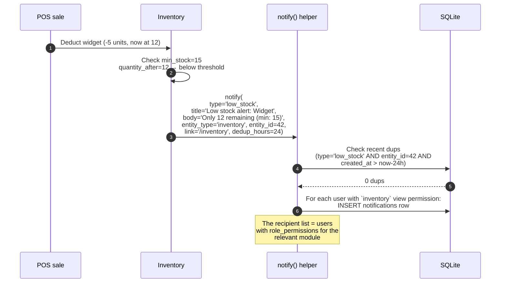
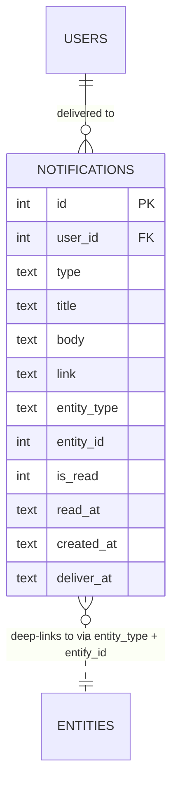

# Notifications

The per-user system-event inbox. 14 event types fan out from every module
into one queryable feed.

## Purpose

Notifications are how the system tells you "something happened that you
should know about". Examples:

- Your payment was received
- An invoice is overdue
- Stock is running low
- An approval is waiting on you
- A new announcement arrived

The SPA polls `/api/notifications/unread-count` every 30 seconds; the bell
in the top bar shows the count.

## Personas

| Persona | What they read |
|---|---|
| **Anyone with an account** | Their own notifications |
| **No-one** | Nobody can see others' notifications (privacy by design) |

## Quick reference

- **Types** (14 seeded):
  `announcement`, `approval_request`, `asset_depreciated`, `cash_variance`,
  `hr_activity_reminder`, `invoice_overdue`, `invoice_paid`, `low_stock`,
  `payment_received`, `production_completed`, `quotation_accepted`,
  `recruitment_hired`, `recruitment_status`, `task_due_soon`
- **Per-user** — `notifications.user_id` is mandatory
- **Deduplication** — repeating events use a key + lookback to avoid spamming
- **Deliver-at** — supports scheduled delivery (e.g. HR activity reminders)
- **Soft-read** — `is_read` flips; rows are never deleted (retention indefinite)

---

=== "Operator's view"

    ### The bell

    Top right corner — bell icon with a red count badge. Click → dropdown
    list of recent unread notifications.

    Each row: icon (per type), title, body snippet, "X minutes ago", and
    an inline link button.

    ### Reading

    Click a notification → it marks as read AND navigates to the linked
    entity (invoice / approval / etc).

    ### Bulk actions

    Notifications page (full list):

    - **Mark all as read** — flips `is_read=1` for everything
    - Filter by type
    - Filter by read state
    - Date range

=== "Administrator's view"

    ### Permissions

    Self-only. No role grants visibility into another user's notifications
    — that's a privacy boundary the system enforces server-side. Even
    superadmin can't pull another user's feed.

    ### Source of every notification

    Each `notifications` row carries `entity_type` + `entity_id` so the
    notification deep-links to the source. Examples:

    | Type | entity_type | entity_id | Link target |
    |---|---|---|---|
    | `payment_received` | `invoice` | invoice id | `/invoices` |
    | `low_stock` | `inventory` | item id | `/inventory` |
    | `approval_request` | `approval_request` | request id | `/approvals` |
    | `cash_variance` | `cash_reconciliation` | rec id | `/cash` |
    | `task_due_soon` | `planning_task` | task id | `/planning` |
    | `announcement` | `announcement` | announcement id | `/announcements` |

    ### Deduplication

    The `notify()` helper accepts a `dedup_hours` parameter. With it, the
    helper checks for an existing notification of the same `type` +
    `entity_id` within the lookback window — if one exists, it's a no-op.
    This prevents spam: stock dipping below min_stock 20 times in a day =
    one notification, not twenty.

    ### Deliver at

    `deliver_at` defaults to `created_at` for immediate delivery. For
    scheduled notifications (HR activity reminders), it's set to "X
    minutes before the event". The unread-count and inbox endpoints
    filter to `deliver_at <= now`.

=== "Auditor's view"

    Notifications are operational — not typically part of a financial
    audit — but useful for:

    ### Verifying approval-request notifications fired

    ```sql
    -- Approval requests with no notification (control: approvers must be told)
    SELECT ar.id, ar.policy_name, ar.requested_at
    FROM approval_requests ar
    LEFT JOIN notifications n
      ON n.type = 'approval_request' AND n.entity_id = ar.id
    WHERE ar.status = 'pending' AND n.id IS NULL;
    -- Expected: zero rows
    ```

    ### Cash variance notification trail

    ```sql
    SELECT cr.id, cr.business_date, cr.variance,
           n.id AS notification_id, n.created_at
    FROM cash_reconciliations cr
    LEFT JOIN notifications n
      ON n.type = 'cash_variance' AND n.entity_id = cr.id
    WHERE cr.status = 'closed' AND ABS(cr.variance) > 5
    ORDER BY cr.closed_at DESC LIMIT 20;
    ```

---

## Workflow — fan-out on a single event



The same fan-out pattern applies to every event type. Some are
single-recipient (e.g. HR activity reminder fires only to the activity
owner); some are role-targeted (cash variance fires to anyone with
`cash` view).

## Data model



## API surface

| Endpoint | Purpose |
|---|---|
| `GET /api/notifications/` | Caller's notifications (paginated, filter by read/type) |
| `GET /api/notifications/unread-count` | Polled by the bell |
| `POST /api/notifications/{id}/mark-read` | Single |
| `POST /api/notifications/mark-all-read` | Bulk |

## What's NOT supported

- Per-user notification preferences (mute X type). Currently you receive
  every type you're entitled to.
- Email / SMS delivery channels. Notifications are in-app only.
- Push notifications. Polling-based, 30s cadence.
- Cross-user mention notifications ("@manager please review"). Comments
  fire on announcements + approvals but the mention syntax isn't
  parsed.
