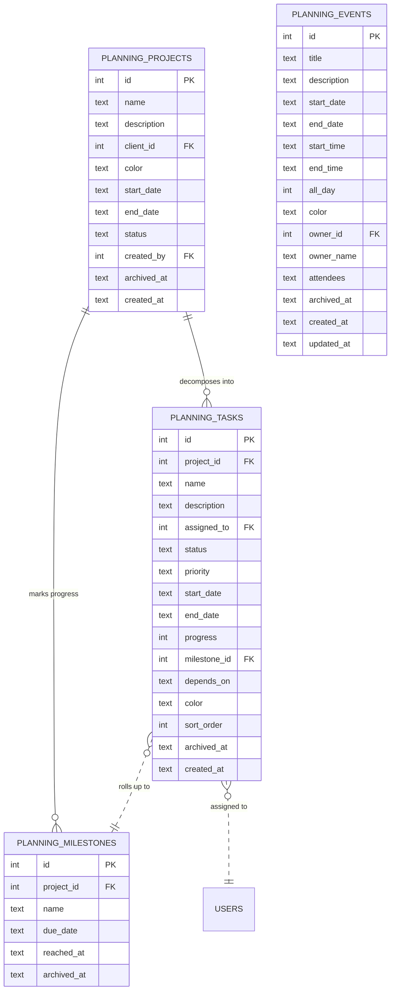

# Planning

The project-planning board: Gantt, tasks, milestones, and calendar events.
A lighter, more visual companion to the Projects module from the Sales
chapter.

## Purpose

Where the [Projects](../sales/projects.md) module (Sales chapter) is the
**commercial** project — budget, materials, invoicing — the Planning module
is the **operational** project: who does what when. Gantt board, task
ownership, milestone tracking, and calendar events for everyone.

The two share `planning_milestones` (one table); the rest is independent.

## Personas

| Persona | What they do here |
|---|---|
| **Project Manager** | Plans tasks, assigns ownership, tracks progress |
| **Assignee** | Marks tasks Done, comments on progress |
| **Manager** | Sees team workload at a glance |
| **Anyone** | Reads / creates calendar events |

## Quick reference

- **Planning project** — separate from `projects` (sales-side); same client linkage
- **Task status**: `To Do`, `In Progress`, `Done`
- **Task priority**: `Low`, `Normal`, `High`, `Urgent`
- **Milestone**: name + due date + optional `reached_at`
- **Event**: title + start_date/time + optional end + all_day flag + attendees JSON
- **Dependencies**: each task's `depends_on` is a JSON array of other task ids

---

=== "Operator's view"

    ### Planning a project

    Planning → **+ New planning project**:

    | Field | Notes |
    |---|---|
    | Name | |
    | Description | |
    | Client | Optional FK |
    | Color | Used in Gantt + calendar |
    | Start, End | |
    | Status | Active by default |

    Save. Now add tasks and milestones.

    ### Adding tasks

    Project detail → **Tasks** tab → **+ Add task**:

    | Field | Notes |
    |---|---|
    | Name | |
    | Description | |
    | Assigned to | User FK |
    | Start, End | Drives Gantt position |
    | Status | To Do / In Progress / Done |
    | Priority | Low / Normal / High / Urgent |
    | Progress | 0-100% |
    | Milestone | Optional FK |
    | Depends on | JSON list of task ids — Gantt draws arrows |
    | Color | Inherits project unless overridden |

    ### Marking progress

    Click a task → drag the progress slider, or change status. Done = 100%
    auto.

    ### Milestones

    Project detail → **Milestones** tab → **+ Add milestone** with a due
    date. When reached, the operator clicks **Mark reached** to set
    `reached_at`.

    Upcoming milestones surface on the Dashboard's "Upcoming milestones"
    KPI tile.

    ### Calendar events

    Planning → **Calendar** tab. Add events for the team:

    | Field | Notes |
    |---|---|
    | Title | |
    | Description | |
    | Start date, End date | |
    | Start time, End time | Optional |
    | All day | Toggle |
    | Color | |
    | Attendees | JSON array of user ids |

    Events show on the dashboard's "Upcoming Agenda" panel for everyone.

=== "Administrator's view"

    ### Permissions

    | Role | view | create | edit | delete |
    |---|---|---|---|---|
    | Project Manager | ✅ | ✅ | ✅ | ✅ |
    | Operations Manager | ✅ | ✅ | ✅ | ✗ |
    | Sales | ✅ | ✗ | ✗ | ✗ |
    | Anyone with `planning` view | ✅ | ✗ | ✗ | ✗ |

    ### Calendar events visibility

    Events are visible to everyone with `planning` view permission. To
    restrict, an attendees-only event filter would need a vendor extension.

=== "Auditor's view"

    Planning is operational; not typically part of a financial audit. For
    HR reporting, useful queries:

    ```sql
    -- Per-user workload (open tasks + hours)
    SELECT u.username, COUNT(*) AS open_tasks,
           SUM(julianday(t.end_date) - julianday(t.start_date)) AS planned_days
    FROM planning_tasks t
    LEFT JOIN users u ON u.id = t.assigned_to
    WHERE t.status != 'Done' AND t.archived_at IS NULL
    GROUP BY u.id ORDER BY open_tasks DESC;
    ```

    ```sql
    -- Overdue milestones
    SELECT p.name AS project, m.name AS milestone, m.due_date
    FROM planning_milestones m
    JOIN planning_projects p ON p.id = m.project_id
    WHERE m.reached_at IS NULL
      AND date(m.due_date) < date('now')
      AND m.archived_at IS NULL
    ORDER BY m.due_date;
    ```

---

## Data model



## API surface

| Endpoint | Purpose |
|---|---|
| `GET /api/planning/projects` | List |
| `POST /api/planning/projects` | Create |
| `GET /api/planning/projects/{id}/tasks` | Tasks for project |
| `POST /api/planning/tasks` | Create task |
| `PATCH /api/planning/tasks/{id}` | Update |
| `POST /api/planning/milestones` | Create milestone |
| `PATCH /api/planning/milestones/{id}/reach` | Mark reached |
| `GET /api/planning/events` | List events (filter by date range) |
| `POST /api/planning/events` | Create event |
| `GET /api/planning/summary` | KPIs |
